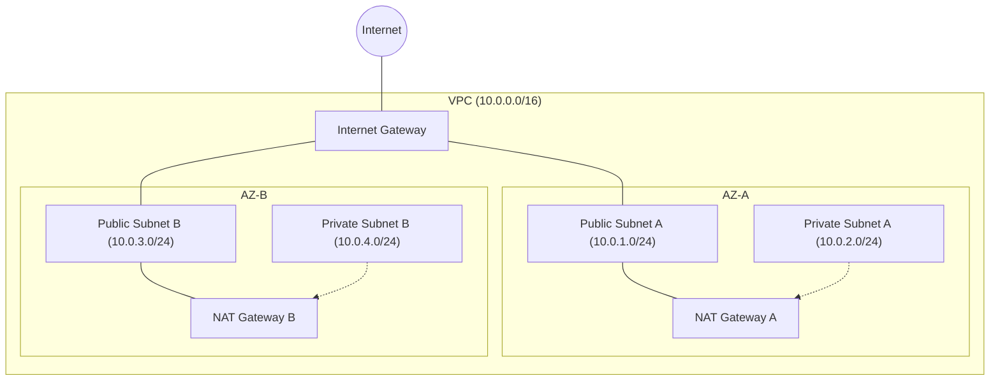
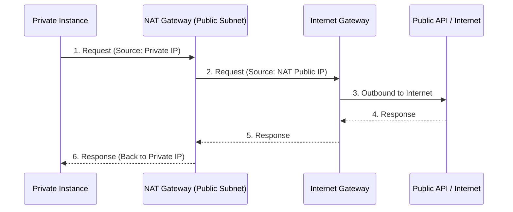

## Public vs. Private

Architecture is about isolation. A well-designed VPC separates "front-facing" resources from "internal" ones to minimize the attack surface and optimize traffic flow.

---
## 🛡️ The Public / Private Split
In a professional cloud environment, we categorize subnets based on how they interact with the external world.
### 📊 Comparison at a Glance

| Feature               | Public Subnet                    | Private Subnet                       |
| :-------------------- | :------------------------------- | :----------------------------------- |
| **Internet Access**   | Direct (via Internet Gateway)    | Indirect (via NAT Gateway)           |
| **Incoming Traffic**  | Allowed from Internet            | Denied from Internet (Internal only) |
| **Typical Resources** | Load Balancers, Bastions, NAT GW | Databases, App Servers, Storage      |
| **Routing Policy**    | `0.0.0.0/0 -> IGW`               | `0.0.0.0/0 -> NAT GW`                |

### 1. Public Subnets
- **Definition**: A subnet whose route table has a direct route to an **Internet Gateway (IGW)** (`0.0.0.0/0 -> igw-xxxx`).
- **Role**: Serves as the DMZ (Demilitarized Zone) of your architecture.
- **Security Group Strategy**: Highly restrictive. Only allow ports needed for the service (e.g., 80/443 for Web, 22 for SSH from trusted IPs).

### 2. Private Subnets
- **Definition**: A subnet whose route table DOES NOT have a route to an IGW.
- **Role**: Protects sensitive workloads. These instances have private IP addresses but no public IPs.
- **Security Group Strategy**: Only allow traffic from the Public Subnet or specific internal security groups.

---

## 🏗️ VPC Architecture Visualization

The diagram below shows a highly available VPC architecture with subnets spread across two Availability Zones (AZs).

---
## 🌩️ Outbound Access (NAT Logic)
Resources in private subnets often need to download updates or talk to external APIs. Since the internet cannot initiate a connection to them, they use a **NAT (Network Address Translation)** device.
### How it works:
1. An instance in a **Private Subnet** sends a request to `google.com`.
2. The **Route Table** sends this traffic to the **NAT Gateway** (located in the Public Subnet).
3. The NAT Gateway "borrows" its Public IP address to send the request to the **Internet Gateway**.
4. The response returns to the NAT Gateway, which forwards it back to the original Private Instance.

---
## 💡 Best Practices
- **High Availability**: Always deploy subnets in at least two Availability Zones. A single NAT Gateway is a single point of failure; ideally, use one per AZ.
- **Size Matters**: Use CIDR blocks like `/24` (256 IPs) for subnets. Small blocks like `/28` run out of IPs quickly once you account for reserved addresses.
- **Reserved IPs**: Cloud providers (AWS, Azure, GCP) reserve the first few and last few IPs in a block for networking services (DHCP, DNS, Gateways).
- **Least Privilege**: Instances in private subnets should not have Public IPs even if they have route access to a NAT.

---

## ❓ Interview Preparation

### Top 5 Interview Questions
1. **Explain the difference between a Public and Private subnet.**
2. **Where should a NAT Gateway be placed, and why?**
3. **If an instance in a private subnet can't reach the internet, what are the first 3 things you check?** (Route table, NAT Gateway state, Security Group/NACL).
4. **How many IP addresses are actually usable in a /24 subnet in AWS?** (251).
5. **Can a private subnet have an Internet Gateway?** (Yes, but once it has a route to it, it becomes a Public subnet by definition).

---

## 📝 Practice Quiz

1. **Which resource allows a private instance to initiate outbound connections?**
   - [ ] Internet Gateway
   - [x] NAT Gateway
   - [ ] VPC Peering
   - [ ] Security Group

2. **A "Public Subnet" is defined by having a route to:**
   - [ ] A VPN Gateway
   - [ ] A Database
   - [x] An Internet Gateway
   - [ ] The AWS Console

3. **In which subnet should you place a Bastion Host?**
   - [x] Public Subnet
   - [ ] Private Subnet
   - [ ] Isolated Subnet
   - [ ] Management Subnet

---
## 🏢 Real-Life Scenario: The 3-Tier Web App

**Requirement**: Deploy a secure web application with a Load Balancer, Web Servers, and a Database.

**Solution**:
1. **Public Subnets**: Place the **Application Load Balancer (ALB)** and **Bastion Host** here. The ALB receives traffic from the internet and forwards it inwards.
2. **Private Subnet 1 (App Tier)**: Place your **Web/App Instances** here. They receive traffic only from the ALB.
3. **Private Subnet 2 (Data Tier)**: Place your **Database (RDS)** here. It only allows traffic on port 5432/3306 from the App Tier.

This ensures that even if a web server is compromised, the database is still one layer deeper and not directly accessible from the internet.

