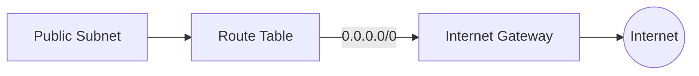
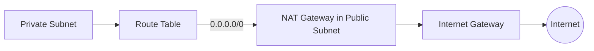
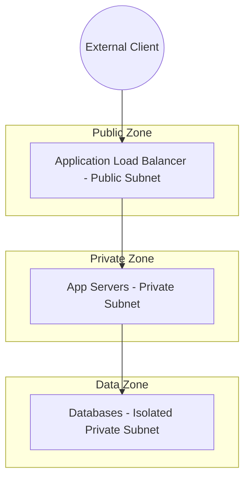

# 03. Public and Private Zoning

In AWS, the difference between a Public and a Private subnet is not a checkbox; it is a **Routing Policy**. Understanding this distinction is the key to building secure, multi-tier architectures.

## What makes a Subnet "Public"?

A subnet is considered **Public** if its associated route table has an entry pointing to an **Internet Gateway (IGW)**.

## What makes a Subnet "Private"?

A subnet is **Private** if its route table DOES NOT have a route to an IGW. To access the internet (e.g., for software updates), resources in a private subnet must use a **NAT Gateway**.

---

## The 3-Tier Architecture Pattern

This is the industry standard for production environments, ensuring that only the load balancer is exposed to the web.

---

## Real-Life Scenarios

### Scenario 1: "The Exposed Database"
**Problem**: An inexperienced developer created a database in a subnet that had a route to an Internet Gateway. They also granted the database a Public IP. 
**Consequence**: The database was "Publicly Accessible". Within hours, automated bots found the open port and attempted a brute-force attack.
**Solution**: Moved the database to a Private Subnet with no IGW route.

### Scenario 2: "NAT Gateway Failure"
**Problem**: A DevOps engineer forgot to add a route to the NAT Gateway in the private subnet's route table.
**Impact**: Application servers couldn't download security patches or talk to external APIs, cause deployment pipeline failures.
**Solution**: Verified the Route Table: `0.0.0.0/0 -> nat-12345`.

### Scenario 3: "The Bastion Gate"
**Problem**: Security policy required that no developer could SSH directly into an application server.
**Solution**: Created a "Bastion Host" (or Jump Box) in the Public Subnet. 
*   Result: Developers SSH into the Bastion, and then from the Bastion into the Private App Servers. Security Groups only allowed Port 22 from the Bastion's IP.

---

## ❓ Interview Questions

1. **What specifically makes a subnet 'public' in AWS?**
    - A route in its route table pointing to an Internet Gateway (IGW).
2. **Where should you place a NAT Gateway?**
    - In a **Public** Subnet (so it can talk to the IGW).
3. **Does a private subnet have a direct IGW route?**
    - No.
4. **Can a resource in a private subnet have a Public IP?**
    - Yes, but it won't be reachable from the internet because the routing doesn't exist.
5. **What is a 'DMZ' in AWS terms?**
    - The Public Subnet layer.
6. **Why use three-tier architecture?**
    - To provide layered security; ensuring databases are never directly reachable from the web.
7. **What is 'Egress-only' Internet Gateway?**
    - A gateway specifically for IPv6 traffic to allow outgoing connections while blocking incoming ones.
8. **What happens if you delete the IGW while resources are in a public subnet?**
    - They lose all internet connectivity immediately.
9. **How do Private subnets get updates?**
    - Via a NAT Gateway or a NAT Instance.
10. **Difference between IGW and NAT Gateway?**
    - IGW allows two-way traffic (In/Out); NAT Gateway allows one-way (Outbound only).

---

## 🧠 Quiz

1. **Public subnets must have a route to:**
    - [x] Internet Gateway (IGW)
    - [ ] NAT Gateway
2. **Private app servers usually talk to the web via:**
    - [x] NAT Gateway
    - [ ] Directly to IGW
3. **Primary role of a Public Subnet:**
    - [x] Load Balancers and Bastions
    - [ ] Database storage
4. **NACLs are applied at the:**
    - [x] Subnet level
    - [ ] Instance level
5. **Standard Tier count for production:**
    - [x] 3
    - [ ] 1
6. **Is a NAT Gateway stateful or stateless?**
    - [x] Stateful (for routing responses)
    - [ ] Stateless
7. **Incoming traffic from the web is blocked by default in:**
    - [x] Private Subnets
    - [ ] Public Subnets
8. **Can a Public Subnet contain a NAT Gateway?**
    - [x] Yes (It must)
    - [ ] No
9. **Does a private subnet need an IGW?**
    - [x] No
    - [ ] Yes
10. **Bastion hosts should live in:**
    - [x] Public Subnets
    - [ ] Private Subnets
11. **Databases should live in:**
    - [x] Private Subnets
    - [ ] Public Subnets
12. **IGW stands for:**
    - [x] Internet Gateway
    - [ ] Internal Global Web
13. **Route for 'all traffic' is:**
    - [x] 0.0.0.0/0
    - [ ] 255.255.255.255
14. **principle of 'Least Privilege' means:**
    - [x] Only allow necessary traffic
    - [ ] Allow everything but log it
15. **If a subnet route table is empty, traffic is:**
    - [x] Dropped
    - [ ] Broadcasted
16. **NAT stands for:**
    - [x] Network Address Translation
    - [ ] Network Access Topology
17. **Can you have multiple IGWs in one VPC?**
    - [x] No (Limit is 1 per VPC)
    - [ ] Yes
18. **Egress traffic means:**
    - [x] Outbound traffic
    - [ ] Inbound traffic
19. **Ingress traffic means:**
    - [x] Inbound traffic
    - [ ] Outbound traffic
20. **Is 10.0.0.0/16 a private or public range?**
    - [x] Private (RFC 1918)
    - [ ] Public