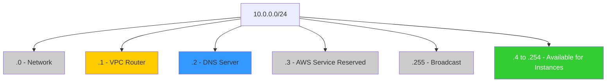

# 04. AWS Reserved IPs and Limits

When you create a subnet in AWS, you do not get 100% of the IP addresses in that CIDR block. AWS reserves **5 IP addresses** in every subnet for its own internal management.

## The Reserved Five

If you have a subnet `10.0.0.0/24`, the following addresses are reserved and cannot be assigned to instances:

| Address | Role | Description |
| :--- | :--- | :--- |
| **.0** | Network Address | The first address in the range. |
| **.1** | VPC Router | Assigned to the internal router for traffic between subnets. |
| **.2** | DNS Server | The AWS provided DNS server (`AmazonProvidedDNS`). |
| **.3** | Future Use | Reserved by AWS for future features. |
| **.255** | Broadcast Address | AWS does not support broadcast, but reserves this in line with standard IP patterns. |

## Subnet Size Constraints

AWS imposes specific limits on CIDR block sizes:

*   **Minimum Size**: `/28` (16 IP addresses).
*   **Maximum Size**: `/16` (65,536 IP addresses) for primary VPC CIDR.
*   **Expansion**: You cannot resize a subnet once created. You can, however, add additional CIDR blocks to a VPC.

---

## Real-Life Scenarios

### Scenario 1: "The Smallest Subnet Trap"
**Problem**: An administrator created a `/28` subnet for a specific microservice. They calculated they needed 14 host addresses.
**Outcome**: They could only launch 11 instances. 
**Realization**: `16 total - 5 reserved = 11 usable`.
**Resolution**: Had to destroy the subnet and replace it with a `/27`.

### Scenario 2: "DNS Customization"
**Problem**: A hybrid cloud setup required instances to talk to an on-premise DNS server. 
**Discovery**: AWS instances by default look at `base_ip + 2`. 
**Solution**: Changed the DHCP Options Set of the VPC to point traffic elsewhere, but the `.2` address remained reserved by AWS.

### Scenario 3: "The Peering Expansion"
**Problem**: A company ran out of IPs in their main `/16` VPC. 
**Solution**: Rather than migrating everything, they added a secondary CIDR block (`10.1.0.0/16`) to the VPC and created new subnets within that range.
*   Result: Seamless expansion without downtime for existing resources.

---

## ❓ Interview Questions

1. **How many IP addresses are available in a /24 subnet in AWS?**
    - 251.
2. **Which IP address is always the VPC Router?**
    - `Base CIDR + 1`.
3. **Can you use the .255 address in an AWS subnet?**
    - No, it is reserved as the broadcast address.
4. **What is the smallest CIDR block allowed for an AWS subnet?**
    - `/28`.
5. **If my subnet is 10.0.0.0/28, what is the address of the DNS server?**
    - `10.0.0.2`.
6. **Can you change the size of a subnet after it is created?**
    - No.
7. **What happens to the .0 address?**
    - It is reserved as the Network address.
8. **Why does AWS reserve a .3 address?**
    - For future internal AWS service use.
9. **Could you have a /15 VPC in AWS?**
    - No, the maximum primary CIDR size is /16.
10. **How many usable IPs are in a /28?**
    - 11.

---

## 🧠 Quiz

1. **Total IPs reserved by AWS per subnet:**
    - [x] 5
    - [ ] 2
2. **The .1 address is the:**
    - [x] VPC Router
    - [ ] DNS Server
3. **The .2 address is the:**
    - [x] DNS Server
    - [ ] Network Address
4. **Smallest subnet prefix allowed:**
    - [x] /28
    - [ ] /32
5. **Largest VPC prefix allowed:**
    - [x] /16
    - [ ] /8
6. **Usable IPs in a /24:**
    - [x] 251
    - [ ] 254
7. **Does AWS support network broadcasting?**
    - [x] No
    - [ ] Yes
8. **Is the .3 address usable?**
    - [x] No
    - [ ] Yes
9. **Address for base CIDR is the:**
    - [x] Network Address
    - [ ] Broadcast Address
10. **Usable IPs in a /28:**
    - [x] 11
    - [ ] 14
11. **Reserved DNS address is also known as:**
    - [x] AmazonProvidedDNS
    - [ ] Route53Internal
12. **Can you add secondary CIDR blocks to a VPC?**
    - [x] Yes
    - [ ] No
13. **Subnet mask for /28:**
    - [x] 255.255.255.240
    - [ ] 255.255.255.0
14. **Reserved address for broadcast:**
    - [x] Last address (.255 in /24)
    - [ ] First address (.0)
15. **If subnet is 10.0.1.0/24, the router is:**
    - [x] 10.0.1.1
    - [ ] 10.0.0.1
16. **Usable IPs in a /20:**
    - [x] 4091
    - [ ] 4096
17. **Can you launch 256 instances in a /24?**
    - [x] No
    - [ ] Yes
18. **Reserved addresses are mandatory?**
    - [x] Yes
    - [ ] No
19. **IP for AWS DNS is always Base+:**
    - [x] 2
    - [ ] 1
20. **Usable IPs in /29 (if it were allowed):**
    - [x] 3 (8 - 5)
    - [ ] 8
