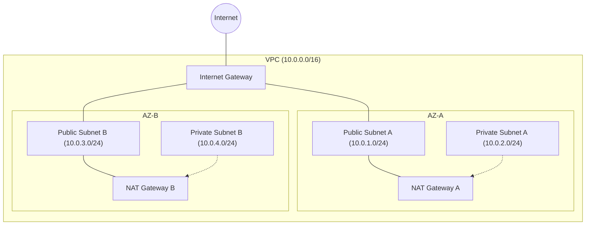

# Subnetting and CIDR in AWS VPC

Subnetting is the practice of dividing a VPC's IP address range into smaller, manageable segments. Understanding CIDR (Classless Inter-Domain Routing) notation is crucial for defining these ranges efficiently.

## 🧱 fundamentals of CIDR

CIDR notation is a compact way to represent an IP address and its associated network mask. It is written as an IP address, a slash character (`/`), and a decimal number.

-   **Example**: `10.0.0.0/16`
-   **/16** means the first 16 bits are the network portion, and the remaining 16 bits are for hosts.
-   **Total IPs**: 2^(32-16) = 2^16 = 65,536 addresses.

### Common VPC CIDR Blocks

| CIDR | Total IPs | Usable IPs (AWS) | Typical Usage |
| :--- | :--- | :--- | :--- |
| `/16` | 65,536 | 65,531 | Entire VPC |
| `/20` | 4,096 | 4,091 | Large Subnet |
| `/24` | 256 | 251 | Standard Subnet |
| `/28` | 16 | 11 | Smallest allowed Subnet |

> [!NOTE]
> AWS reserves 5 IP addresses in every subnet:
> 1.  `10.0.0.0`: Network address.
> 2.  `10.0.0.1`: VPC Router.
> 3.  `10.0.0.2`: DNS Server.
> 4.  `10.0.0.3`: Future use.
> 5.  `10.0.0.255`: Broadcast address (AWS doesn't support broadcast, but reserves it).

---

## 🛡️ Public vs. Private Subnets

Architecture is about isolation. A well-designed VPC separates "front-facing" resources from "internal" ones to minimize the attack surface.

### 📊 Comparison at a Glance

| Feature | Public Subnet | Private Subnet |
| :--- | :--- | :--- |
| **Internet Access** | Direct (via Internet Gateway) | Indirect (via NAT Gateway) |
| **Incoming Traffic** | Allowed from Internet | Denied from Internet (Internal only) |
| **Typical Resources** | Load Balancers, Bastions, NAT GW | Databases, App Servers, Storage |
| **Routing Policy** | `0.0.0.0/0 -> IGW` | `0.0.0.0/0 -> NAT GW` |

### 1. Public Subnets
-   **Definition**: A subnet whose route table has a direct route to an **Internet Gateway (IGW)**.
-   **Role**: DMZ (Demilitarized Zone).
-   **Security**: Highly restrictive Security Groups.

### 2. Private Subnets
-   **Definition**: A subnet whose route table DOES NOT have a route to an IGW.
-   **Role**: Trusted internal zone.
-   **Security**: Only allow traffic from known internal sources.

---

## 🏗️ VPC Architecture Visualization

The diagram below shows a highly available VPC architecture with subnets spread across two Availability Zones (AZs).

---

## ❓ Interview Questions

1.  **How many IP addresses are available in a /24 subnet on AWS?**
    *   *Answer*: 251. AWS reserves 5 addresses (Network, Router, DNS, Future, Broadcast) from the 256 total.
2.  **Can I increase the size of an existing subnet?**
    *   *Answer*: No. You cannot resize a subnet. You must create a new, larger subnet and migrate resources. You *can* add secondary CIDR blocks to the VPC itself.
3.  **What is the smallest subnet size AWS allows?**
    *   *Answer*: `/28` (16 IP addresses).
4.  **Why should I use at least two Availability Zones?**
    *   *Answer*: To ensure High Availability and Fault Tolerance. If one AZ goes down, resources in the other AZ can continue serving traffic.

---

## 🧠 Quiz Snippet

1.  **Which IP address is reserved for the AWS DNS server in a subnet?** `(Base + 2)`
2.  **True/False: A subnet can span multiple Availability Zones.** `(False - A subnet sits entirely within one AZ)`
3.  **What is the CIDR notation for a single IP address?** `(/32)`
4.  **If you need 1000 hosts in a subnet, which CIDR should you choose?** `(/22 gives 1024 IPs)`
5.  **What does CIDR stand for?** `(Classless Inter-Domain Routing)`
