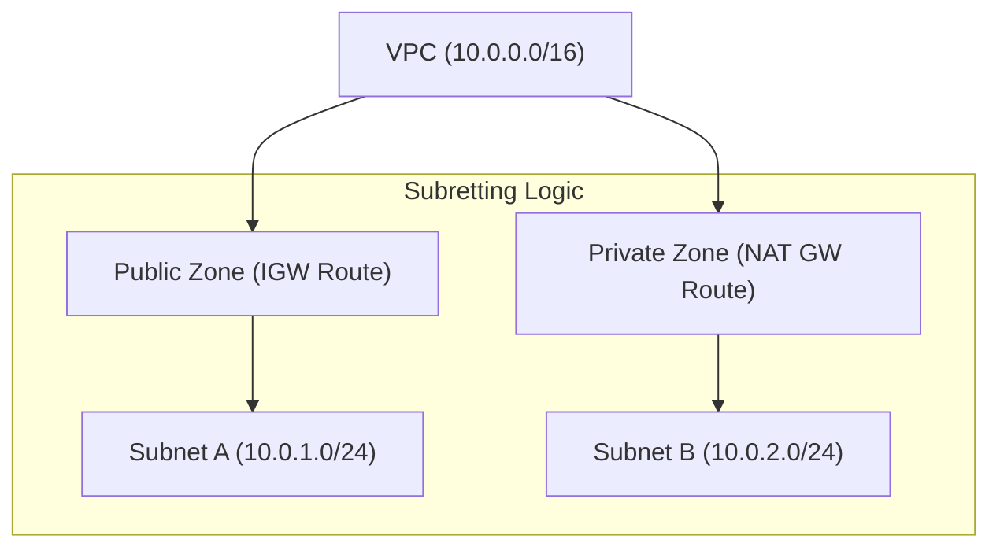

# Subnetting and CIDR

Subnetting is the practice of dividing a VPC's IP address range into smaller, manageable segments. Understanding CIDR (Classless Inter-Domain Routing) notation and binary math is crucial for defining these ranges efficiently and securely.

## 📚 Learning Path

| # | Topic | Description | Key Concepts |
| :--- | :--- | :--- | :--- |
| **01** | [**Binary Fundamentals**](./01-Binary-and-IP-Fundamentals/README.md) | How Computers see IPs | Octets, Bits, Bits-to-Decimal |
| **02** | [**CIDR Math**](./02-CIDR-Math-and-Calculation/README.md) | Calculating Network Sizes | Host formulas, Masks, Boundaries |
| **03** | [**Zoning Patterns**](./03-Public-and-Private-Zoning/README.md) | Architectural Isolation | Public vs Private, 3-Tier Design |
| **04** | [**AWS Limits**](./04-AWS-Reserved-IPs-and-Limits/README.md) | Cloud-Specific Constraints | The 5 Reserved IPs, /16 to /28 |

---

## 🏗️ Architecture Visualization

## Quick Start

To calculate the number of usable IPs in any AWS subnet:
1.  Take total IPs: `2^(32 - prefix)`
2.  Subtract reserved: `- 5`
3.  **Result**: Usable host addresses.

*Example: /24 = 256 - 5 = 251.*

Please proceed to **[01-Binary-Fundamentals](./01-Binary-and-IP-Fundamentals/README.md)**.
