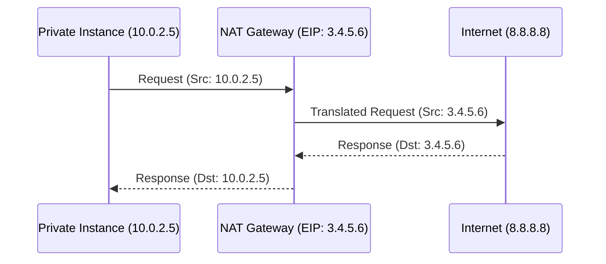

# 02. NAT Gateway Deep Dive

A **NAT Gateway** is a managed service that allows instances in a **Private Subnet** to connect to the internet (one-way outbound) while preventing external entities on the internet from initiating a connection to those instances.

## How it Works (The Packet Flow)

When a private instance sends a request to the internet:
1.  **Source IP**: The Private IP of the instance (e.g., `10.0.2.5`).
2.  **Destination IP**: The Internet Service (e.g., `8.8.8.8`).
3.  **NAT Translation**: The packet hits the NAT Gateway. The NAT Gateway replaces the source Private IP with its own **Elastic IP (EIP)** (e.g., `52.x.x.x`) and records the connection in its mapping table.
4.  **Internet Request**: The packet goes to the internet.
5.  **Response**: The response comes back to the NAT Gateway's EIP. The NAT Gateway looks at its table and forwards the response back to the private instance (`10.0.2.5`).

## Managed NAT Gateway vs. NAT Instance

| Feature | Managed NAT Gateway | NAT Instance (EC2) |
| :--- | :--- | :--- |
| **Maintenance** | Managed by AWS (No patching) | Managed by YOU |
| **High Availability** | Redundant within an AZ | Dependent on the EC2's health |
| **Bandwidth** | Scales up to 45 Gbps | Limited by EC2 Instance Type |
| **Security Groups** | None (Uses NACLs only) | Managed via Security Groups |

---

## Real-Life Scenarios

### Scenario 1: "The Deployment Blackout"
**Problem**: During a massive container deployment, half the pods failed to start because they couldn't pull images from an external registry.
**Discovery**: The NAT Gateway bandwidth reached its limit (bursting through the standard baseline).
**Solution**: Monitored `BytesOutPerSecond` in CloudWatch and realized the traffic was spikey. 
*   Result: Architected for multiple NAT Gateways to distribute the load.

### Scenario 2: "The Static IP Requirement"
**Problem**: A client's security policy only allowed incoming traffic from a specific whitelist of IP addresses. The company's app servers were in a private subnet.
**Solution**: Deployed a NAT Gateway with a fixed **Elastic IP**.
*   Result: The client whitelisted that single EIP, allowing the app servers to securely transmit data to the client's API.

### Scenario 3: "The NAT Instance Nightmare"
**Problem**: An old startup used a single `t2.micro` as a NAT Instance to save money. The instance crashed at 3 AM.
**Consequence**: All production background jobs failed to run because they couldn't talk to the database (which was an external SaaS).
**Solution**: Replaced the brittle instance with a Managed NAT Gateway.

---

## ❓ Interview Questions

1. **Where should you ideally place a NAT Gateway?**
    - In a **Public Subnet**.
2. **Does a NAT Gateway need an Elastic IP?**
    - Yes, for a Public NAT Gateway to communicate with the internet.
3. **Can a NAT Gateway be used in a Private Subnet?**
    - There is a "Private NAT Gateway" type, but it is for connecting between VPCs or on-prem networks, NOT the internet.
4. **Is a NAT Gateway stateful or stateless?**
    - It is **stateful**. It remembers the outgoing connection so it can correctly route the returning response.
5. **How does a private instance know to use the NAT Gateway?**
    - Its Route Table must have a route: `0.0.0.0/0 -> nat-xxxxxxxx`.
6. **Can you associate a Security Group with a NAT Gateway?**
    - No. You must use Network ACLs (NACLs) to filter traffic if needed.
7. **What is the maximum bandwidth of a Managed NAT Gateway?**
    - It starts at 5 Gbps and scales automatically up to 100 Gbps (depends on region and AWS updates).
8. **Does a NAT Gateway allow incoming connections from the internet?**
    - No. It only allows responses to outbound requests.
9. **Which is better for High Availability: NAT Instance or NAT Gateway?**
    - Managed NAT Gateway.
10. **Why would someone use a NAT Instance today?**
    - To save costs on very low-traffic environments or for specific custom routing needs (not recommended for production).

---

## 🧠 Quiz

1. **NAT Gateway must live in a:**
    - [x] Public Subnet
    - [ ] Private Subnet
2. **Standard NAT Gateway bandwidth baseline:**
    - [x] 5 Gbps
    - [ ] 1 Gbps
3. **NAT Gateway is:**
    - [x] Stateful
    - [ ] Stateless
4. **Does NAT Gateway use an EIP?**
    - [x] Yes
    - [ ] No
5. **Private instances use NAT via:**
    - [x] Route Table
    - [ ] Security Group
6. **Maximum NAT Gateways per Availability Zone?**
    - [x] No hard limit (Usually 5 per account)
    - [ ] 1
7. **NAT Gateway performs mapping for:**
    - [x] Port Address Translation (PAT)
    - [ ] 1-to-1 NAT
8. **In which zone is a NAT Gateway highly available?**
    - [x] Within its AZ
    - [ ] Across the whole Region
9. **Can a NAT Gateway process IPv6?**
    - [x] No (Use Egress-only IGW)
    - [ ] Yes
10. **Cost components for NAT Gateway:**
    - [x] Hourly + Data Processed
    - [ ] Data Processed only
11. **NAT Gateway ID prefix:**
    - [x] nat-
    - [ ] igw-
12. **Elastic IP ID prefix:**
    - [x] eipalloc-
    - [ ] addr-
13. **Can you assign a private IP to a NAT Gateway?**
    - [x] Yes (Automatically assigned from the public subnet)
    - [ ] No
14. **Is NAT Gateway managed by AWS?**
    - [x] Yes
    - [ ] No
15. **To scale a NAT Gateway, you:**
    - [x] Do nothing (AWS handles it)
    - [ ] Change the instance type
16. **Inbound responses are allowed because NAT is:**
    - [x] Stateful
    - [ ] Open by default
17. **If the public subnet's IGW route is missing, the NAT GW:**
    - [x] Stops working
    - [ ] Uses another path
18. **Can you see NAT Gateway metrics in CloudWatch?**
    - [x] Yes
    - [ ] No
19. **Standard practice is one NAT Gateway per:**
    - [x] Availability Zone
    - [ ] Region
20. **NAT Gateway prevents:**
    - [x] Inbound-initiated connections
    - [ ] Outbound traffic
