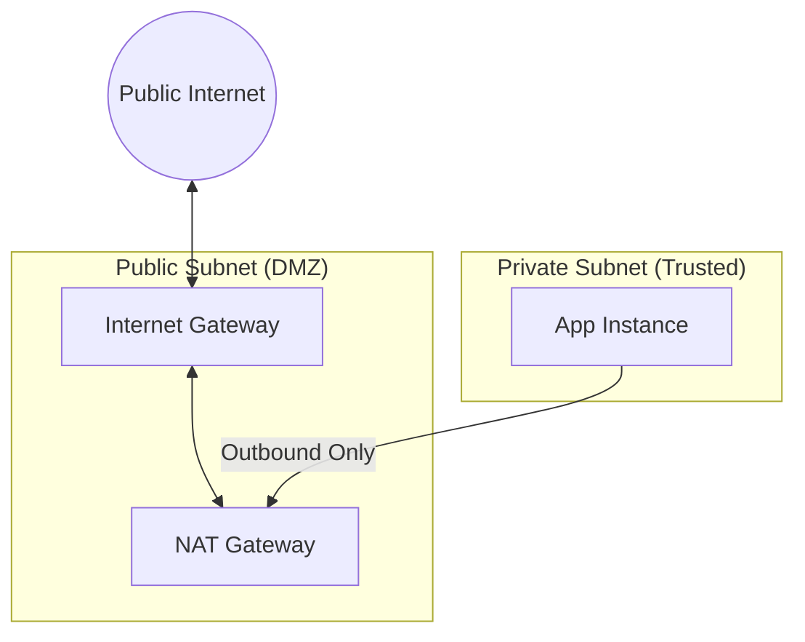

# Internet and NAT Gateways

Gateways are the doors that allow traffic to enter and exit your Virtual Private Cloud. Proper gateway design ensures that your VPC is not an isolated island while maintaining the security of your private resources.

## 📚 Learning Path

| # | Topic | Description | Key Modules |
| :--- | :--- | :--- | :--- |
| **01** | [**IGW Fundamentals**](./01-Internet-Gateway-Fundamentals/README.md) | The Edge of the VPC | Horizontal Scaling, 1-to-1 NAT |
| **02** | [**NAT Gateway Deep Dive**](./02-NAT-Gateway-Deep-Dive/README.md) | Outbound for Private Instances | EIPs, Managed vs Instances, PAT |
| **03** | [**IPv6 Egress-Only**](./03-IPv6-and-Egress-Only-Gateways/README.md) | Modern Network Security | Unidirectional IPv6, Routing |
| **04** | [**HA & Optimization**](./04-High-Availability-and-Optimization/README.md) | Professional Design | Multi-AZ NAT, Cost Control, Endpoints |

---

## 🏗️ Gateway Architecture

---

## 🏗️ Real-Life Scenarios

### Scenario 1: The "Bandwidth Bottleneck" Incident
**Problem**: An e-commerce company noticed that their nightly data backup from private database servers to an external S3-compatible service was taking 10 hours instead of the usual 1 hour.
**Crisis**: During the backup window, other services (like email notifications) failing to reach the internet because the **NAT Gateway** was hitting its bandwidth limit.
**Outcome**: Backups were incomplete, and customers didn't receive order confirmations.
**Solution**: NAT Gateways scale automatically up to 100Gbps, but they can be throttled if a single flow is too heavy. The team split the backup traffic across multiple NAT Gateways in different subnets and AZs.
**Result**: Backup time returned to 1 hour, and secondary service reliability was restored.

### Scenario 2: The "Single Point of Failure" Outage
**Problem**: A DevOps engineer set up a production VPC with two Availability Zones (AZ-A and AZ-B) but deployed only **one NAT Gateway** in AZ-A to save money.
**Crisis**: AWS US-EAST-1A experienced a power outage. While the servers in AZ-B were still running, they couldn't download security patches or communicate with external APIs because their route pointed to the failed NAT Gateway in AZ-A.
**Outcome**: The application in AZ-B crashed due to failed API calls, resulting in a total service outage.
**Solution**: Implement **High Availability NAT**. Deploy one NAT Gateway per AZ. If AZ-A fails, servers in AZ-B use their own local NAT Gateway.
**Result**: The architecture became "AZ-Independent," surviving the next regional hiccup with zero impact.

### Scenario 3: The "Elastic IP" Trap
**Problem**: A company whitelisted their NAT Gateway's **Elastic IP (EIP)** for an external partner's firewall. Later, a junior admin deleted the NAT Gateway and recreated it without realizing the EIP would change.
**Crisis**: All connections to the partner were blocked because the partner was still looking for the old, deleted EIP.
**Outcome**: Business operations were halted for 24 hours while the partner manually updated their firewall rules.
**Solution**: Treat NAT EIPs as "Critical Infrastructure." Use Infrastructure as Code (Terraform/CloudFormation) to lock these resources and prevent accidental deletion.
**Result**: The company now uses a "Reserved EIP Pool" that is never modified without a 48-hour change notice.

---

## ❓ Interview Questions

1.  **What is the fundamental difference between an Internet Gateway (IGW) and a NAT Gateway?**
    - *Answer*: An **IGW** allows bidirectional traffic (Inbound and Outbound) and performs 1-to-1 NAT for public instances. A **NAT Gateway** allows only unidirectional traffic (Outbound only) and performs Many-to-1 NAT (PAT) for private instances, hiding them from the internet.
2.  **Why should you deploy a NAT Gateway in every Availability Zone (AZ)?**
    - *Answer*: For **High Availability and Cost**. If the AZ hosting your only NAT Gateway goes down, all private subnets across the entire VPC lose internet access. Furthermore, routing traffic across AZs to a NAT Gateway incurs "Inter-AZ Data Transfer" costs, which can be significant.
3.  **Explain the term 'PAT' (Port Address Translation) in the context of NAT Gateways.**
    - *Answer*: NAT Gateways use PAT to allow hundreds of private instances to share a single public Elastic IP. It does this by mapping the internal private IP and source port of an outgoing request to a unique source port on the public EIP.
4.  **Can an Internet Gateway be attached to multiple VPCs simultaneously?**
    - *Answer*: No. An IGW has a 1-to-1 relationship with a VPC. It must be detached from one VPC before it can be attached to another.
5.  **What is an 'Egress-Only Internet Gateway' and when is it used?**
    - *Answer*: It is an IPv6-specific component. Since every IPv6 address is public by default, the Egress-Only IGW allows outbound IPv6 traffic while blocking all inbound connection attempts, providing the same security benefit for IPv6 that a NAT Gateway provides for IPv4.
6.  **How do you troubleshoot a private instance that cannot reach the internet?**
    - *Answer*: 1. Check if the instance has a route in its Route Table pointing `0.0.0.0/0` to a NAT Gateway. 2. Verify the NAT Gateway is in a **Public Subnet**. 3. Ensure the Public Subnet has a route to an **Internet Gateway**. 4. Check Security Groups and NACLs allow port 80/443 outbound.

---

## 🧠 Comprehensive Quiz (25 Questions)

**1. Which gateway is required for a subnet to be considered 'Public'?**
- A) NAT Gateway
- B) Internet Gateway (IGW)
- C) Transit Gateway
- D) Customer Gateway

Show Answer

**Answer: B**

**2. True/False: NAT Gateways support inbound connection requests from the Internet.**
- A) True
- B) False (Outbound only)

Show Answer

**Answer: B**

**3. What must be attached to a NAT Gateway for it to function?**
- A) A Public IP (Elastic IP)
- B) A Database
- C) A VPN
- D) A password

Show Answer

**Answer: A**

**4. In which type of subnet must a NAT Gateway be deployed?**
- A) Private Subnet
- B) Public Subnet
- C) Database Subnet
- D) It doesn't matter

Show Answer

**Answer: B**

**5. Which gateway is scaled automatically by the cloud provider (AWS)?**
- A) NAT Instance
- B) NAT Gateway
- C) VPN Gateway
- D) nothing

Show Answer

**Answer: B**

**6. 'Egress-Only Internet Gateway' is used for which protocol?**
- A) IPv4
- B) IPv6
- C) FTP
- D) ICMP

Show Answer

**Answer: B**

**7. True/False: Internet Gateways are highly available by default across a region.**
- A) True
- B) False

Show Answer

**Answer: A**

**8. What is the main cost component of a NAT Gateway?**
- A) The number of routes
- B) Hourly charge + Data processing charge (per GB)
- C) The color of the cable
- D) nothing

Show Answer

**Answer: B**

**9. A private instance uses which target in its route table to get to the internet?**
- A) `igw-xxxx`
- B) `nat-xxxx`
- C) `vgw-xxxx`
- D) `pcx-xxxx`

Show Answer

**Answer: B**

**10. How many NAT Gateways can you have per Availability Zone?**
- A) 1
- B) Multiple (but usually one per AZ is sufficient for HA)
- C) 0
- D) 100

Show Answer

**Answer: B**

**11. Which component allows 'Many-to-1' IP translation?**
- A) IGW
- B) NAT Gateway
- C) Route Table
- D) NACL

Show Answer

**Answer: B**

**12. 'IGW' stands for:**
- A) Integrated Global Web
- B) Internet Gateway
- C) Internal Gateway Web
- D) nothing

Show Answer

**Answer: B**

**13. True/False: You must manually scale a NAT Gateway when traffic increases.**
- A) False (Managed NAT scales automatically)
- B) True

Show Answer

**Answer: A**

**14. If a NAT Gateway's Elastic IP is deleted, what happens?**
- A) It stays working
- B) The NAT Gateway stops functioning and outbound traffic fails
- C) It gets a new IP automatically
- D) nothing

Show Answer

**Answer: B**

**15. Which is more cost-effective for VERY low traffic: NAT Gateway or NAT Instance?**
- A) NAT Gateway
- B) NAT Instance (A small EC2 t3.nano is cheaper but manual)
- C) IGW
- D) nothing

Show Answer

**Answer: B**

**16. 'Source/Dest Check' must be disabled for which type of gateway?**
- A) Internet Gateway
- B) NAT Instance (Custom EC2 NAT)
- C) NAT Gateway
- D) nothing

Show Answer

**Answer: B**

**17. What is the bandwidth limit of a single AWS NAT Gateway?**
- A) 1 Gbps
- B) Up to 100 Gbps (Burst)
- C) 100 Mbps
- D) nothing

Show Answer

**Answer: B**

**18. To connect a VPC to the internet, the VPC status must be:**
- A) Pending
- B) Attached to an IGW
- C) Deleted
- D) nothing

Show Answer

**Answer: B**

**19. Which gateway type provides 'Stateful' NAT?**
- A) IGW
- B) NAT Gateway
- C) NACL
- D) nothing

Show Answer

**Answer: B**

**20. True/False: You can use a NAT Gateway to connect to a VPN.**
- A) True (If the VPN client is on a private instance)
- B) False

Show Answer

**Answer: A**

**21. 'Destination' `0.0.0.0/0` in a route table means:**
- A) My local network
- B) All traffic not destined for the VPC (The Internet)
- C) Errors
- D) nothing

Show Answer

**Answer: B**

**22. How many Internet Gateways can you attach to ONE VPC?**
- A) 1
- B) 5
- C) 10
- D) Unlimited

Show Answer

**Answer: A**

**23. 'Static IP' required by a NAT Gateway is called:**
- A) DHCP
- B) Elastic IP (EIP)
- C) Private IP
- D) nothing

Show Answer

**Answer: B**

**24. Which is a managed service?**
- A) NAT Instance
- B) NAT Gateway
- C) SSH Tunnel
- D) nothing

Show Answer

**Answer: B**

**25. A NAT Gateway is the _____ of your private network.**
- A) Speaker
- B) Bodyguard/Outbound Proxy
- C) Brain
- D) Enemy

Show Answer

**Answer: B**

