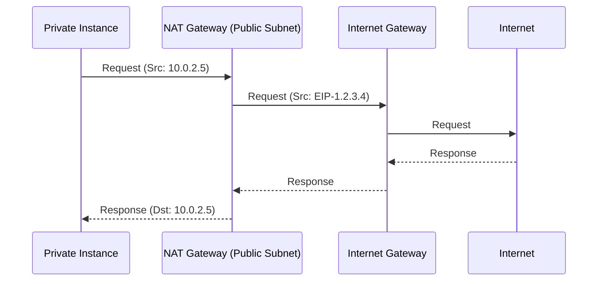

# Internet and NAT Gateways

Gateways are the doors that allow traffic to enter and exit your Virtual Private Cloud. Without them, your VPC is an isolated island.

## 🌐 Internet Gateway (IGW)

An Internet Gateway is a horizontally scaled, redundant, and highly available VPC component that allows communication between your VPC and the internet.

### Key Characteristics
-   **One per VPC**: You can attach only one IGW to a VPC at a time.
-   **No Bandwidth Limit**: It handles as much traffic as your instances can generate.
-   **Public IP Handling**: It performs the 1-to-1 NAT for instances with public IPv4 addresses.

### Setup Steps
1.  Create an Internet Gateway.
2.  Attach it to your VPC.
3.  Add a route to your Public Subnet's Route Table: `0.0.0.0/0 -> igw-xxxx`.

---

## 🔄 NAT Gateway (Network Address Translation)

A NAT Gateway enables instances in a private subnet to connect to the internet (e.g., for software updates) or other AWS services, but prevents the internet from initiating a connection with those instances.

### Managed NAT Gateway vs. NAT Instance

| Feature | Managed NAT Gateway | NAT Instance (Legacy) |
| :--- | :--- | :--- |
| **Availability** | Highly Available (Multi-AZ implemented by user redundancy) | Dependent on single instance health |
| **Bandwidth** | Scales up to 45 Gbps automatically | Limited by EC2 instance type |
| **Maintenance** | Managed by AWS (OS updates, patches) | Managed by Customer |
| **Cost** | Hourly charge + Data processing fee | Hourly EC2 rate (can be cheaper) |
| **Security Groups** | Uses network ACLs, no Security Groups associated | Uses Security Groups |

### Architecture Flow

1.  **Private Instance** sends request to `0.0.0.0/0`.
2.  **Route Table** directs traffic to **NAT Gateway** in Public Subnet.
3.  **NAT Gateway** replaces source IP with its own Elastic IP (EIP).
4.  **IGW** sends traffic to Internet.
5.  Response follows the reverse path.

---

## 🔒 Egress-Only Internet Gateway (IPv6)

For IPv6, there is no NAT. Access is direct. To replicate the "outbound only" behavior of a private subnet for IPv6, you use an **Egress-Only Internet Gateway**.

-   **Function**: Allows outbound IPv6 traffic to the internet but blocks inbound IPv6 traffic.
-   **Restriction**: Only supports IPv6.

---

## ❓ Interview Questions

1.  **Why do I need a NAT Gateway if I have an Internet Gateway?**
    *   *Answer*: An IGW allows bidirectional traffic (in and out) for instances with Public IPs. A NAT Gateway is specifically for Private instances to initiate outbound connections without exposing them to inbound internet traffic.
2.  **Can a NAT Gateway in one AZ serve a Private Subnet in another AZ?**
    *   *Answer*: Yes, but it introduces cross-AZ data transfer costs and a single point of failure (if the NAT AZ goes down). Best practice is one NAT Gateway per AZ.
3.  **What happens if the NAT Gateway goes down?**
    *   *Answer*: Private instances lose internet access. Traffic drops. Managed NAT Gateways are highly available within an AZ, but for regional HA, use multiple NATs.

---

## 🧠 Quiz Snippet

1.  **Where must a NAT Gateway be deployed to function correctly?** `(Public Subnet)`
2.  **Does a NAT Gateway require an Elastic IP (EIP)?** `(Yes, for Public NAT Gateways)`
3.  **Maximum number of Internet Gateways per VPC?** `(One)`
4.  **How do you prevent inbound traffic on an IPv6 private subnet?** `(Egress-Only Internet Gateway)`
5.  **Does an IGW scale automatically?** `(Yes, it is highly available and scalable by design)`
