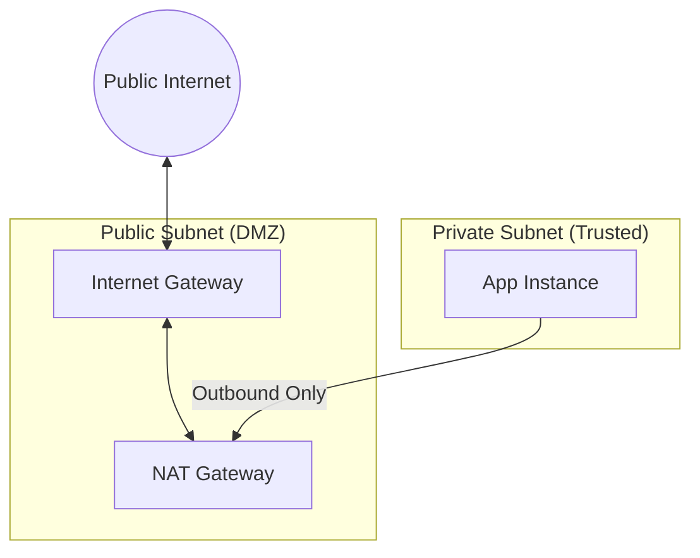

# Internet and NAT Gateways

Gateways are the doors that allow traffic to enter and exit your Virtual Private Cloud. Proper gateway design ensures that your VPC is not an isolated island while maintaining the security of your private resources.

## 📚 Learning Path

| # | Topic | Description | Key Modules |
| :--- | :--- | :--- | :--- |
| **01** | [**IGW Fundamentals**](./01-Internet-Gateway-Fundamentals/README.md) | The Edge of the VPC | Horizontal Scaling, 1-to-1 NAT |
| **02** | [**NAT Gateway Deep Dive**](./02-NAT-Gateway-Deep-Dive/README.md) | Outbound for Private Instances | EIPs, Managed vs Instances, PAT |
| **03** | [**IPv6 Egress-Only**](./03-IPv6-and-Egress-Only-Gateways/README.md) | Modern Network Security | Unidirectional IPv6, Routing |
| **04** | [**HA & Optimization**](./04-High-Availability-and-Optimization/README.md) | Professional Design | Multi-AZ NAT, Cost Control, Endpoints |

---

## 🏗️ Gateway Architecture

## Quick Start

To enable internet access for a private subnet:
1.  **Public Subnet**: Deploy a **NAT Gateway** and attach an **Elastic IP**.
2.  **Private Subnet**: Add a route `0.0.0.0/0` pointing to the `nat-xxxxxxxx` ID.
3.  **VPC Root**: Ensure an **Internet Gateway** is attached and the Public Subnet has a route to it.

Please proceed to **[01-IGW-Fundamentals](./01-Internet-Gateway-Fundamentals/README.md)**.
