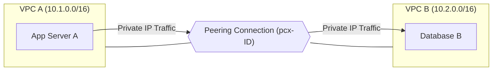
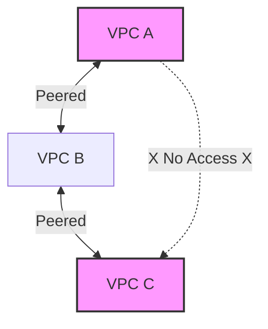

## VPC Peering: Bridging Private Networks
VPC Peering is a networking connection between two VPCs that enables you to route traffic between them using private IPv4 or IPv6 addresses. It allows instances in either VPC to communicate as if they are part of the same physical network.

---
## 🏗️ How it Works
A VPC Peering connection is a one-to-one relationship between two VPCs. You can create peering connections between your own VPCs, with a VPC in another account, or with a VPC in a different region (Inter-Region Peering).

### 📊 Peering Architecture

---

## 🚫 Critical Constraints & Rules
Understanding what VPC Peering **cannot** do is just as important as knowing what it can.

| Constraint | Explanation |
| :--- | :--- |
| **No Overlapping CIDRs** | You cannot peer VPCs with matching or overlapping IP ranges (e.g., 10.0.0.0/16 and 10.0.1.0/24). |
| **Non-Transitive** | If A is peered with B, and B is peered with C, A **cannot** communicate with C through B. |
| **Edge-to-Edge Routing** | You cannot use a peering connection to reach a VPN or Direct Connect on the other side by default. |
| **Bandwidth** | There is no aggregate bandwidth limit for peering connections; it is limited by the instance types. |

### 🧩 Visualizing Non-Transitivity

---

## 🛠️ The 4-Step Setup Process
To establish a functional peering connection, you must follow these four distinct steps:

1.  **Request**: The "Requester" VPC sends a request to the "Accepter" VPC.
2.  **Accept**: The owner of the Accepter VPC must explicitly accept the request.
3.  **RouteTable Update (CRITICAL)**: You must manually add a route in BOTH VPCs pointing to the peering connection ID (`pcx-xxxx`).
    - **VPC A RT**: `10.2.0.0/16 (VPC B) -> pcx-12345`
    - **VPC B RT**: `10.1.0.0/16 (VPC A) -> pcx-12345`
4.  **Security Groups**: Update Security Group rules to allow traffic from the peer VPC's CIDR or specific Security Group (if in the same region).

---

## 💡 Best Practices
- **Security Groups**: Always use the "Least Privilege" principle. Instead of allowing the whole CIDR, allow only specific ports from the peer VPC.
- **DNS Resolution**: Enable "DNS Resolution Support" in the peering connection options so you can use private DNS hostnames across the peer.
- **Region Awareness**: Remember that Inter-Region peering traffic travels over the public internet backbone (encrypted) but incurs data transfer costs.

---

## ❓ Interview Preparation

### Top 5 Interview Questions
1. **Explain why VPC Peering is non-transitive.**
2. **What happens if you try to peer two VPCs with the CIDR block 10.0.0.0/16?** (The request will fail/be impossible to route).
3. **If two VPCs are peered but instances can't talk, what is the most likely missing step?** (Updating the Route Tables).
4. **Does VPC Peering traffic go over the public internet?** (No, it stays within the provider's private network infrastructure, though cross-region traffic uses their global backbone).
5. **How do you overcome the non-transitive limit in a large network?** (Use a Transit Gateway).

---
## 📝 Practice Quiz
1. **VPC A is peered with VPC B. VPC B is peered with VPC C. How can VPC A talk to VPC C?**
   - [ ] Automatically via VPC B
   - [ ] Create a direct peer between VPC A and VPC C
   - [x] Enable "Transitive Route" in the settings
   - [ ] Use a NAT Gateway

2. **Which of the following is required for a peering connection to work?**
   - [ ] Internet Gateway
   - [ ] Public IP address
   - [x] Route Table entry for the peer's CIDR
   - [ ] VPN Gateway

3. **VPC Peering can be established across:**
   - [ ] Different Accounts only
   - [ ] Different Regions only
   - [x] Different Accounts and Different Regions
   - [ ] Only VPCs in the same account

---

## 🏢 Real-Life Scenario: The Shared Services Hub
**Requirement**: A company has 10 different production VPCs, each needing access to a single "Shared Services" VPC (containing Logging, Monitoring, and Jenkins).

**Solution**:
1. Create a **Hub-and-Spoke** model.
2. Peer each of the 10 Production VPCs (Spokes) directly to the Shared Services VPC (Hub).
3. Important: None of the Production VPCs can talk to each other through the Hub (due to non-transitivity). If they need local communication, they would need their own direct peers or a Transit Gateway.

