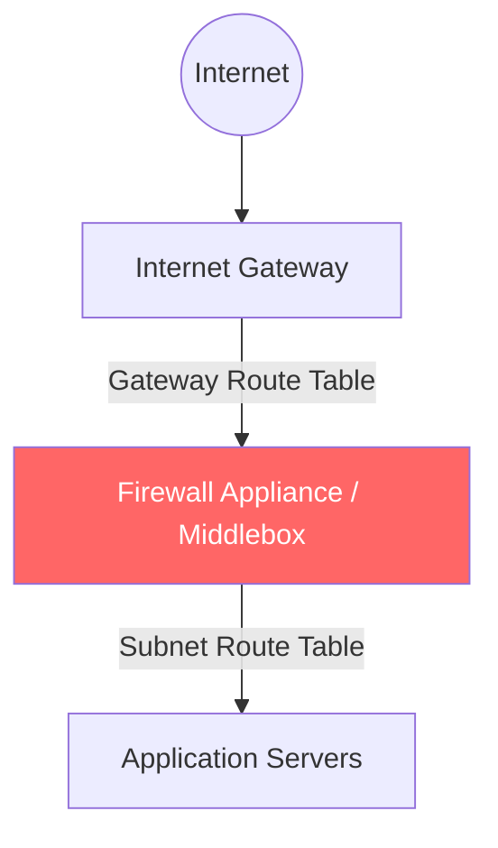

# 03. Gateway Routing and Middleboxes

Advanced VPC architectures often require traffic to pass through a "Middlebox" (like a firewall, IDS/IPS, or proxys) before it reaches its final destination. This is achieved using **Gateway Route Tables** and ingress routing.

## The "Bump-in-the-wire" Pattern

In this pattern, you intercept traffic coming from the internet at the **Internet Gateway** level and redirect it to a security appliance instead of letting it go straight to the subnet.

### 1. Gateway Route Tables
A Gateway Route Table is a special type of route table that you associate with an **Internet Gateway** or a **Virtual Private Gateway**.
*   **Purpose**: Control where traffic goes as it **enters** the VPC from the outside world.
*   **Target**: Typically a Network Interface (ENI) of an EC2 instance running a security appliance.

### 2. The Appliance Subnet
Best practice is to put your middlebox appliances in a dedicated "Appliance Subnet" to isolate security processing from application logic.

---

## Traffic Mirroring

For deep packet inspection without slowing down the primary traffic flow, AWS offers **VPC Traffic Mirroring**.
*   **Out-of-band**: It copies traffic from an elastic network interface (ENI) and sends it to a monitoring appliance.
*   **No Latency**: Because it is a copy, the primary traffic flow is unaffected even if the monitoring appliance is busy.

---

## Real-Life Scenarios

### Scenario 1: "The IDS Gatekeeper"
**Problem**: A financial company required that all incoming traffic from the internet must be scanned for malware by a third-party Intrusion Detection System (IDS) before reaching the web servers.
**Solution**: 
1.  Created a **Gateway Route Table** for the Internet Gateway.
2.  Added a route: `10.0.1.0/24 (Web Subnet) -> eni-IDS`.
*   Result: Traffic destined for the web servers was "forced" through the IDS appliance first.

### Scenario 2: "East-West Security"
**Problem**: Management wanted to inspect traffic moving *between* two internal subnets (East-West traffic).
**Discovery**: Subnet route tables can point traffic destined for another internal subnet to an appliance ENI.
**Solution**: Updated the Private Subnet A route table: `10.0.2.0/24 (Subnet B) -> eni-Firewall`.
*   Result: All cross-subnet traffic was intercepted and filtered by the firewall.

### Scenario 3: "Transparent Inspection"
**Problem**: A troubleshooting team needed to see exactly what was happening inside an encrypted SSL stream without breaking the production connection.
**Solution**: Enabled **Traffic Mirroring**. They mirrored the ENI of the suspicious server to a Wireshark instance in a separate management VPC.

---

## ❓ Interview Questions

1. **What is a Gateway Route Table?**
    - A route table associated with an IGW or VGW to control ingress traffic flow.
2. **Where do you attach a Gateway Route Table?**
    - To the Internet Gateway (IGW) or Virtual Private Gateway (VGW).
3. **What is a Middlebox?**
    - A network appliance (usually an EC2 instance) that sits between the source and destination to provide services like firewalling or load balancing.
4. **How do you intercept traffic going TO a specific subnet from the internet?**
    - By adding a route for that subnet's CIDR in the Gateway Route Table, pointing to a security appliance ENI.
5. **Does Traffic Mirroring slow down the production application?**
    - No, it is "out-of-band" and does not impact the primary traffic path.
6. **What is an ENI?**
    - Elastic Network Interface; the virtual network card attached to an EC2 instance.
7. **Can you route traffic between subnets through a firewall?**
    - Yes, by updating the subnet route tables to point the destination CIDR to the firewall's ENI.
8. **What is 'North-South' traffic?**
    - Traffic moving between the VPC and the external internet (via IGW).
9. **What is 'East-West' traffic?**
    - Traffic moving between different subnets or resources inside the same VPC/network.
10. **Do you need a NAT Gateway for ingress routing to work?**
    - No, ingress routing is primarily for traffic entering through the IGW.

---

## 🧠 Quiz

1. **Gateway Route Tables are associated with:**
    - [x] Internet Gateway
    - [ ] EC2 Instance
2. **To redirect traffic to a firewall, use target:**
    - [x] Network Interface (eni-xxxx)
    - [ ] User ID
3. **In-band inspection means traffic:**
    - [x] Passes through the appliance
    - [ ] Is copied to the appliance
4. **VPC Traffic Mirroring is:**
    - [x] Out-of-band
    - [ ] In-band
5. **Ingress traffic means traffic:**
    - [x] Entering the VPC
    - [ ] Leaving the VPC
6. **ENI stands for:**
    - [x] Elastic Network Interface
    - [ ] Enhanced Network Interconnect
7. **Gateway Route Tables allow control of:**
    - [x] North-South Traffic
    - [ ] Internal CPU usage
8. **Typical target for Gateway routing:**
    - [x] ENI of an appliance
    - [ ] S3 Bucket
9. **IDS stands for:**
    - [x] Intrusion Detection System
    - [ ] Internal Data Storage
10. **Transparent inspection uses:**
    - [x] Traffic Mirroring
    - [ ] Gateway RTs
11. **Redirecting Subnet A to Subnet B via a firewall is:**
    - [x] East-West routing
    - [ ] North-South routing
12. **Can you attach a Gateway RT to a Subnet?**
    - [x] No
    - [ ] Yes
13. **Benefit of a dedicated Appliance Subnet:**
    - [x] Isolation and security
    - [ ] Faster internet
14. **Middleboxes are usually:**
    - [x] EC2 Instances
    - [ ] Lambda functions
15. **Does IGW support multiple Gateway RTs?**
    - [x] No (Only one can be associated)
    - [ ] Yes
16. **Traffic Mirroring target can be:**
    - [x] Network Load Balancer
    - [ ] S3 bucket
17. **Gateway Routing was introduced to support:**
    - [x] Virtual Appliances/Firewalls
    - [ ] Better ping times
18. **Can you route specific ports in a route table?**
    - [x] No (Only IP ranges)
    - [ ] Yes
19. **If the firewall instance dies, ingress traffic is:**
    - [x] Dropped (if it's the next hop)
    - [ ] Automatically bypassed
20. **Most common use for VGW route tables:**
    - [x] Inspecting VPN/Direct Connect traffic
    - [ ] Speeding up S3 access