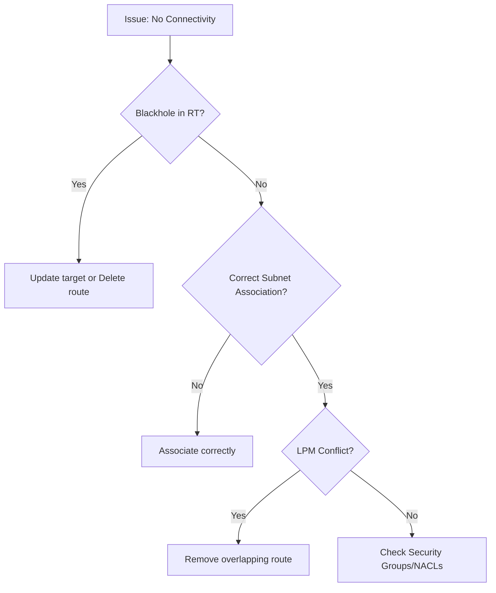

# 04. Troubleshooting and Blackholes

Even a perfect network can fail if the destination targets of your routes are deleted or misconfigured. In AWS, this often leads to a "Blackhole" status in the route table.

## What is a Blackhole Route?

A route enters **Blackhole** status when its target is no longer available or has been deleted. Traffic sent to a blackhole route is silently dropped by the VPC router.

### Common Causes of Blackholes:
*   A **NAT Gateway** was deleted but the route table still points to its ID.
*   A **VPC Peering Connection** was deleted by the partner side.
*   An **EC2 Instance** (acting as a NAT or Firewall) was terminated.
*   A **Virtual Private Gateway (VGW)** was detached or deleted.

---

## Step-by-Step Troubleshooting Flow

If an instance cannot communicate with a specific destination:

1.  **Check Route Table Status**: Look for the "Blackhole" tag in the VPC console.
2.  **Verify Association**: Ensure the subnet is actually associated with the route table you *think* it is.
3.  **LPM Validation**: Is there a more specific route (`/32` or `/24`) stealing the traffic?
4.  **Security Group / NACL**: If routing is fine, check the firewalls.
5.  **VPC Flow Logs**: Analyze the logs to see if traffic is even reaching the gateway.

---

## Real-Life Scenarios

### Scenario 1: "The Silent Drop"
**Problem**: Suddenly, all servers in the private subnet lost internet access. The DevOps engineer checked the NAT Gateway and it appeared to be "Deleted".
**Discovery**: A script had accidentally decommissioned the production NAT Gateway.
**Result**: The Route Table showed `0.0.0.0/0 -> nat-007 (Blackhole)`.
**Solution**: Created a new NAT Gateway and updated the route table with the new ID.

### Scenario 2: "The Partner Side Deletion"
**Problem**: A cross-company database sync failed. The local peering connection looked "Active" in the VPC dashboard.
**Discovery**: The partner company had deleted the peering connection on their side.
**Result**: Because the connection was gone, the local route table went into Blackhole status.
**Solution**: Re-established peering and updated the static route.

### Scenario 3: "The Route Table Confusion"
**Problem**: An instance in Subnet A had a route to the IGW, but still couldn't reach the web.
**Discovery**: The engineer was looking at the "Public RT", but Subnet A was actually implicitly associated with the "Main RT" which had no internet route.
**Solution**: Explicitly associated Subnet A with the "Public RT".

---

## ❓ Interview Questions

1. **What does the status 'Blackhole' mean in a route table?**
    - It means the target resource (like a NAT Gateway or ENI) has been deleted or is otherwise unavailable.
2. **How do you fix a Blackhole route?**
    - Either delete the route or update it to point to a new, valid target.
3. **Does a Blackhole route still follow Longest Prefix Match?**
    - Yes. If it is the most specific match, traffic will go to it and be dropped.
4. **How can you tell which route table a subnet is using?**
    - By looking at the 'Subnet Associations' tab of the Route Table in the VPC console.
5. **What is the first thing you check if a private instance can't talk to the internet?**
    - Check the Route Table for a `0.0.0.0/0` route pointing to an active NAT Gateway.
6. **Can a route be in 'Active' status but still fail?**
    - Yes, if the target (like an EC2 instance) is running but its OS-level firewall is blocking the traffic.
7. **What tool provides a visual path of network connectivity in AWS?**
    - **VPC Reachability Analyzer**.
8. **What happens if a route table has no route for a destination?**
    - Traffic is dropped (it doesn't enter the router).
9. **Can a static route ever override a local route?**
    - No.
10. **Does AWS notify you if a route enters Blackhole status?**
    - Not by default. You should set up CloudWatch Alarms or periodically check the console.

---

## 🧠 Quiz

1. **Blackhole status indicates:**
    - [x] Deleted or missing target
    - [ ] Network congestion
2. **Traffic sent to a blackhole is:**
    - [x] Dropped silently
    - [ ] Redirected to IGW
3. **Common cause of peering blackholes:**
    - [x] Deletion by partner
    - [ ] High latency
4. **First step in routing troubleshooting:**
    - [x] Check Route Table status
    - [ ] Restart EC2 instance
5. **If target NAT GW is deleted, the route becomes:**
    - [x] Blackhole
    - [ ] Active
6. **Tool for path analysis:**
    - [x] Reachability Analyzer
    - [ ] CloudFront
7. **LPM conflict means:**
    - [x] More specific route wins unexpectedly
    - [ ] Traffic is too fast
8. **Implicit associations are linked to:**
    - [x] Main Route Table
    - [ ] No Route Table
9. **Fix for a blackhole route:**
    - [x] Update target ID
    - [ ] Change IP address
10. **A /32 blackhole route will:**
    - [x] Drop traffic to one specific IP
    - [ ] Drop all traffic
11. **VPC Flow Logs show:**
    - [x] ACCEPT/REJECT status
    - [ ] HTML content
12. **Can an IGW enter blackhole status?**
    - [x] Yes (if detached)
    - [ ] No
13. **Routing happens BEFORE or AFTER Security Groups?**
    - [x] Before (conceptually, to reach the interface)
    - [ ] After
14. **Is Blackhole status color-coded in AWS?**
    - [x] Yes (usually Red/Warning)
    - [ ] No
15. **Status for a healthy route:**
    - [x] Active
    - [ ] Online
16. **Route Table 'local' route is always:**
    - [x] Active
    - [ ] Blackhole
17. **Can you manually set a route to Blackhole?**
    - [x] No (it's a status, not a target)
    - [ ] Yes
18. **Peering ID starts with:**
    - [x] pcx-
    - [ ] vpc-
19. **NAT Gateway ID starts with:**
    - [x] nat-
    - [ ] gw-
20. **Troubleshooting 'GPS' for VPC is:**
    - [x] Route Table
    - [ ] IAM
    )
