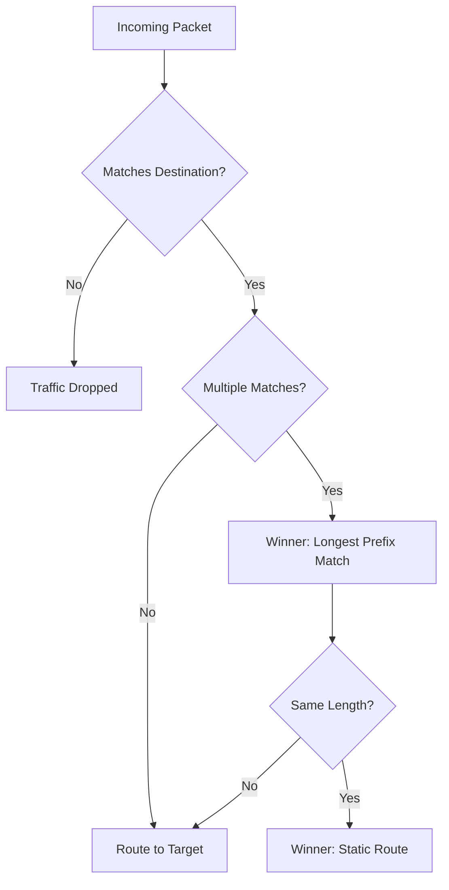

# Routing and Route Tables

Route tables are the GPS of your VPC. They determine where network traffic from your subnet or gateway is directed, ensuring packets reach their intended destination securely and efficiently.

## 📚 Learning Path

| # | Topic | Description | Key Concepts |
| :--- | :--- | :--- | :--- |
| **01** | [**Fundamentals**](./01-Route-Table-Fundamentals/README.md) | Basics of VPC Routing | Main vs Custom, Local route |
| **02** | [**Priority Logic (LPM)**](./02-Priority-Logic-LPM/README.md) | How the Router Decides | Longest Prefix Match, Origin Priority |
| **03** | [**Gateway & Middleboxes**](./03-Gateway-Routing-and-Middleboxes/README.md) | Advanced Ingress Routing | Ingress Gates, Security Appliances |
| **04** | [**Troubleshooting**](./04-Troubleshooting-and-Blackholes/README.md) | Fixing Broken Paths | Blackhole status, Diagnostic Flow |

---

## 🚦 Route Priority Decision Flow

## Quick Start

1.  **Requirement**: Connect to a partner network via Peering.
2.  **Action**: Add a route to the Partner CIDR (e.g., `172.16.0.0/16`) targeting the `pcx-xxxx` ID.
3.  **Validation**: Ensure no overlapping `/24` or `/32` routes exist that might steal the traffic.

Please proceed to **[01-Fundamentals](./01-Route-Table-Fundamentals/README.md)**.
