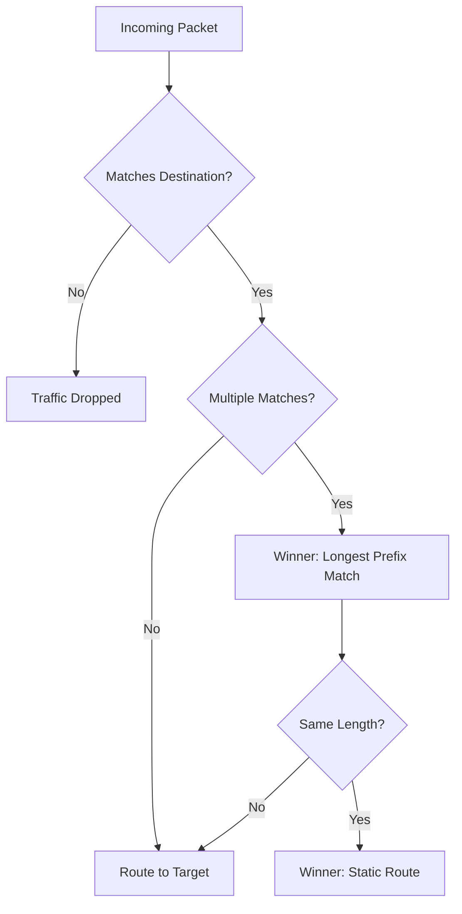

# Routing and Route Tables

Route tables are the GPS of your VPC. They determine where network traffic from your subnet or gateway is directed, ensuring packets reach their intended destination securely and efficiently.

## 📚 Learning Path

| # | Topic | Description | Key Concepts |
| :--- | :--- | :--- | :--- |
| **01** | [**Fundamentals**](./01-Route-Table-Fundamentals/README.md) | Basics of VPC Routing | Main vs Custom, Local route |
| **02** | [**Priority Logic (LPM)**](./02-Priority-Logic-LPM/README.md) | How the Router Decides | Longest Prefix Match, Origin Priority |
| **03** | [**Gateway & Middleboxes**](./03-Gateway-Routing-and-Middleboxes/README.md) | Advanced Ingress Routing | Ingress Gates, Security Appliances |
| **04** | [**Troubleshooting**](./04-Troubleshooting-and-Blackholes/README.md) | Fixing Broken Paths | Blackhole status, Diagnostic Flow |

---

## 🚦 Route Priority Decision Flow

---

## 🏗️ Real-Life Scenarios

### Scenario 1: The "Blackhole" Route Disaster
**Problem**: An engineer deleted a VPC Peering connection that was no longer needed for a staging environment.
**Crisis**: Suddenly, the production application's dashboard (hosted in a separate VPC) stopped working.
**Outcome**: The route table still had a destination entry for the dashboard's IP range, but since the peering connection was gone, the route status changed to **Blackhole**. All traffic for the dashboard was being dropped instead of finding an alternative path.
**Solution**: Route tables must be cleaned up manually when connectivity resources (Peering, TGW, VGW) are deleted. Remove the static route or update it to point to a valid target.
**Result**: The dashboard team implemented a "Connectivity Audit" script that checks for Blackhole routes every hour.

### Scenario 2: The "LPM" Routing Confusion
**Problem**: A network admin added a specific route `10.0.1.50/32` to point to a security appliance for inspection. Later, they added a broader `10.0.0.0/16` route pointing to a Transit Gateway.
**Crisis**: The security appliance stopped seeing traffic for `10.0.1.50`.
**Outcome**: The admin didn't realize that **Longest Prefix Match (LPM)** always wins. Because `/32` is more specific than `/16`, traffic for that specific host was still going to the appliance, but everything else went to the TGW. When they accidentally deleted the `/32` route, traffic started bypassing the security appliance entirely.
**Solution**: Use LPM purposefully. If you want to "Intercept" traffic for a specific sub-range, add a more specific route (e.g., `/24` or `/32`) to the route table.
**Result**: The team documented their routing "Specifics" to prevent accidental bypasses of security controls.

### Scenario 3: The "Main Route Table" Mess
**Problem**: A junior developer didn't realize that subnets automatically associate with the **Main Route Table** if no custom one is specified.
**Crisis**: They added a route for a public Internet Gateway to the Main Route Table to fix one developer's instance.
**Outcome**: Every "Private" subnet in the VPC (which were all implicitly associated with the Main table) suddenly became public-facing, exposing internal databases to the internet.
**Solution**: Always use **Custom Route Tables** for every subnet. Leave the Main Route Table with only the default `local` route as a safety measure.
**Result**: The organization implemented a CI/CD check that prevents deployment if a subnet is not explicitly associated with a custom route table.

---

## ❓ Interview Questions

1.  **What is the 'Local Route' and can it be deleted?**
    - *Answer*: The Local Route is the default entry in every route table that allows communication between all subnets within the same VPC. It matches the VPC's CIDR block. No, it **cannot be deleted or modified** in most cloud providers; it ensures internal connectivity is always preserved.
2.  **Explain the principle of 'Longest Prefix Match' (LPM).**
    - *Answer*: LPM is the rule used by routers to decide which route to take when a destination matches multiple entries. The router chooses the most specific route (the one with the longest bitmask). For example, `10.0.1.0/24` will always take precedence over `10.0.0.0/16` for traffic going to `10.0.1.5`.
3.  **What is a 'Blackhole' route and how does it occur?**
    - *Answer*: A Blackhole route is an entry in a route table where the destination is valid but the target (e.g., a peered VPC, a NAT Gateway, or a VPN) is no longer available or has been deleted. Traffic hitting a blackhole is silently dropped.
4.  **How do you enable a subnet to communicate with the internet?**
    - *Answer*: You must add a route to the subnet's route table with the destination `0.0.0.0/0` and set the target to an **Internet Gateway (IGW)** (for public subnets) or a **NAT Gateway** (for private subnets).
5.  **What is the difference between a Main Route Table and a Custom Route Table?**
    - *Answer*: The **Main Route Table** is created automatically with the VPC and becomes the default for any subnet not explicitly associated with another table. A **Custom Route Table** is created by the user to provide fine-grained control over specific subnets. Best practice is to use Custom tables for everything.
6.  **Can a single Route Table be associated with multiple subnets?**
    - *Answer*: Yes. Many subnets can share the same routing logic (e.g., all private subnets in a tier often share one route table). However, a single subnet can only be associated with **one** route table at a time.

---

## 🧠 Comprehensive Quiz (25 Questions)

**1. What is the default destination in every VPC route table?**
- A) 0.0.0.0/0
- B) The VPC CIDR (Local Route)
- C) 8.8.8.8
- D) nothing

Show Answer

**Answer: B**

**2. True/False: You can delete the 'Local' route in an AWS Route Table.**
- A) True
- B) False

Show Answer

**Answer: B**

**3. Which route wins if both match? 10.0.0.0/16 or 10.0.1.0/24?**
- A) 10.0.0.0/16
- B) 10.0.1.0/24 (Longest Prefix Match)
- C) Neither
- D) It depends on creation time

Show Answer

**Answer: B**

**4. A route destination of '0.0.0.0/0' represents:**
- A) Internal traffic
- B) The Public Internet
- C) An error
- D) nothing

Show Answer

**Answer: B**

**5. What is the status of a route if its target (PCX, IGW, etc.) is deleted?**
- A) Active
- B) Blackhole
- C) Pending
- D) Deleted

Show Answer

**Answer: B**

**6. How many subnets can be associated with a single route table?**
- A) Only 1
- B) Up to 5
- C) Multiple
- D) 0

Show Answer

**Answer: C**

**7. True/False: A subnet without an explicit association uses the Main Route Table.**
- A) True
- B) False

Show Answer

**Answer: A**

**8. Target ID prefix for an Internet Gateway in a route table is:**
- A) nat-
- B) igw-
- C) pcx-
- D) tgw-

Show Answer

**Answer: B**

**9. Target ID prefix for a VPC Peering connection is:**
- A) vgw-
- B) pcx-
- C) nat-
- D) nothing

Show Answer

**Answer: B**

**10. Which table is created automatically with every VPC?**
- A) Custom Route Table
- B) Main Route Table
- C) NACL Table
- D) nothing

Show Answer

**Answer: B**

**11. True/False: You can have different routes for the same destination in one table.**
- A) False (Destinations must be unique)
- B) True

Show Answer

**Answer: A**

**12. When using a NAT Gateway, the route destination `0.0.0.0/0` points to:**
- A) igw-xxxx
- B) nat-xxxx
- C) local
- D) nothing

Show Answer

**Answer: B**

**13. In a public subnet, the route destination `0.0.0.0/0` points to:**
- A) nat-xxxx
- B) igw-xxxx
- C) s3-xxxx
- D) nothing

Show Answer

**Answer: B**

**14. What happens to packets that don't match any route in the table?**
- A) They are sent to the internet
- B) They are dropped
- C) They go to the main table
- D) nothing

Show Answer

**Answer: B**

**15. 'Priority' in routing is determined by:**
- A) Cost
- B) Specificity (More specific = Higher priority)
- C) Name
- D) Alphabetic order

Show Answer

**Answer: B**

**16. True/False: Route tables are regional resources.**
- A) True
- B) False

Show Answer

**Answer: A**

**17. Which service allows you to connect a VPC to an On-Premises network?**
- A) Virtual Private Gateway (VGW)
- B) Internet Gateway
- C) NAT Gateway
- D) nothing

Show Answer

**Answer: A**

**18. Target ID for a Transit Gateway is:**
- A) tgw-
- B) vpc-
- C) eni-
- D) nothing

Show Answer

**Answer: A**

**19. Can you edit the 'Local' route destination?**
- A) Yes
- B) No (It is fixed to the VPC CIDR)
- C) Only if the VPC is empty
- D) nothing

Show Answer

**Answer: B**

**20. True/False: You can associate a Route Table with a Gateway.**
- A) True (Ingress Routing)
- B) False

Show Answer

**Answer: A**

**21. 'Propagation' in route tables refers to:**
- A) Viruses
- B) Automatically adding routes from a VPN or Direct Connect
- C) Deleting routes
- D) nothing

Show Answer

**Answer: B**

**22. How many 'Main' route tables can a VPC have?**
- A) 1
- B) 5
- C) unlimited
- D) 0

Show Answer

**Answer: A**

**23. Which tool can help you visualize the path of a packet through route tables?**
- A) VPC Reachability Analyzer
- B) CloudWatch
- C) IAM
- D) nothing

Show Answer

**Answer: A**

**24. A route table is most similar to a:**
- A) Phonebook
- B) Map/GPS for network packets
- C) Password manager
- D) nothing

Show Answer

**Answer: B**

**25. Reliable routing requires avoiding '_____' where traffic never reaches its destination.**
- A) Speed bumps
- B) Blackholes
- C) Green zones
- D) nothing

Show Answer

**Answer: B**

