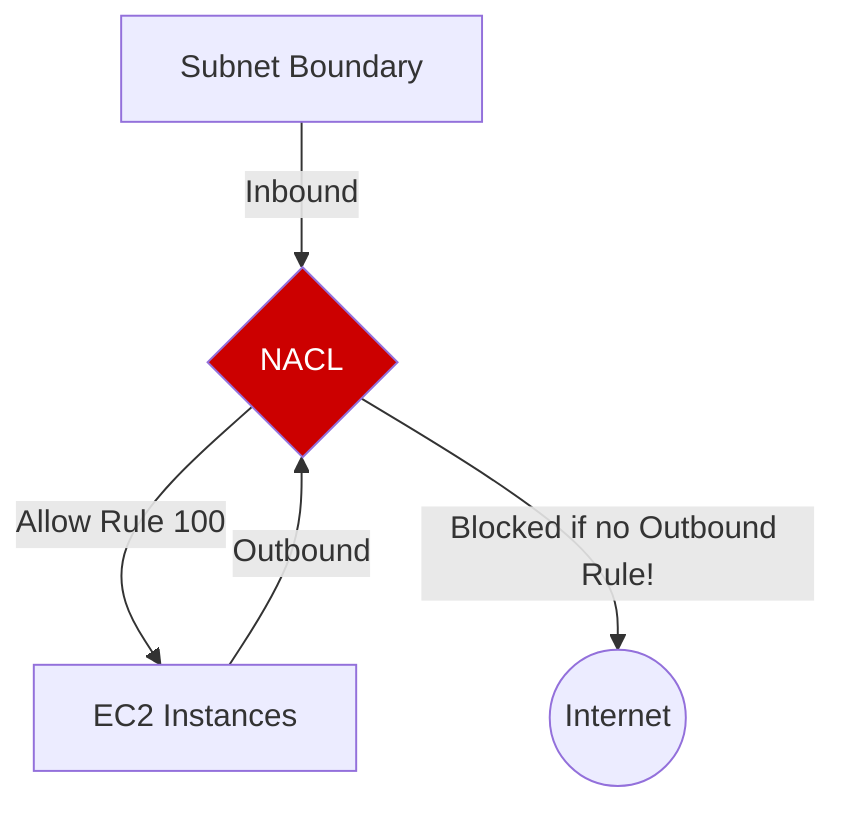

# 02. Network ACLs: Stateless Subnet Filtering

A **Network Access Control List (NACL)** is an optional layer of security for your VPC that acts as a firewall for controlling traffic in and out of one or more subnets.

## Core Characteristics

Unlike Security Groups, NACLs are **Stateless** and operate at the **Subnet Level**.

### 1. Stateless Behavior
*   **Independent Streams**: The NACL does not remember connection states. If an inbound packet is allowed, the responding outbound packet **must** be explicitly allowed in the outbound rules.
*   **Ephemeral Port Requirement**: Because return traffic often uses a random high port (1024-65535), your outbound NACL must be open to these ports for communication to succeed.

### 2. Numbered Rule Priorities
Rules are evaluated in order, starting with the **lowest numbered rule**. 
*   **Stop-on-Match**: As soon as a rule matches the traffic (Allow or Deny), AWS applies it and stops evaluating further rules.
*   **Implicit Deny**: Every NACL has a final catch-all rule (represented by an asterisk `*`) that denies all remaining traffic.

### 3. Allow AND Deny Support
Unlike Security Groups, NACLs support **Deny** rules. This makes them the primary tool for blocking specific malicious IP addresses or ranges.

---

## Comparison: Default vs. Custom

| Feature | Default NACL | Custom NACL |
| :--- | :--- | :--- |
| **Inbound Rules** | Allow All | Deny All (*) |
| **Outbound Rules** | Allow All | Deny All (*) |
| **Recommendation** | Good for getting started | Use for strict security |

---

## Real-Life Scenarios

### Scenario 1: "The Bot Blocker"
**Problem**: A website was under a DDoS attack from a specific IP range (`1.2.3.0/24`).
**Action**: The admin added Rule 50 to the Inbound NACL: `Source: 1.2.3.0/24, Protocol: ALL, Action: DENY`.
*   Result: Traffic from the botnet was dropped at the subnet gate before it even reached the web servers, saving CPU and bandwidth.

### Scenario 2: "The SSH Lockdown"
**Problem**: Company policy stated that only the company's VPN IP (`50.50.50.50`) should ever be able to SSH into the environment.
**Action**:
1. Rule 100: `Allow SSH from 50.50.50.50`.
2. Rule 200: `Deny SSH from 0.0.0.0/0`.
*   Result: Only the VPN could enter.

### Scenario 3: "The Forgotten Return Path"
**Problem**: An engineer created a custom NACL and allowed inbound traffic on port 80. Users reported "Connection Timed Out".
**Discovery**: The engineer forgot to add an outbound rule for **Ephemeral Ports**.
**Solution**: Added Outbound Rule 100: `Allow TCP 1024-65535 to 0.0.0.0/0`.
*   Result: The server could now send its response packets back to the users.

---

## ❓ Interview Questions

1. **What does 'stateless' mean?**
    - It means the firewall doesn't keep track of connections. Each packet is evaluated against the rules independently of whether it's a request or a response.
2. **What is the significance of rule numbers in NACLs?**
    - Rules are evaluated in order from lowest to highest. The first rule that matches the traffic is applied, and the rest are ignored.
3. **If Rule 100 denies Port 80 and Rule 200 allows Port 80, what happens?**
    - All Port 80 traffic is **denied** because Rule 100 matches first.
4. **How many NACLs can a subnet be associated with?**
    - Exactly one.
5. **Can a single NACL be associated with multiple subnets?**
    - Yes.
6. **What is an ephemeral port?**
    - A temporary port range (usually 1024-65535) used by the client for the return leg of a connection.
7. **Why use a NACL if I already have Security Groups?**
    - NACLs provide an extra layer of defense at the subnet level and have the unique ability to explicitly **Deny** traffic from specific IPs.
8. **What happens if a subnet is not explicitly associated with a NACL?**
    - It is automatically associated with the **Default NACL** (which allows all traffic).
9. **Where are NACL rules enforced?**
    - At the subnet boundary (not the instance).
10. **Difference between the '*' rule and other rules?**
    - The `*` rule is the default catch-all at the end of every NACL. It cannot be deleted or modified; it always denies traffic.

---

## 🧠 Quiz

1. **NACLs are:**
    - [x] Stateless
    - [ ] Stateful
2. **NACLs operate at the:**
    - [x] Subnet Level
    - [ ] Instance Level
3. **Rules are evaluated by:**
    - [x] Numerical order (lowest first)
    - [ ] Alphabetical order
4. **Once a rule matches:**
    - [x] Evaluation stops
    - [ ] It continues to the next rule
5. **NACLs support 'Deny' rules?**
    - [x] Yes
    - [ ] No
6. **Return traffic in a NACL must be:**
    - [x] Explicitly allowed
    - [ ] Handled automatically
7. **Default NACL initial rules allow:**
    - [x] All traffic
    - [ ] No traffic
8. **Custom NACL initial rules allow:**
    - [x] No traffic (except catch-all *)
    - [ ] All traffic
9. **Subnets per NACL limit:**
    - [x] Many subnets to one NACL
    - [ ] One subnet to many NACLs
10. **Catch-all rule identifier:**
    - [x] *
    - [ ] default
11. **Standard rule number step:**
    - [x] 100 (100, 200, 300)
    - [ ] 1 (1, 2, 3)
12. **Why leave gaps in rule numbers?**
    - [x] To insert future rules easily
    - [ ] For better performance
13. **Ephemeral port range for Linux/NAT:**
    - [x] 1024 - 65535
    - [ ] 1 - 1024
14. **Is NACL evaluation faster than SG?**
    - [x] Conceptually yes (happens earlier at network entry)
    - [ ] No
15. **To block a malicious IP subnet, use:**
    - [x] NACL
    - [ ] Security Group
16. **NACL CIDR destination 0.0.0.0/0 means:**
    - [x] Everywhere (Anywhere)
    - [ ] Nowhere
17. **Can a NACL reference a Security Group ID?**
    - [x] No (Only CIDR blocks)
    - [ ] Yes
18. **If a packet matches NO numbered rules:**
    - [x] It matches '*' and is denied
    - [ ] It is allowed by default
19. **If you detach a NACL from a subnet:**
    - [x] It rollbacks to Default NACL
    - [ ] The subnet has no security
20. **NACLs are a layer of defense-in:**
    - [x] Depth
    - [ ] Breadth