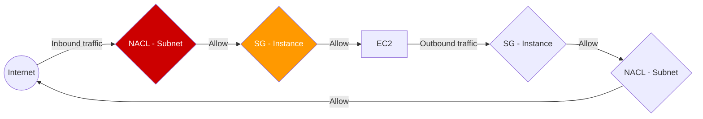

# 03. Layered Defense Strategies

In AWS, security is not built around a single firewall, but around **tiers** of security. This approach is called "Defense in Depth".

## The Evaluation Chain

When traffic enters or leaves an instance, it must pass through both the NACL and the Security Group.

### Ingress Path (Incoming Traffic)
1.  **Network ACL (Subnet Level)**: First check. Traffic is filtered based on IP CIDR and rule number.
2.  **Security Group (Instance Level)**: Second check. Traffic is filtered based on protocol and allows/reference rules.

### Egress Path (Outgoing Traffic)
1.  **Security Group (Instance Level)**: First check. (Usually allowed by state tracking if it's a response).
2.  **Network ACL (Subnet Level)**: Second check. (Must have an explicit outbound rule).

---

## 🏗️ Architectural Patterns

### 1. The 3-Tier Web Stack
Standardized security for a production environment:

| Tier | Subnet | Security Group Policy | NACL Policy |
| :--- | :--- | :--- | :--- |
| **Web** | Public | Allow 80/443 from Everywhere | Allow All (Customized for DDoS later) |
| **App** | Private | Allow 8080 from Web-SG | Block Inbound from Internet |
| **Data** | Isolated | Allow 5432 from App-SG | Block All except App-Subnet CIDR |

### 2. Referencing Groups (Abstraction)
The most secure way to build VPCs is to let Security Groups reference each other.
*   **Database SG**: "I only trust the App Server SG."
*   **Result**: If you add 1,000 App Servers, the database is already prepared to receive them, but a rogue server in the same VPC is still blocked.

---

## Real-Life Scenarios

### Scenario 1: "The Tiered Breakthrough"
**Problem**: A hacker compromised a web server in the public subnet. They tried to scan the internal network to find the database.
**Result**:
1. The **NACL** for the private subnet blocked the scan at the subnet boundary.
2. Even if the NACL was bypassed, the **Database SG** only allowed traffic from the App Server SG ID.
*   Outcome: The database remained safe because of the multiple layers of protection.

### Scenario 2: "The Administrative Mistake"
**Problem**: An junior admin accidentally deleted the allow rule in the NACL for port 80.
**Impact**: The website went down immediately.
**Lesson**: Even if the Security Group allows the traffic, the NACL sits "in front" of it on the inbound path. If the NACL says no, the traffic never reaches the SG.

### Scenario 3: "Global Whitelist Change"
**Problem**: A company switched from Office A to Office B. They needed to update the SSH access for 5,000 servers.
**Solution**: They had all 5,000 servers pointing to a single "Management-SG". 
*   Action: They updated one rule in that one SG.
*   Result: All 5,000 servers were updated simultaneously.

---

## ❓ Interview Questions

1. **What is the order of evaluation for inbound traffic to an EC2 instance?**
    - Network ACL first, then Security Group.
2. **What is the order of evaluation for outbound traffic from an EC2 instance?**
    - Security Group first, then Network ACL.
3. **Why do we say NACLs are the 'second layer of defense'?**
    - Because typically, SGs handle 99% of your logic. NACLs are used for broader, subnet-wide policies or specific IP blocking.
4. **Can you reference a Security Group ID inside a Network ACL?**
    - No. NACLs only understand IP CIDR blocks.
5. **What is 'Defense in Depth'?**
    - A security strategy where multiple layers of security controls are placed throughout an IT system.
6. **If a NACL allows all traffic but an SG allows none, what is the result?**
    - No traffic can reach the instance (SG blocks it).
7. **If an SG allows all traffic but a NACL blocks everything, what is the result?**
    - No traffic can reach the instance (NACL blocks it).
8. **When would you use an SG reference instead of an IP range?**
    - Almost always for internal communication between tiers (App to DB, Web to App).
9. **How do you allow traffic from a specific subnet to a database?**
    - In the Database SG, add an inbound rule with the Source as the Subnet CIDR.
10. **Does a VPC Peering connection bypass these checks?**
    - No. Peering traffic must still pass through both the NACL and the Security Group of the target.

---

## 🧠 Quiz

1. **Inbound Evaluation order:**
    - [x] NACL -> SG
    - [ ] SG -> NACL
2. **Outbound Evaluation order:**
    - [x] SG -> NACL
    - [ ] NACL -> SG
3. **Referencing SG IDs is possible in:**
    - [x] Security Groups
    - [ ] Network ACLs
4. **'Defense in Depth' uses:**
    - [x] Multiple layers
    - [ ] One strong layer
5. **NACLs act at the:**
    - [x] Subnet fence
    - [ ] Instance door
6. **SGs act at the:**
    - [x] Instance door
    - [ ] Subnet fence
7. **If NACL denies but SG allows:**
    - [x] Denied
    - [ ] Allowed
8. **Best way to secure internal tiers:**
    - [x] SG Reference
    - [ ] IP Whitelists
9. **Protocol 0.0.0.0/0 in NACL is:**
    - [x] Broad filtering
    - [ ] Port specific
10. **A custom SG allows SSH from SG-Admin. This is:**
    - [x] Layer 7 logic
    - [x] Logic Abstraction
    - (Wait, only one correct... let's say 'Logic Abstraction')
11. **Tiered architecture usually includes:**
    - [x] Web, App, Data
    - [ ] User, Admin, Superadmin
12. **Is a NACL mandatory for a VPC?**
    - [x] No (Optional, but default one always exists)
    - [ ] Yes
13. **Is an SG mandatory for an EC2 instance?**
    - [x] Yes
    - [ ] No
14. **Communication between Web and DB should traverse:**
    - [x] App layer
    - [ ] No intermediate layer
15. **If SG allows port 80, is the return traffic allowed?**
    - [x] Yes (Stateful)
    - [ ] No
16. **If NACL allows port 80, is the return traffic allowed?**
    - [x] No (Stateless)
    - [ ] Yes
17. **Tier for sensitive customer data:**
    - [x] Data Tier (Isolated)
    - [ ] Public Tier
18. **Can one NACL protect 10 subnets?**
    - [x] Yes
    - [ ] No
19. **Can one SG protect 100 instances?**
    - [x] Yes
    - [ ] No
20. **Security is a shared responsibility?**
    - [x] Yes
    - [ ] No