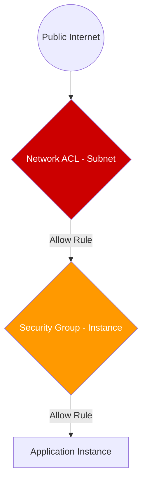

# Network Security: NACLs and Security Groups

AWS provides two layers of firewall protection for your VPC: **Security Groups** (Instance level) and **Network ACLs** (Subnet level). Understanding the layered interaction between these two is critical for architecting secure cloud environments.

## 📚 Learning Path

| # | Topic | Description | Key Concepts |
| :--- | :--- | :--- | :--- |
| **01** | [**SGs: Stateful**](./01-Security-Groups-Stateful/README.md) | The Instance-Level Firewall | State Tracking, Allow Rules, SG-IDs |
| **02** | [**NACLs: Stateless**](./02-Network-ACLs-Stateless/README.md) | The Subnet-Level Gatekeeper | Rule Numbering, Deny Rules, Ephemeral Ports |
| **03** | [**Layered Defense**](./03-Layered-Defense-Strategies/README.md) | Professional Security Design | Evaluation Order, 3-Tier Security |
| **04** | [**Troubleshooting**](./04-Advanced-Troubleshooting/README.md) | Finding the "Block" | Reachability Analyzer, Flow Logs |

---

## 🛡️ The Layered Defense Diagram

## Quick Reference

| Feature | Security Group | Network ACL |
| :--- | :--- | :--- |
| **Enforced At** | Instance (ENI) | Subnet |
| **Track State?** | Yes (Stateful) | No (Stateless) |
| **Rules Type** | Allow only | Allow & Deny |
| **Default** | Deny All | Allow All |

Please proceed to **[01-SGs-Stateful](./01-Security-Groups-Stateful/README.md)**.
