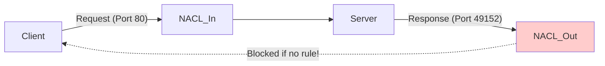

# Network Security: NACLs and Security Groups

AWS provides two layers of firewall protection for your VPC: **Security Groups** (Instance level) and **Network ACLs** (Subnet level). Understanding the difference is critical for securing your infrastructure.

## 🛡️ Security Groups (SGs)

-   **Level**: Instance Level (EC2, RDS, ALB, etc.).
-   **Behavior**: **Stateful**.
    -   If you allow an inbound request (e.g., port 80), the response is *automatically* allowed out, regardless of outbound rules.
-   **Default Rules**:
    -   Inbound: Deny All (Implicit). You must explicitly add allow rules.
    -   Outbound: Allow All.
-   **Usage**: The primary defense mechanism.

---

## 🚧 Network Access Control Lists (NACLs)

-   **Level**: Subnet Level.
-   **Behavior**: **Stateless**.
    -   If you allow inbound traffic, you must *also* explicitly allow the return traffic in the outbound rules (Ephemeral ports).
-   **Default Rules**:
    -   Default NACL: Allow All (Inbound & Outbound) to ensure connectivity.
    -   Custom NACL: Deny All (Inbound & Outbound) until rules are added.
-   **Usage**: An optional second layer of defense. Often used to block specific IPs.

---

## ⚔️ Comparison Table

| Feature | Security Group | Network ACL |
| :--- | :--- | :--- |
| **Scope** | Instance (ENI) | Subnet |
| **State** | Stateful | Stateless |
| **Rules Support** | Allow only | Allow and Deny |
| **Order of Evaluation** | All rules evaluated | Numbered order (lowest triggers first) |
| **Defense Layer** | First layer of defense | Second layer of defense |

---

## 🔢 Rule Evaluation Logic

### Security Groups
Since all rules are evaluated, order doesn't matter. If *any* rule allows the traffic, it is allowed. You cannot create a "Deny" rule in an SG.

### NACLs
Rules are numbered (e.g., 100, 200, *).
-   AWS evaluates mainly from lowest number to highest.
-   **Stop-on-match**: As soon as a rule matches the traffic, it is applied, and evaluation stops.
-   **Example**:
    -   Rule 100: Deny SSH from IP 1.2.3.4
    -   Rule 200: Allow SSH from 0.0.0.0/0
    -   **Result**: 1.2.3.4 is blocked. Everyone else is allowed.

---

## 🔒 Ephemeral Ports (The NACL Trap)

Because NACLs are stateless, return traffic must be explicitly allowed.
-   **Client Side**: When your server responds to a client request, it sends traffic to a high-numbered port (Ephemeral Port) on the client, usually `1024-65535` or `32768-61000`.
-   **Requirement**: Your Outbound NACL must allow traffic on these ephemeral ports for the response to leave the subnet.

---

## ❓ Interview Questions

1.  **I have allowed port 80 in my Security Group, but I still can't connect. What should I check?**
    *   *Answer*: Check the NACL associated with the subnet. Ensure it allows inbound port 80 AND outbound ephemeral ports. Also, check the route table and ensure the application is actually listening.
2.  **Can I block a specific IP address using a Security Group?**
    *   *Answer*: No. Security Groups only support "Allow" rules. To block an IP, you must use a Network ACL (NACL) or AWS WAF.
3.  **What is the difference between Stateful and Stateless firewalls?**
    *   *Answer*: Stateful (SG) remembers the connection state and automatically allows return traffic. Stateless (NACL) treats each packet independently, requiring explicit rules for both directions.

---

## 🧠 Quiz Snippet

1.  **Which firewall operates at the subnet level?** `(Network ACL)`
2.  **Which rule takes precedence in a NACL?** `(The one with the lowest rule number)`
3.  **If an SG has no rules, what traffic is allowed?** `(None - Implicit Deny)`
4.  **To block a malicious bot IP, which tool do you use?** `(NACL)`
5.  **What is the range of ephemeral ports for AWS NAT Gateway?** `(1024-65535)`
