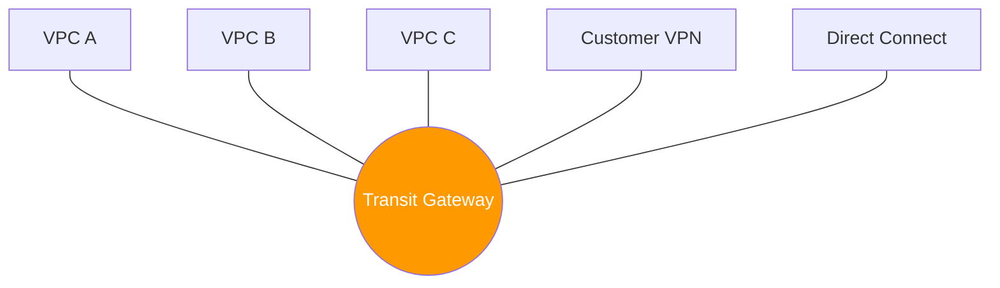

# 03. Transit Gateway Architecture

If VPC Peering is a "bridge" between two islands, **AWS Transit Gateway (TGW)** is a "central hub" connecting multiple islands, ships, and the mainland. It acts as a Regional virtual router for your VPCs and on-premise networks.

## Core Concepts

### 1. The Hub-and-Spoke Model
TGW simplifies network topology by acting as a central hub. Instead of thousands of peering connections, you have one attachment per VPC to the TGW.

### 2. TGW Attachments
To connect a resource to TGW, you create an **Attachment**.
*   **VPC Attachment**: Requires you to select one subnet per Availability Zone.
*   **VPN Attachment**: Connects a Site-to-Site VPN.
*   **Direct Connect Gateway Attachment**: Connects your on-premise backbone.
*   **Peering Attachment**: Connects two Transit Gateways (even in different regions).

### 3. Route Tables and Transitivity
TGW supports **Transitive Routing**. 
*   If VPC A and VPC B are both attached to TGW, they can talk to each other through the TGW (assuming routes are configured).
*   **Propagation**: You can configure attachments to automatically "announce" their CIDRs to the TGW Route Table.
*   **Association**: You decide which TGW Route Table an attachment "listens" to.

---

## Real-Life Scenarios

### Scenario 1: "The Mesh Tamer"
**Problem**: A growing fintech company reached 60 VPCs across 3 accounts. Their peering mesh was unmanageable, requiring hundreds of manual route updates.
**Solution**: They deployed a Transit Gateway. 
**Result**: They replaced 1,000+ peering lines with 60 TGW attachments. Routing was centralized in the TGW Route Table, reducing operational overhead by 90%.

### Scenario 2: "The Inspection VPC"
**Problem**: Security required all traffic between all VPCs to be inspected by a centralized Firewall (middle box).
**Discovery**: In Peering, you can't force traffic through a middle VPC easily.
**Solution**: With TGW, they used "Appliance Mode" and custom TGW Route Tables to point all inter-VPC traffic to a dedicated "Security VPC" before reaching its destination.

### Scenario 3: "Global Network Backbone"
**Problem**: An Enterprise needed to connect VPCs in Dublin (EU-West-1) to VPCs in Ohio (US-East-2) and their London Data Center.
**Architecture**: They created a TGW in Dublin and a TGW in Ohio, then **Peered the兩個 TGWs**.
**Result**: Traffic from the London DC reaches the Dublin TGW, hops to the Ohio TGW, and reaches the US VPCs—all over the AWS Private Backbone.

---

## ❓ Interview Questions

1. **What is the primary benefit of Transit Gateway over VPC Peering?**
    - Scalability (Hub-and-Spoke model) and support for transitive routing.
2. **What is a Transit Gateway Attachment?**
    - The connection point between TGW and a resource like a VPC, VPN, or DX Gateway.
3. **Does Transit Gateway support transitive routing?**
    - Yes, it is designed for it.
4. **How many Transit Gateways do you usually need per Region?**
    - Usually just one, though some high-isolation designs use multiple.
5. **What is 'Association' in TGW?**
    - Mapping an attachment to a specific TGW Route Table so it knows where to send incoming packets.
6. **What is 'Propagation' in TGW?**
    - TGW learning the routes (CIDRs) from an attachment and adding them to a TGW Route Table automatically.
7. **What is the bandwidth limit for a single VPC TGW attachment?**
    - Up to 50 Gbps of burstable throughput.
8. **Can TGW connect different AWS Accounts?**
    - Yes, via AWS Resource Access Manager (RAM).
9. **What is TGW Peering?**
    - Connecting two Transit Gateways, typically in different regions, to build a global network.
10. **How does TGW handle overlapping CIDRs?**
    - It uses routing table priority. However, overlapping CIDRs are still highly discouraged as they cause routing ambiguity.

---

## 🧠 Quiz

1. **Topological model of TGW:**
    - [x] Hub-and-Spoke
    - [ ] Full Mesh
2. **Component needed to share TGW across accounts:**
    - [x] AWS Resource Access Manager (RAM)
    - [ ] IAM Role
3. **Bandwidth per VPC attachment:**
    - [x] 50 Gbps
    - [ ] 10 Gbps
4. **Is TGW transitive?**
    - [x] Yes
    - [ ] No
5. **A 'Peering Attachment' connects:**
    - [x] Two Transit Gateways
    - [ ] Two VPCs
6. **TGW Route learning is called:**
    - [x] Propagation
    - [ ] Aggregation
7. **Requirement for VPC Attachment:**
    - [x] One subnet per AZ
    - [ ] One IGW
8. **Primary cost component of TGW:**
    - [x] Hourly fee per attachment + Data processing
    - [ ] Only data transfer
9. **TGW stands for:**
    - [x] Transit Gateway
    - [ ] Total Gateway
10. **To reach TGW from a VPC subnet, update:**
    - [x] VPC Route Table (Target: tgw-id)
    - [ ] NACL
11. **TGW is a _______ service:**
    - [x] Regional
    - [ ] Global
12. **Can TGW connect to a VPN?**
    - [x] Yes
    - [ ] No
13. **Routing logic in TGW is managed by:**
    - [x] TGW Route Tables
    - [ ] Security Groups
14. **Appliance Mode is used for:**
    - [x] Centralized firewalls/IPS
    - [ ] Public internet access
15. **Maximum VPC attachments per TGW:**
    - [x] 5,000
    - [ ] 50
16. **Does TGW support IPv6?**
    - [x] Yes
    - [ ] No
17. **If Association is missing:**
    - [x] Packets are dropped
    - [ ] Packets go to default route
18. **TGW Peering across regions uses:**
    - [x] AWS Global Backbone
    - [ ] Public Internet
19. **Default TGW Route Table is created:**
    - [x] Automatically with TGW
    - [ ] Manually
20. **TGW attachment ID prefix:**
    - [x] tgw-attach-
    - [ ] pcx-