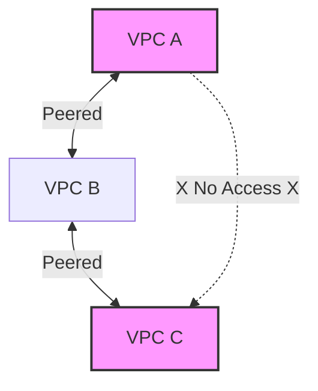
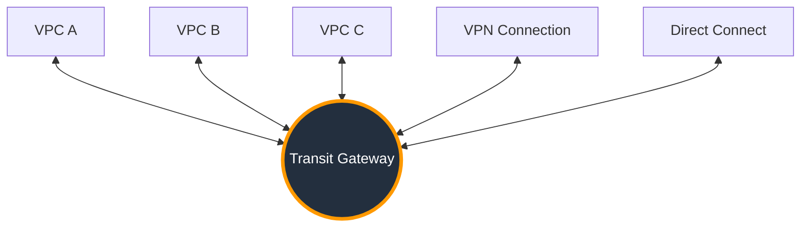

# VPC Peering and Transit Gateway

Connecting VPCs is essential for modern cloud architectures. You have two primary methods: **VPC Peering** (1:1 connection) and **Transit Gateway** (Hub-and-Spoke).

## 🤝 VPC Peering

VPC Peering is a networking connection between two VPCs that enables you to route traffic between them using private IPv4 or IPv6 addresses.

### 🚫 Critical Constraints
1.  **No Overlapping CIDRs**: You cannot peer `10.0.0.0/16` with `10.0.0.0/16`.
2.  **Non-Transitive**: If A is peered with B, and B is peered with C, A **cannot** communicate with C through B.
3.  **Edge-to-Edge Routing**: You cannot use a peering connection to reach a VPN or Direct Connect on the other side.

### 🧩 Visualizing Non-Transitivity

---

## 🚇 AWS Transit Gateway (TGW)

As your network grows, mesh peering becomes unmanageable. **Transit Gateway** acts as a cloud router, simplifying your network architecture.

### Benefits over Peering
-   **Transitive Routing**: VPC A <-> TGW <-> VPC C works!
-   **Scalability**: Connect thousands of VPCs, VPNs, and Direct Connects.
-   **Centralized Control**: Manage all routing policies in one place.

### Architecture Comparison

| Feature | VPC Peering | Transit Gateway |
| :--- | :--- | :--- |
| **Topology** | Mesh (One-to-One) | Hub-and-Spoke (Many-to-One) |
| **Transitivity** | No | Yes |
| **Bandwidth** | No aggregate limit | 50 Gbps per attachment (burst capable) |
| **Cost** | Data Transfer only | Hourly Attachment + Data Processing |
| **Complexity** | Low (for few VPCs) | Medium (but simplifies large networks) |

---

## ❓ Interview Questions

1.  **Explain why VPC Peering is non-transitive.**
    *   *Answer*: Standard VPC peering only allows routing between the two directly connected VPCs. The VPC routing table cannot forward traffic to a third destination through a peer.
2.  **When should I choose Transit Gateway over VPC Peering?**
    *   *Answer*: Use Transit Gateway when you have a complex network (many VPCs), require transitive routing (A -> B -> C), or need to connect on-premises VPN/DX to multiple VPCs centrally.
3.  **What is the "hub-and-spoke" model?**
    *   *Answer*: A network topology where a central device (Hub/TGW) connects to multiple peripheral networks (Spokes/VPCs). Traffic flows through the hub.

---

## 🧠 Quiz Snippet

1.  **VPC A is peered with VPC B. VPC B is peered with VPC C. How can A talk to C?** `(They cannot traverse VPC B. You must peer A with C directly or use a Transit Gateway.)`
2.  **Which service supports transitive routing?** `(Transit Gateway)`
3.  **Does VPC Peering traffic traverse the public internet?** `(No)`
4.  **Can you peer VPCs in different regions?** `(Yes, Inter-Region Peering)`
5.  **What must be unique for peering to work?** `(CIDR Blocks)`
