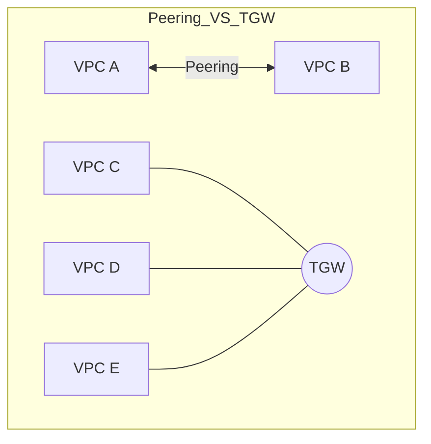

# VPC Peering and Transit Gateway

Connect your VPCs together with point-to-point peering or a centralized hub-and-spoke transit gateway. This module covers everything from the basics of virtual cables to the architecture of the "Cloud Router."

## 📚 Learning Path

| # | Topic | Description | Key Concepts |
| :--- | :--- | :--- | :--- |
| **01** | [**VPC Peering Basics**](./01-VPC-Peering-Basics/README.md) | Point-to-Point Pipelines | Request/Accept, CIDR Overlaps, Backbone |
| **02** | [**Routing & DNS**](./02-Routing-and-Security-in-Peering/README.md) | Making the Connection Work | Non-Transitivity, DNS Resolution, SG-Refs |
| **03** | [**Transit Gateway (TGW)**](./03-Transit-Gateway-Architecture/README.md) | Centralized Hub-and-Spoke | Attachments, TGW Route Tables, Peering Hubs |
| **04** | [**Optimization**](./04-Interconnectivity-Optimization/README.md) | Performance vs. Cost | $0.02/GB, MTU Limits, Scaling Architectures |

---

## 🛠️ Architecture Visualization

---

## 🏗️ Real-Life Scenarios

### Scenario 1: The "Peering Mesh" Nightmare
**Problem**: An enterprise grew from 5 VPCs to 50 VPCs. To connect them all, they used VPC Peering, creating a massive "Full Mesh" where every VPC was peered to every other VPC.
**Crisis**: Managing 1,225 peering connections and their associated route tables became impossible. Any change to one VPC required updating 49 other route tables.
**Outcome**: High human error rate, frequent network outages, and a "Frozen" infrastructure where nobody dared to touch the network settings.
**Solution**: Migrated to an **AWS Transit Gateway (TGW)**. All 50 VPCs were connected to a single central hub.
**Result**: Simplified routing (one attachment per VPC). Reduced 1,225 connections to 50, making the environment manageable and scalable.

### Scenario 2: The "Hidden TGW Bill"
**Problem**: A startup migrated from peering to Transit Gateway because they loved the management simplicity. They routed all traffic, including multi-terabyte data transfers between an S3 bucket and an EC2 fleet, through the TGW.
**Crisis**: Their AWS bill showed a surprise $40,000 monthly charge for "Transit Gateway Data Processing."
**Outcome**: The startup burned through their funding twice as fast as expected.
**Solution**: Redesigned the architecture. They used **VPC Endpoints** for S3 (free or cheap) and **VPC Peering** for the highest-volume service-to-service flows, leaving the TGW only for management and low-volume traffic.
**Result**: Network costs dropped by 85% while maintaining centralized control for the majority of services.

### Scenario 3: The "Non-Transitive" Connection Failure
**Problem**: A company peered VPC A to VPC B, and VPC B to VPC C. They expected instances in VPC A to be able to reach VPC C through VPC B.
**Crisis**: The ping failed. The network team spent 3 days debugging firewall rules and routes.
**Outcome**: The issue was a fundamental misunderstanding of VPC Peering: **It is not transitive**. You cannot hop through a VPC to reach another.
**Solution**: Peer VPC A directly to VPC C, or move to a Transit Gateway which *does* support transitive routing.
**Result**: The team switched to Transit Gateway for all multi-hop requirements, saving dozens of hours of future debugging.

---

## ❓ Interview Questions

1.  **What does 'Non-Transitive' mean in the context of VPC Peering?**
    - *Answer*: It means that if VPC A is peered to VPC B, and VPC B is peered to VPC C, VPC A cannot reach VPC C through the existing peering connections. You must create a direct peering connection between A and C, or use a Transit Gateway.
2.  **When should you choose VPC Peering over Transit Gateway?**
    - *Answer*: Use **VPC Peering** when you have a small number of VPCs (less than 10) and cost is a primary concern, or when you have extremely high-volume data transfers between two specific VPCs (Peering has no data processing fees). Use **TGW** for large-scale, complex environments with many VPCs.
3.  **Explain how DNS resolution works over a VPC Peering connection.**
    - *Answer*: By default, peering only allows IP-based communication. To resolve private DNS hostnames (like `ip-10-0-1-5.ec2.internal`), you must enable the "DNS Resolution Support" flag on the peering connection for both the requester and the accepter VPCs.
4.  **How do Transit Gateway Route Tables differ from Subnet Route Tables?**
    - *Answer*: TGW Route Tables are centralized. They use **Associations** (which TGW route table a VPC attachment uses to find its destination) and **Propagations** (how the TGW learns about a VPC's CIDR ranges). Subnet Route Tables only tell an instance how to get *out* of its subnet.
5.  **Can you peer VPCs across different AWS Regions and different Accounts?**
    - *Answer*: Yes. Both VPC Peering and Transit Gateway support Inter-Region and Inter-Account connectivity. Traffic remains on the private AWS backbone, never traversing the public internet.
6.  **What is a Transit Gateway 'Attachment'?**
    - *Answer*: An attachment is the logical connection between a resource (like a VPC, VPN, or Direct Connect) and the Transit Gateway hub. Each attachment occupies one or more ENIs in your subnets to facilitate traffic flow.

---

## 🧠 Comprehensive Quiz (25 Questions)

<b>1. VPC Peering is:</b>

Show Answer

Answer: B

<b>2. Which connectivity option has NO data processing fees?</b>

Show Answer

Answer: B

<b>3. In a Transit Gateway, 'Associations' determine:</b>

Show Answer

Answer: B

<b>4. True/False: You can peer two VPCs with the same CIDR block.</b>

Show Answer

Answer: B

<b>5. Transit Gateway uses which architectural model?</b>

Show Answer

Answer: B

<b>6. To resolve private hostnames over peering, you must enable:</b>

Show Answer

Answer: B

<b>7. True/False: Transit Gateway supports transitive routing between attached VPCs.</b>

Show Answer

Answer: A

<b>8. What is the standard bandwidth limit for a single VPC Peering connection?</b>

Show Answer

Answer: B (Limited only by instance/bandwidth quotas)

<b>9. VPC Peering traffic travels over:</b>

Show Answer

Answer: B

<b>10. How many Transit Gateways can be peered with each other?</b>

Show Answer

Answer: B

<b>11. Which option is best for connecting 100+ VPCs?</b>

Show Answer

Answer: B

<b>12. 'Propagation' in TGW means:</b>

Show Answer

Answer: B

<b>13. True/False: Security Groups can reference SGs in a peered VPC.</b>

Show Answer

Answer: A (AWS only)

<b>14. The MTU (Maximum Transmission Unit) for inter-region peering is:</b>

Show Answer

Answer: A

<b>15. Cost of an AWS Transit Gateway attachment (per hour)?</b>

Show Answer

Answer: A (Check latest pricing for exactness, but it's approximately $0.05)

<b>16. True/False: You must accept a peering request for it to become active.</b>

Show Answer

Answer: A

<b>17. Which service is essentially a 'Cloud Router'?</b>

Show Answer

Answer: B

<b>18. To connect VPC A and B via Peering, the CIDR blocks must be:</b>

Show Answer

Answer: B

<b>19. Which connectivity option allows for 'Centralized Security' (Traffic Inspection)?</b>

Show Answer

Answer: B

<b>20. True/False: Transit Gateway supports multicast traffic.</b>

Show Answer

Answer: A

<b>21. 'Requester' and 'Accepter' are terms used in:</b>

Show Answer

Answer: B

<b>22. How many 'Attachments' can a Transit Gateway have?</b>

Show Answer

Answer: B

<b>23. If two peered VPCs are in different regions, the traffic is:</b>

Show Answer

Answer: A

<b>24. VPC Peering is a _____ relationship.</b>

Show Answer

Answer: B

<b>25. Reliable connectivity is the _____ of a multi-VPC architecture.</b>

Show Answer

Answer: B

