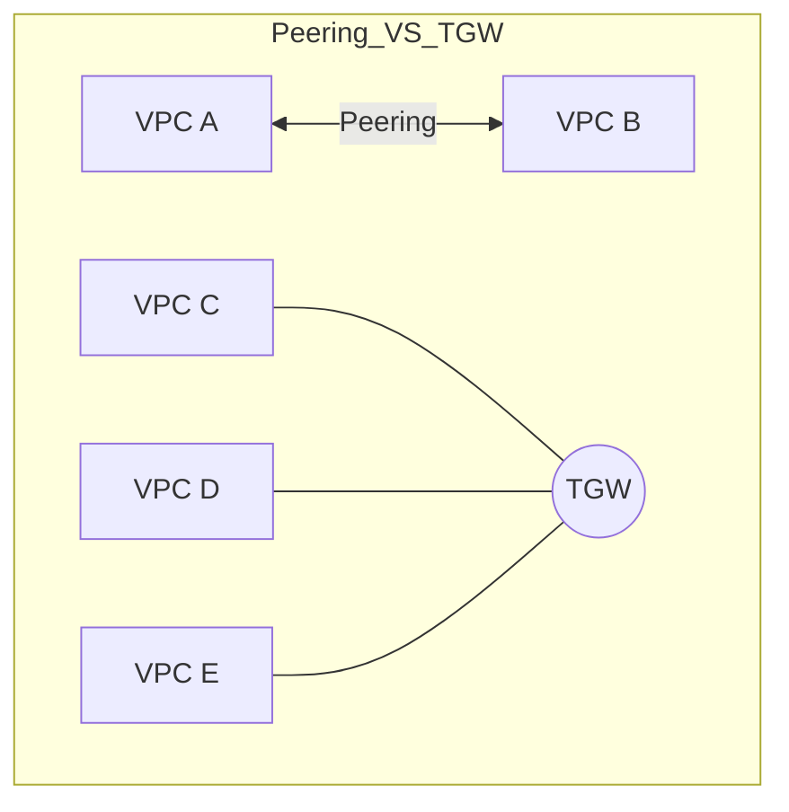

# 06. VPC Peering and Transit Gateway

Connect your VPCs together with point-to-point peering or a centralized hub-and-spoke transit gateway. This module covers everything from the basics of virtual cables to the architecture of the "Cloud Router."

## 📌 Key Concepts Covered
- **VPC Peering**: Point-to-point, non-transitive, cross-region/account.
- **Transit Gateway (TGW)**: Centralized hub, transitive routing, scalable connectivity.
- **Routing Nuances**: Non-transitivity vs Hub-and-Spoke.
- **Optimization**: Decision matrix for Peering vs TGW (Cost/Performance).

---

## 📂 Sub-Modules
1.  **[VPC Peering Basics](./01-VPC-Peering-Basics/README.md)**
    - Lifecycle (Request/Accept), CIDR constraints, and the private AWS backbone.
2.  **[Routing and Security in Peering](./02-Routing-and-Security-in-Peering/README.md)**
    - The Non-Transitive rule, DNS resolution support, and cross-VPC Security Groups.
3.  **[Transit Gateway Architecture](./03-Transit-Gateway-Architecture/README.md)**
    - Attachments, Route Table propagation/association, and the Hub-and-Spoke model.
4.  **[Interconnectivity Optimization](./04-Interconnectivity-Optimization/README.md)**
    - Performance limits (MTU/Bandwidth) and the $0.02/GB data processing fee.

---

## 🛠️ Architecture Visualization

---

## ❓ Module FAQ Snippet
**Q: Can I use Peering for high-volume data and TGW for management?**
**A**: Yes! This is a best-practice strategy to avoid TGW processing fees for your largest data flows while retaining the ease of management for the rest of your fleet.

---
[← Previous: Network Security](../05-Network-Security-NACLs-SGs/README.md) | [Next: Load Balancing →](../07-Load-Balancing-ALB-NLB/README.md)
