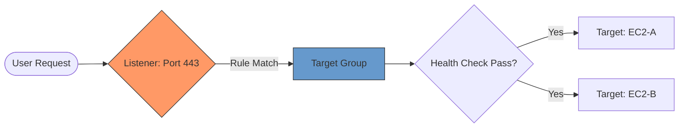

# 01. ELB Types and Fundamentals

**Elastic Load Balancing (ELB)** is a managed service that automatically distributes incoming application or network traffic across a fleet of targets, such as EC2 instances, containers, IP addresses, and Lambda functions. It is the "Traffic Cop" of your AWS architecture.

## The Evolution of ELB

AWS has evolved its load balancing offerings to handle different layers of the OSI model:

| Type | Layer | Best For | Key Feature |
| :--- | :--- | :--- | :--- |
| **ALB** | 7 (Application) | HTTP/HTTPS Traffic | Content-based routing (Path/Host) |
| **NLB** | 4 (Transport) | High Performance / TCP | static IPs, ultra-low latency |
| **GLB** | 3 (Network) | Security Appliances | Transparent inspection via GENEVE |
| **CLB** (Legacy) | 4/7 | Legacy Apps | Basic load balancing (Avoid for new apps) |

## Core Architecture Components

Every modern ELB (ALB/NLB/GLB) consists of three primary components:

1.  **Listener**: A process that checks for connection requests using a specific protocol and port.
2.  **Target Group**: A logical group of targets. It defines where the traffic should go and how to check if the destination is "healthy."
3.  **Target**: The actual resource receiving traffic (Instance ID, IP, or Lambda).

---

## Real-Life Scenarios

### Scenario 1: "The Flash Sale Spike"
**Problem**: An e-commerce site expects 1 million requests per second for a 5-minute sneaker drop.
**Discovery**: A standard ALB might take a few minutes to scale (pre-warming). The traffic spike is too "volatile" for Layer 7 processing overhead.
**Solution**: They use a **Network Load Balancer (NLB)**.
**Outcome**: Because NLB operates at Layer 4 and is designed to handle millions of requests with ultra-low latency, it handles the surge without needing to scale up manually.

### Scenario 2: "The Static IP Requirement"
**Problem**: A financial wholesaler only allows connections from whitelisted IP addresses. Our dynamic auto-scaling group keeps changing IPs.
**Solution**: Deploy an **NLB** and assign an **Elastic IP (EIP)** to each Availability Zone's subnet.
**Outcome**: The wholesaler whitelists those 2-3 static IPs, and we can scale our backend instances freely behind the NLB.

### Scenario 3: "The Layer 7 Umbrella"
**Problem**: A company has a single domain `myapp.com`. They want `/orders` to go to the Java cluster and `/images` to go to the Go cluster.
**Solution**: Use an **Application Load Balancer (ALB)** with **Path-Based Routing**.
**Outcome**: One entry point (one DNS name) intelligently routes traffic to the correct specialized microservice cluster based on the URL path.

---

## ❓ Interview Questions

1. **Which Load Balancer would you choose for millions of requests per second with high volatility?**
    - Network Load Balancer (NLB).
2. **True or False: An ALB can route traffic to a Lambda function.**
    - True.
3. **What is the primary difference between Layer 4 and Layer 7 load balancing?**
    - Layer 4 (NLB) looks at IPs and Ports. Layer 7 (ALB) looks at the actual content of the packet (Headers, Paths, Cookies).
4. **Why is Gateway Load Balancer (GLB) unique?**
    - It operates at Layer 3 and uses the GENEVE protocol to preserve the original packet while routing through a security appliance (Firewall/IDS).
5. **How does ELB ensure high availability across AZs?**
    - You must enable Cross-Zone Load Balancing (on by default for ALB).
6. **What happens if a target group has no healthy targets?**
    - The Load Balancer will typically return a 503 Service Unavailable (ALB) or reset/fail the connection (NLB).
7. **Can an NLB have a Security Group?**
    - Yes (this was a relatively recent AWS update).
8. **What is 'Connection Draining' (Deregistration Delay)?**
    - A setting that allows the LB to finish in-flight requests before removing a target from the group.
9. **Which header does the ALB use to pass the client's original IP?**
    - `X-Forwarded-For`.
10. **Does a Load Balancer protect you from DDOS?**
    - Yes, by acting as a proxy and shielding your instances from direct exposure. For advanced protection, it integrates with AWS Shield.

---

## 🧠 Quiz

1. **ALB Layers:**
    - [x] Layer 7
    - [ ] Layer 4
2. **NLB Layers:**
    - [x] Layer 4
    - [ ] Layer 3
3. **GLB Layers:**
    - [x] Layer 3
    - [ ] Layer 7
4. **Header for Client IP (ALB):**
    - [x] X-Forwarded-For
    - [ ] X-Client-ID
5. **Component that checks for request matches:**
    - [x] Listener
    - [ ] Target Group
6. **Protocol used by GLB:**
    - [x] GENEVE
    - [ ] HTTP
7. **Does NLB support Path-based routing?**
    - [x] No
    - [ ] Yes
8. **Best for HTTP/HTTPS Microservices:**
    - [x] ALB
    - [ ] NLB
9. **Requirement for HA cross-AZ:**
    - [x] Multi-AZ Subnet Selection
    - [ ] IGW
10. **Static IP support is native to:**
    - [x] NLB
    - [ ] ALB
11. **Deregistration Delay is also known as:**
    - [x] Connection Draining
    - [ ] Cold Start
12. **Health check logic lives in:**
    - [x] Target Group
    - [ ] Listener
13. **Can ALB handle TCP (non-HTTP)?**
    - [x] No
    - [ ] Yes
14. **Which ELB is deprecated/legacy?**
    - [x] Classic Load Balancer (CLB)
    - [ ] Network Load Balancer
15. **Maximum bandwidth of NLB:**
    - [x] Theoretically unlimited (scales to millions per sec)
    - [ ] 50 Gbps
16. **Can a Target be an IP address?**
    - [x] Yes
    - [ ] No
17. **If all targets are unhealthy, ALB returns:**
    - [x] 503
    - [ ] 404
18. **HTTPS Listener requires a:**
    - [x] SSL/TLS Certificate (ACM)
    - [ ] Private Key only
19. **ELB stands for:**
    - [x] Elastic Load Balancing
    - [ ] Easy Link Bridge
20. **Does ALB support gRPC?**
    - [x] Yes
    - [ ] No