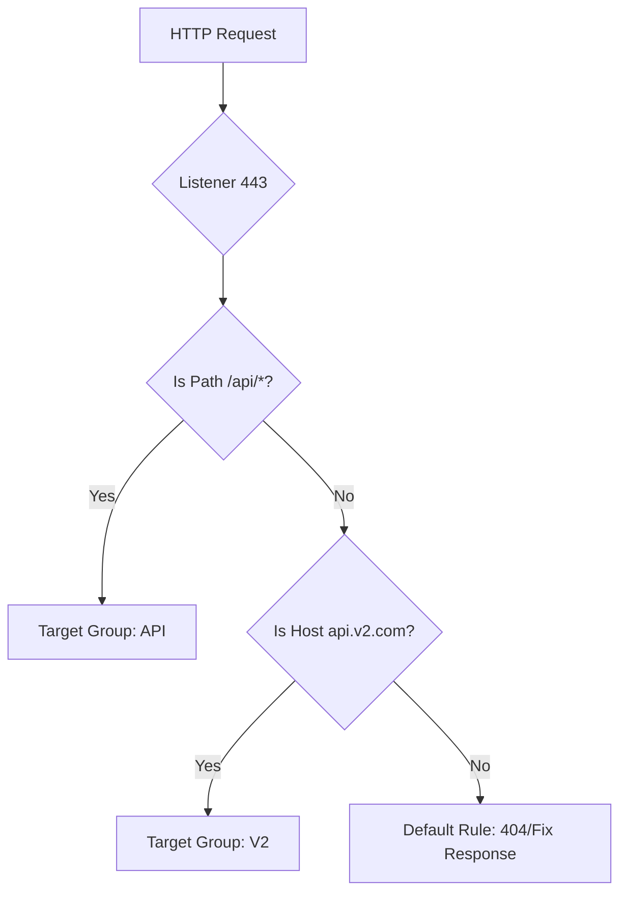

# 02. ALB Deep Dive & L7 Routing

The **Application Load Balancer (ALB)** is a highly intelligent, content-aware proxy. Because it terminates the connection and inspects the HTTP headers, it can make routing decisions that Layer 4 balancers cannot.

## How Layer 7 Routing Works

ALB evaluates "Rules" on its Listeners. Each rule consists of a **Priority**, **Conditions**, and **Actions**.

### Supported Conditions
*   **Path-based**: `/images/*`, `/login`, `/v1/*`.
*   **Host-based**: `mobile.example.com`, `admin.internal.net`.
*   **HTTP Header**: Based on custom headers like `X-User-Type`.
*   **Query String**: `?version=beta`.
*   **Source IP**: Only allow traffic from certain CIDR blocks.

---

## Technical Features

### 1. SSL/TLS Termination
ALB offloads the CPU-intensive task of decrypting HTTPS traffic from your EC2 instances.
*   **ACM Integration**: You can attach certificates from AWS Certificate Manager easily.
*   **SNI (Server Name Indication)**: Host multiple websites with different SSL certificates on a single ALB.

### 2. User Authentication
ALB can authenticate users before they even reach your application. It integrates with **Amazon Cognito** or any OIDC-compliant provider (Google, Auth0, etc.).

### 3. Native Integration with WAF
ALB integrates directly with **AWS WAF (Web Application Firewall)** to block SQL injection, Cross-Site Scripting (XSS), and bot traffic at the edge.

---

## Real-Life Scenarios

### Scenario 1: "The Microservices Umbrella"
**Problem**: An agile team has split their monolith into 5 microservices. They don't want to manage 5 different DNS names or 5 different Load Balancers (to save cost).
**Discovery**: ALB supports path-based routing.
**Solution**: 
- `myapp.com/auth` -> Auth service TG.
- `myapp.com/payments` -> Payments service TG.
- `myapp.com/catalog` -> Catalog service TG.
**Outcome**: One ALB, one certificate, and one DNS name manage the entire ecosystem.

### Scenario 2: "The Phased Rollout (Canary)"
**Problem**: A DevOps team wants to send 10% of traffic to a new "experimental" version of their app without changing DNS.
**Discovery**: ALB supports **Weighted Target Groups**.
**Solution**: Update the route rule to point to two target groups: 90% weight to `Production` and 10% weight to `Beta`.
**Outcome**: Traffic is split at the Load Balancer level, allowing for safe testing in production.

### Scenario 3: "The Forbidden Browser"
**Problem**: A legacy backend service crashes when users access it via Internet Explorer 11.
**Solution**: Create an ALB rule that checks the `User-Agent` header for "MSIE 11" and returns a **Fixed Response** (HTTP 403) with a custom message: "Please upgrade your browser."
**Outcome**: The crash-prone traffic never touches the backend.

---

## ❓ Interview Questions

1. **What is 'Path-Based Routing'?**
    - Routing traffic to different target groups based on the URL path (e.g., `/api` vs `/static`).
2. **What is 'Host-Based Routing'?**
    - Routing traffic based on the domain name in the host header (e.g., `app1.com` vs `app2.com`).
3. **What is SNI and why is it used in ALBs?**
    - Server Name Indication. it allows one ALB to serve multiple domains with different SSL certificates.
4. **How does ALB handle user sessions?**
    - Via **Sticky Sessions** (Session Affinity) using a cookie.
5. **Can an ALB authenticate users before the request reaches the server?**
    - Yes, via integration with Amazon Cognito or OIDC.
6. **What is a 'Fixed Response' rule?**
    - A rule where the ALB returns a status code and custom body (like a 404 or maintenance message) without forwarding to a target.
7. **What is the difference between a 'Forward' and a 'Redirect' action?**
    - Forward sends the packet to a target group. Redirect sends an HTTP 301/302 response to the client to visit a different URL.
8. **Does ALB support WebSockets?**
    - Yes, natively.
9. **Which component manages the SSL certificates for an ALB?**
    - AWS Certificate Manager (ACM).
10. **How many rules can you have on an ALB listener?**
    - 100 rules per listener (default limit).

---

## 🧠 Quiz

1. **Routing based on domain name:**
    - [x] Host-based
    - [ ] Path-based
2. **Routing based on /images:**
    - [x] Path-based
    - [ ] Query-based
3. **Feature for multiple SSLs on one ALB:**
    - [x] SNI
    - [ ] HSTS
4. **Weighted Target Groups are used for:**
    - [x] Canary/Blue-Green deployment
    - [ ] DNS failover
5. **Component for blocking SQL injection:**
    - [x] AWS WAF
    - [ ] AWS Shield
6. **Status code for 'Permanent Redirect':**
    - [x] 301
    - [ ] 200
7. **Maximum priority for a rule:**
    - [x] 1 (Smallest number wins)
    - [ ] 100
8. **Does ALB support HTTP/2?**
    - [x] Yes
    - [ ] No
9. **Action that returns a custom body:**
    - [x] Fixed Response
    - [ ] Redirect
10. **Authentication provider for ALB:**
    - [x] Amazon Cognito
    - [ ] IAM User
11. **Sticky sessions use:**
    - [x] Cookies
    - [ ] IP addresses
12. **Rule that triggers if no others match:**
    - [x] Default Rule
    - [ ] Catch-All
13. **Can you route based on Source IP?**
    - [x] Yes
    - [ ] No
14. **Redirects can be used to move traffic from:**
    - [x] HTTP to HTTPS
    - [ ] Private to Public
15. **ALB rule limit per listener:**
    - [x] 100
    - [ ] 10
16. **Is ALB a 'Transparent' proxy?**
    - [x] No (It terminates the connection)
    - [ ] Yes
17. **Which protocol does ALB use for internal health checks?**
    - [x] HTTP/HTTPS
    - [ ] ICMP (Ping)
18. **Rule priority order:**
    - [x] Top down (Lowest number first)
    - [ ] Bottom up
19. **Content type for Fixed Response:**
    - [x] text/plain or text/html
    - [ ] binary/stream
20. **Can you route based on Query Strings?**
    - [x] Yes
    - [ ] No