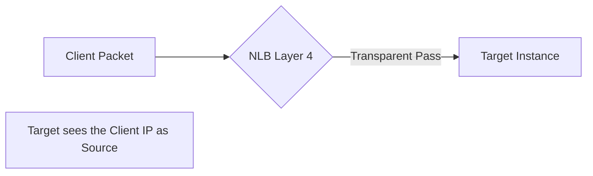
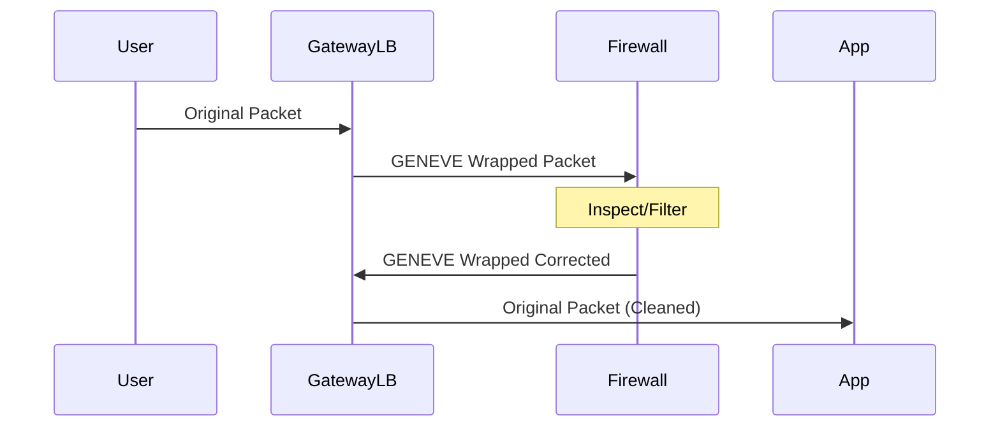

# 03. NLB and GLB Architecture

While ALB handles the complex logic of applications, **Network Load Balancer (NLB)** and **Gateway Load Balancer (GLB)** handle the raw power and security of the network layer.

---

## 🚀 Network Load Balancer (NLB)

NLB operates at Layer 4 (Transport). It is effectively a "pass-through" balancer that handles millions of requests per second with incredibly low latency.

### Key Characteristics
*   **Static IPs**: Each AZ used by the NLB gets one static IP (or Elastic IP). This is vital for whitelisting.
*   **Preserves Client IP**: Unlike ALB (which uses X-Forwarded-For), NLB passes the original client IP directly to the instance at the packet level.
*   **TCP/UDP Support**: Perfect for non-web protocols (Gaming, SIP, SMB).

---

## 🛡️ Gateway Load Balancer (GLB)

GLB is a unique beast. It operates at Layer 3 (Network) and is designed to create a "bump-in-the-wire" for security inspection.

### The GENEVE Protocol
GLB uses the **GENEVE** encapsulation protocol. 
1. The packet enters the GLB.
2. GLB wraps the original packet in a GENEVE header.
3. It sends it to a "Security Appliance" (like a Palo Alto or Fortinet firewall).
4. The appliance inspects, unwraps, and sends it back to the GLB (or to the destination).

---

## Real-Life Scenarios

### Scenario 1: "The Millions of Players"
**Problem**: A massive multiplayer online game (MMO) uses a custom UDP protocol. Millions of players connect simultaneously.
**Discovery**: ALB doesn't support UDP. 
**Solution**: Use an **NLB**.
**Outcome**: NLB handles the UDP traffic with sub-millisecond latency, ensuring players don't "lag."

### Scenario 2: "The Transparent Firewall"
**Problem**: Corporate policy requires every single packet (regardless of port or protocol) entering the VPC to be inspected by a third-party IDS (Intrusion Detection System).
**Discovery**: Setting up a proxy for every port is impossible.
**Solution**: Use a **Gateway Load Balancer**.
**Outcome**: The GLB acts as a single entry point that "forces" all traffic through a fleet of IDS instances. To the user and the application, the IDS is "invisible."

### Scenario 3: "The Fixed Whitelist"
**Problem**: An external third-party API only accepts traffic from one specific IP address.
**Solution**: Put the outgoing traffic from our fleet through an **NLB** with an **Elastic IP** assigned.
**Outcome**: The API sees the same EIP every time, even if we kill and recreate our entire backend cluster.

---

## ❓ Interview Questions

1. **What layer does NLB operate at?**
    - Layer 4 (Transport).
2. **Does NLB terminate the connection like ALB?**
    - No. It is a "pass-through" balancer.
3. **What is the primary use case for Gateway Load Balancer?**
    - Deploying and scaling virtual security appliances (Firewalls, IDS/IPS).
4. **How does NLB provide static IPs?**
    - You assign an Elastic IP to the NLB for each Availability Zone it serves.
5. **Does NLB support SSL Termination?**
    - Yes (using TLS listeners), though ALB is more common for web-specific SSL.
6. **What is GENEVE encapsulation?**
    - A protocol used by GLB to preserve administrative information (like Source/Dest) while routing traffic through third-party appliances.
7. **Difference between NLB and ALB regarding Client IP?**
    - NLB preserves Client IP in the packet source. ALB inserts Client IP into an HTTP header (`X-Forwarded-For`).
8. **Which LB is best for low-latency UDP traffic?**
    - NLB.
9. **Can you scale NLBs manually?**
    - No. AWS handles the scaling automatically, and it is capable of handling rapid, massive spikes.
10. **What is a 'Target' for a GLB?**
    - Usually an EC2 instance running security software (Virtual Appliance).

---

## 🧠 Quiz

1. **NLB stands for:**
    - [x] Network Load Balancer
    - [ ] Node Load Balancer
2. **GLB operates at Layer:**
    - [x] 3
    - [ ] 4
3. **Primary protocol for GLB:**
    - [x] GENEVE
    - [ ] TCP
4. **Benefit of NLB for whitelisting:**
    - [x] Static IPs (EIP)
    - [ ] Dynamic DNS
5. **Does NLB support UDP?**
    - [x] Yes
    - [ ] No
6. **Feature of NLB for high performance:**
    - [x] Low Latency
    - [ ] Content inspection
7. **A 'bump-in-the-wire' architecture uses:**
    - [x] Gateway Load Balancer
    - [ ] Application Load Balancer
8. **NLB is better than ALB for:**
    - [x] Volatile traffic spikes
    - [ ] Path-based routing
9. **How many EIPs can an NLB have per AZ?**
    - [x] 1
    - [ ] 10
10. **Target Group attribute for Client IP preservation (NLB):**
    - [x] proxy_protocol_v2.enabled
    - [ ] client_ip.sticky
11. **GLB targets are typically:**
    - [x] Security Appliances
    - [ ] Web Servers
12. **Protocol for NLB SSL:**
    - [x] TLS
    - [ ] HTTPS
13. **Is NLB stateful or stateless?**
    - [x] Flow-stateful (it remembers the 5-tuple)
    - [ ] Completely stateless
14. **Does GLB support multiple AZs?**
    - [x] Yes
    - [ ] No
15. **Latency of NLB is measured in:**
    - [x] Microseconds/Milliseconds
    - [ ] Seconds
16. **Static IP per AZ is a feature of:**
    - [x] NLB
    - [ ] ALB
17. **Which LB handles the GENEVE header?**
    - [x] GLB
    - [ ] NLB
18. **Can you use NLB for high-performance TCP?**
    - [x] Yes
    - [ ] No
19. **Who manages the scaling of NLB?**
    - [x] AWS (Automatic)
    - [ ] The User
20. **Can you connect an NLB to a Private Link?**
    - [x] Yes
    - [ ] No
