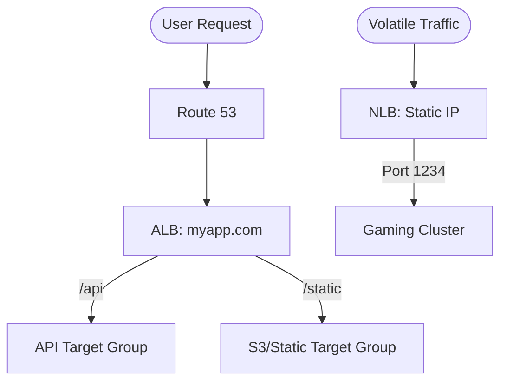

# 07. Load Balancing (ALB, NLB, GLB)

Distribute traffic, ensure high availability, and secure your applications with AWS Elastic Load Balancing. This module explores everything from simple health checks to the complex routing of microservices.

## 📌 Key Concepts Covered
- **ALB (Layer 7)**: Content-based routing, Path/Host rules, HTTP/HTTPS specialized.
- **NLB (Layer 4)**: Millions of requests/sec, static IPs, ultra-low latency.
- **GLB (Layer 3)**: Security appliance scaling and transparent inspection.
- **Optimization**: Sticky sessions, connection draining, and SSL offloading.

---

## 📂 Sub-Modules
1.  **[ELB Types and Fundamentals](./01-ELB-Types-and-Fundamentals/README.md)**
    - The "Traffic Cop" architecture: Listeners, Target Groups, and Health Checks.
2.  **[ALB Deep Dive: L7 Routing](./02-ALB-Deep-Dive-L7-Routing/README.md)**
    - Path/Host rules, WAF integration, and the "Microservices Umbrella."
3.  **[NLB and GLB Architecture](./03-NLB-and-GLB-Architecture/README.md)**
    - Low-latency TCP/UDP power and the GENEVE protocol for security.
4.  **[Advanced ELB Optimization](./04-Advanced-ELB-Optimization/README.md)**
    - Managing session state, zero-downtime draining, and ACM certificate offloading.

---

## ⚖️ Comparison at a Glance

| Factor | ALB | NLB | GLB |
| :--- | :--- | :--- | :--- |
| **Layer** | 7 (App) | 4 (Transport) | 3 (Network) |
| **Latency** | Milliseconds | Microseconds | N/A (Transparent) |
| **IP Address** | Dynamic (DNS name) | Static (EIP) | Target-dependent |
| **Routing** | Path/Host Headers | IP/Port only | Transparent pass |

---

## 🛠️ Architecture Visualization

---
[← Previous: Peering and TGW](../06-VPC-Peering-and-Transit-Gateway/README.md) | [Next: High Availability →](../08-High-Availability-and-Multi-Region/README.md)
