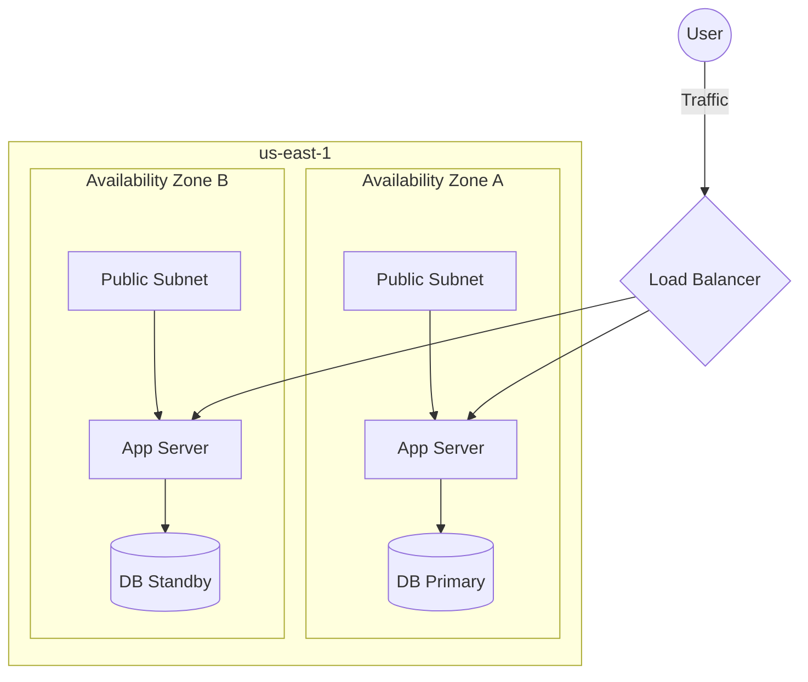

# 01. HA Fundamentals and Multi-AZ Design

**High Availability (HA)** is the ability of a system to remain operational and accessible even when individual components fail. In AWS networking, the primary tool for HA is the **Availability Zone (AZ)**.

## The Pillars of HA

### 1. Redundancy
Redundancy means having more than one of everything. In a VPC, this implies:
*   At least two subnets (one per AZ).
*   At least two NAT Gateways (one per AZ).
*   Target Groups spanning multiple AZs.

### 2. Isolation (Fault Domains)
An Availability Zone is a distinct fault domain. By spreading resources across AZs, you ensure that a flood, fire, or power outage in one location does not affect the other.

## Inter-AZ Networking Costs
While Multi-AZ is essential for HA, it is not free. 
*   **Data Transfer**: AWS typically charges for data that crosses AZ boundaries (usually $0.01 per GB in each direction).
*   **Optimization**: To save costs, keep "chatty" services (like an app and its database) in the same AZ unless you are performing a cross-AZ replication.

---

## Real-Life Scenarios

### Scenario 1: "The Single-AZ Trap"
**Problem**: A startup deployed their entire stack (Web, App, DB) in `us-east-1a`. They created a second subnet in `us-east-1b` but didn't put anything in it "to save money."
**Outcome**: `us-east-1a` experienced a 30-minute networking brownout. The startup's entire site went offline.
**Solution**: Redeployed instances into an Auto Scaling Group (ASG) spanning both AZs and moved the DB to an RDS Multi-AZ configuration.
**Result**: The site now survives single-AZ failures automatically.

### Scenario 2: "The Cascading Failure"
**Problem**: An application in AZ-A ran out of memory and started crashing. Because the Load Balancer didn't have health checks properly configured, it kept sending traffic to the dying instances.
**Discovery**: Fault isolation isn't just about location; it's about health management.
**Solution**: Implemented deep health checks (`/health` endpoint).
**Outcome**: When instances in AZ-A started failing, the LB immediately shifted 100% of the load to AZ-B, preventing a total outage.

### Scenario 3: "The NAT Gateway Bottleneck"
**Problem**: A company had one NAT Gateway in AZ-A. Subnets in AZ-B used it for internet access via a route table.
**Outcome**: AZ-A had a massive power failure. Even though the App servers in AZ-B were fine, they couldn't talk to the internet to fetch updates or talk to external APIs because their "bridge" (the NAT GW in AZ-A) was dead.
**Solution**: Deploy one NAT Gateway per AZ.

---

## ❓ Interview Questions

1. **What is the difference between an Availability Zone and a Region?**
    - A Region is a geographic area. An AZ is one or more discrete data centers with redundant power/cooling within that Region.
2. **True or False: A VPC can span multiple Regions.**
    - False. VPCs are regional.
3. **How many AZs should you use for a production workload?**
    - At least two.
4. **What is 'Cross-Zone Load Balancing'?**
    - A feature that allows a Load Balancer node in one AZ to distribute traffic to targets in all enabled AZs.
5. **Why should you have one NAT Gateway per AZ?**
    - To avoid a single point of failure. If the AZ where the NAT GW lives fails, subnets in other AZs will lose internet connectivity.
6. **What is the default data transfer cost between AZs in the same Region?**
    - Usually $0.01 per GB.
7. **How does RDS Multi-AZ work?**
    - It maintains a synchronous standby replica in a different AZ. Failover is automatic via DNS.
8. **What is a 'Fault Domain'?**
    - A section of a network/infrastructure that can fail without affecting other sections.
9. **Can you move an EC2 instance from one AZ to another?**
    - Not directly. you must create an AMI (Image) and launch a new instance from that image in the new AZ.
10. **Does Multi-AZ deployment guarantee zero downtime?**
    - No. It provides high availability, but a system-wide application bug or a global AWS service failure could still cause downtime.

---

## 🧠 Quiz

1. **Primary unit of isolation in AWS:**
    - [x] Availability Zone
    - [ ] VPC
2. **VPC is a ________ service:**
    - [x] Regional
    - [ ] Global
3. **Minimum AZs for HA:**
    - [x] 2
    - [ ] 1
4. **Data transfer between AZs cost:**
    - [x] $0.01 per GB
    - [ ] $0.05 per GB
5. **ASG spanning AZs provides:**
    - [x] High Availability
    - [ ] Disaster Recovery
6. **RDS Multi-AZ failover target:**
    - [x] Synchronous Standby
    - [ ] S3 Bucket
7. **Isolation level of an IGW:**
    - [x] Regional
    - [ ] AZ-specific
8. **Isolation level of a NAT Gateway:**
    - [x] AZ-specific
    - [ ] Regional
9. **RDS Multi-AZ failover is triggered by:**
    - [x] DNS change
    - [ ] Manual override
10. **Cross-Zone LB helps with:**
    - [x] Target imbalance
    - [ ] Cost reduction
11. **Subnets are always localized to:**
    - [x] One AZ
    - [ ] One Account
12. **Traffic between AZs in a Region uses:**
    - [x] Private AWS Network
    - [ ] Public Internet
13. **Primary goal of HA:**
    - [x] Minimize downtime
    - [ ] Zero data loss
14. **Is an Elastic IP Zonal or Regional?**
    - [x] Regional
    - [ ] Zonal
15. **To ensure NAT HA, you need:**
    - [x] NAT GW per AZ + Route table updates
    - [ ] One large NAT GW
16. **Health checks are performed by:**
    - [x] Load Balancer / Route 53
    - [ ] The OS
17. **Can a subnet span multiple AZs?**
    - [x] No
    - [ ] Yes
18. **Multi-AZ RDS protects against:**
    - [x] Hardware/AZ failure
    - [ ] Accidental 'DROP DATABASE' command
19. **If AZ-A fails, what happens to AZ-B subnets?**
    - [x] They continue to operate normally
    - [ ] They fail as well
20. **Is Inter-AZ traffic encrypted?**
    - [x] Yes (by the AWS physical layer)
    - [ ] No
