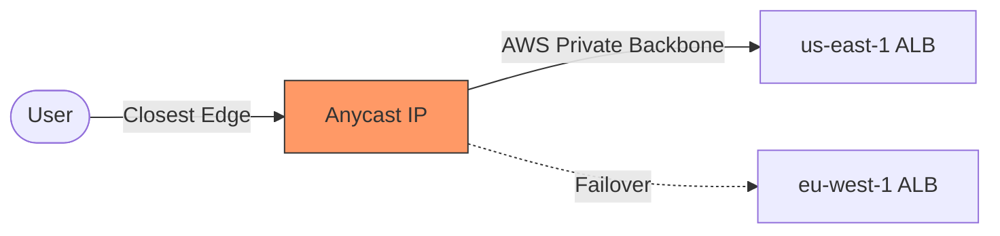

# 03. Global Accelerator and Route 53

To handle global traffic and regional failover, you need more than just a VPC. You need a Global Traffic Manager. AWS provides two primary choices: **Route 53 (DNS-based)** and **Global Accelerator (Network-based).**

## AWS Global Accelerator

**Global Accelerator (GA)** is a service that improves the availability and performance of your applications with local or global users. 

### How it Works
1.  **Static Anycast IPs**: You receive two static IP addresses that are broadcast from every AWS Edge Location globally.
2.  **The AWS Backbone**: Traffic enters the AWS network at the Edge Location closest to the user. From there, it travels over the high-speed AWS private backbone to your endpoint (ALB, NLB, or EC2).
3.  **No DNS Caching Problems**: Because the IPs are static, you don't have to wait for DNS TTLs to expire during a failover.

---

## Route 53 Global Routing

**Route 53** is a highly available and scalable DNS service. It provides several policies for global traffic:

*   **Latency-based Routing**: Routes users to the region with the lowest network latency.
*   **Geolocation Routing**: Routes users based on their physical location (e.g., all users in France go to eu-west-3).
*   **Geoproximity Routing**: Routes based on the physical distance between users and resources (using a "bias").
*   **Failover Routing**: Sends traffic to a primary region and shifts to a secondary only if health checks fail.

### The Challenge: DNS TTL
The biggest drawback of Route 53 for DR is **TTL (Time to Live)**. Even if you update a record, ISPs and browsers may cache the old "dead" IP for minutes or hours.

---

## Comparison: Global Accelerator vs. Route 53

| Feature | Global Accelerator | Route 53 |
| :--- | :--- | :--- |
| **Layer** | Network (Layer 4) | DNS (Application) |
| **Failover Speed** | Seconds | Minutes (due to TTL) |
| **IP Address** | Static Anycast IPs | Dynamic (CNAME/Alias) |
| **Backbone Path** | Rides AWS Backbone | Rides Public Internet to Region |
| **Use Case** | Fast failover, Static IPs | Standard Web, Latency routing |

---

## Real-Life Scenarios

### Scenario 1: "The Stale DNS Ghost"
**Problem**: A gaming company used Route 53 failover. When Region A went down, they switched to Region B.
**Outcome**: 30% of their players could not connect for over an hour because their local ISPs had cached the Region A DNS record.
**Solution**: Migrated to **Global Accelerator**.
**Result**: Failover now happens in under 30 seconds globally, bypassing ISP DNS caching completely.

### Scenario 2: "The TCP Jitter"
**Problem**: A financial app in London had users in Singapore experiencing high jitter and dropped TCP connections.
**Discovery**: The traffic was jumping through multiple public ISPs across the ocean.
**Solution**: Deployed **Global Accelerator**.
**Outcome**: Singapore users now hit an AWS Edge Location in Singapore. The rest of the trip to London is over the stable, private AWS backbone, reducing jitter by 60%.

### Scenario 3: "The Regional Blacklist"
**Problem**: A streaming service is only licensed to show content in the United Kingdom.
**Solution**: Used **Route 53 Geolocation Routing**.
**Outcome**: Only users with UK-based source IPs are resolved to the application endpoints. Everyone else is routed to a "Not Available" static S3 page.

---

## ❓ Interview Questions

1. **What is an 'Anycast IP'?**
    - A single IP address that is announced from multiple locations. The internet routes the user to the "closest" one.
2. **What are the two biggest benefits of Global Accelerator?**
    - Faster failover (no DNS TTL issues) and improved performance (rides the AWS backbone).
3. **True or False: Global Accelerator works with on-premise endpoints.**
    - False. It works with ALBs, NLBs, and EC2 instances within AWS.
4. **How does Route 53 'Failover' routing work?**
    - It uses Health Checks. If the primary endpoint fails the check, Route 53 returns the secondary record.
5. **Why is Global Accelerator better for VOIP or Gaming applications?**
    - Because it minimizes the "First Mile" on the public internet, reducing jitter and packet loss.
6. **Can you use both Route 53 and Global Accelerator together?**
    - Yes. You can point a Route 53 CNAME at the Global Accelerator DNS name.
7. **What is 'biased' geoproximity routing?**
    - It allows you to expand or shrink the geographic region served by a specific resource.
8. **Does Global Accelerator encrypt my traffic?**
    - No. You still need to use HTTPS/TLS on your application. GA just routes the packets.
9. **How many Anycast IPs do you get with a Global Accelerator?**
    - Two.
10. **Which Route 53 policy is best for GDPR compliance?**
    - Geolocation routing (to ensure EU users stay in EU regions).

---

## 🧠 Quiz

1. **GA uses ________ IPs:**
    - [x] Anycast
    - [ ] Unicast
2. **Layer for Global Accelerator:**
    - [x] 4
    - [ ] 7
3. **Benefit of GA over Route 53:**
    - [x] Bypasses DNS caching
    - [ ] Cheaper
4. **GA traffic rides the:**
    - [x] AWS Backbone
    - [ ] Public Internet
5. **Route 53 policy for 'lowest latency':**
    - [x] Latency Routing
    - [ ] Simple Routing
6. **Route 53 policy for 'UK only':**
    - [x] Geolocation
    - [ ] Geoproximity
7. **Number of GA IPs provided:**
    - [x] 2
    - [ ] 1
8. **GA stands for:**
    - [x] Global Accelerator
    - [ ] Global Access
9. **Is Route 53 a 'Global' service?**
    - [x] Yes
    - [ ] No
10. **Problem with long DNS TTLs:**
    - [x] Slow failover
    - [ ] Security risk
11. **GA Endpoint types:**
    - [x] ALB, NLB, EC2
    - [ ] S3, Lambda
12. **Route 53 Health Checks verify:**
    - [x] Endpoint health (HTTP/TCP)
    - [ ] CPU usage
13. **Anycast IP is broadcast from:**
    - [x] Edge Locations
    - [ ] Availability Zones
14. **Geoproximity uses a ______ to shift traffic:**
    - [x] Bias
    - [ ] Weight
15. **Standard HTTP failover in Route 53 takes:**
    - [x] Minutes
    - [ ] Seconds
16. **Standard failover in GA takes:**
    - [x] Seconds
    - [ ] Minutes
17. **Which is better for jitter-sensitive apps?**
    - [x] GA
    - [ ] Route 53
18. **Can GA route to multiple regions?**
    - [x] Yes
    - [ ] No
19. **Weight 0 in Route 53 implies:**
    - [x] No traffic
    - [ ] Full traffic
20. **Can you bring your own IP (BYOIP) to GA?**
    - [x] Yes
    - [ ] No
