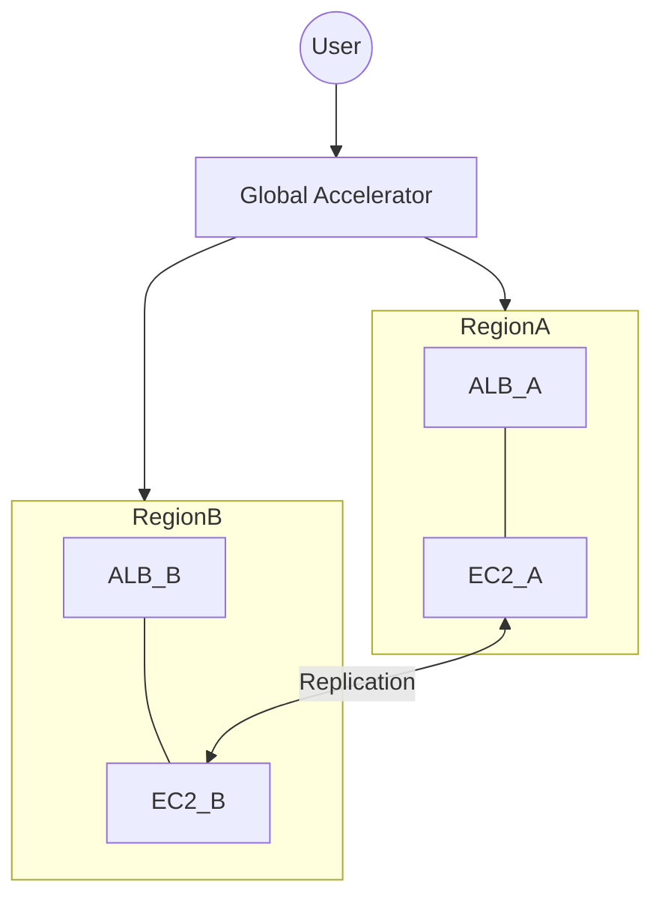

# High Availability and Multi-Region Strategies

Build resilient, fault-tolerant, and global architectures using AWS's multi-layered infrastructure. This module covers everything from Availability Zone isolation to real-time Multi-Region failover with Global Accelerator.

## 📚 Learning Path

| # | Topic | Description | Key Concepts |
| :--- | :--- | :--- | :--- |
| **01** | [**HA Fundamentals**](./01-HA-Fundamentals-Multi-AZ/README.md) | Multi-AZ Power | Redundancy, Isolation, Data Costs |
| **02** | [**DR Strategies**](./02-Disaster-Recovery-Strategies/README.md) | Planning for Failure | RTO, RPO, Pilot Light, Active-Active |
| **03** | [**Global Traffic**](./03-Global-Accelerator-and-Route53/README.md) | Global Reach | Route 53, Global Accelerator, Anycast |
| **04** | [**Global Backbone**](./04-Multi-Region-Networking/README.md) | Inter-Region Links | Peering Hubs, TGW Peering, Replication |

---

## ⚖️ DR Strategy Comparison

| Metric | Pilot Light | Warm Standby | Multi-Site |
| :--- | :--- | :--- | :--- |
| **Cost** | Low | Medium | High |
| **RTO** | Hours | Minutes | Real-time |
| **RPO** | Minutes | Seconds | Zero |

---

## 🛠️ Architecture Visualization

---

## 🏗️ Real-Life Scenarios

### Scenario 1: The "DNS TTL" Failover Failure
**Problem**: A company used Route 53 DNS failover to switch from a primary region to a secondary region.
**Crisis**: During a real regional outage, the company updated their DNS record to point to the new IP. However, 30% of their customers still couldn't access the site for 2 hours.
**Outcome**: The failure was due to aggressive **DNS Caching** at the ISP level. Even though the TTL was set to 60 seconds, some ISPs ignored it and kept the old cached IP.
**Solution**: Implement **AWS Global Accelerator**. This provides two static "Anycast" IP addresses that NEVER change. Failover happens at the network layer on the AWS backbone, bypassing DNS cache issues entirely.
**Result**: Regional failover time dropped from 2 hours to under 30 seconds globally.

### Scenario 2: The "Pilot Light" Cost-Trap
**Problem**: A financial firm implemented a "Pilot Light" DR strategy to save money. They kept the database replicated but the web servers turned off.
**Crisis**: When the primary region failed, it took the team 4 hours to launch the EC2 instances, install the software, and update the Load Balancer targets.
**Outcome**: The company exceeded its RTO (Recovery Time Objective) of 1 hour, resulting in a $500k regulatory fine.
**Solution**: Upgraded to **Warm Standby**. A minimal version of the application cluster is always running in the secondary region. Scaling up during a disaster is near-instant.
**Result**: RTO was reduced to 10 minutes, ensuring compliance for all future events.

### Scenario 3: The "Split-Brain" Database Horror
**Problem**: A gaming platform used an Active-Active multi-region architecture with asynchronous replication.
**Crisis**: A temporary network partitioning occurred between US-East-1 and US-West-2. Users in both regions updated the same character's gold balance simultaneously.
**Outcome**: When the network recovered, the database experienced "Conflict Overwrites," resulting in lost data and corrupted user states.
**Solution**: Implement **Global/Distributed Locking** or use a database like DynamoDB Global Tables that handles conflict resolution (Last Writer Wins) or strictly routed traffic based on "User Stickiness" to a single region.
**Result**: Data integrity was restored, and the team added "Conflict Resolution Logic" to their application layer.

---

## ❓ Interview Questions

1.  **What is the difference between RTO and RPO?**
    - *Answer*: **RTO (Recovery Time Objective)** is the maximum acceptable amount of time to restore a system after a failure (How long can we be down?). **RPO (Recovery Point Objective)** is the maximum acceptable amount of data loss measured in time (How much data can we lose?).
2.  **Explain the architecture of a 'Warm Standby' DR strategy.**
    - *Answer*: In Warm Standby, a scaled-down but fully functional version of your environment is always running in a second region. The database is alive and being replicated. In the event of a failure, you only need to scale up the existing instances and point traffic to the secondary Load Balancer.
3.  **Why is 'AWS Global Accelerator' better than Route 53 for global failover?**
    - *Answer*: Route 53 relies on DNS, which is subject to TTL (Time to Live) caching at client devices and ISPs. Global Accelerator uses **Anycast IPs** and failover occurs at the network layer within the AWS backbone, ensuring consistent 30-second failover regardless of client DNS settings.
4.  **How do you avoid 'Inter-AZ' data transfer costs?**
    - *Answer*: To minimize costs, try to keep traffic within the same Availability Zone whenever possible. Use "AZ-Aware" routing for Load Balancers and cross-reference which subnets your instances are in. However, never sacrifice high availability (Multi-AZ) just to save on transfer costs.
5.  **What is a 'Region' vs an 'Availability Zone' in the cloud?**
    - *Answer*: A **Region** is a separate geographic area (e.g., North Virginia). An **Availability Zone (AZ)** is one or more discrete data centers within a region, located miles apart to provide isolation from local disasters while maintaining low-latency connectivity.
6.  **Explain 'Active-Active' multi-region architecture.**
    - *Answer*: In this model, the application is serving live traffic from two or more regions simultaneously. This provides the lowest RTO (near zero) and best performance for global users, but it is the most complex and expensive to implement due to data synchronization challenges.

---

## 🧠 Comprehensive Quiz (25 Questions)

<b>1. Which metric refers to the maximum acceptable time to restore service?</b>

Show Answer

Answer: B

<b>2. True/False: Multi-AZ architecture protects against a total region failure.</b>

Show Answer

Answer: B

<b>3. Which DR strategy has the SHORTEST RTO?</b>

Show Answer

Answer: C

<b>4. AWS Global Accelerator provides how many static Anycast IP addresses?</b>

Show Answer

Answer: B

<b>5. 'Anycast' allows multiple servers to share the same IP across:</b>

Show Answer

Answer: B

<b>6. RPO refers to:</b>

Show Answer

Answer: A

<b>7. True/False: Route 53 is a Global service.</b>

Show Answer

Answer: A

<b>8. Which service is best for avoiding DNS caching issues during failover?</b>

Show Answer

Answer: B

<b>9. 'Pilot Light' DR keeps which component running at all times?</b>

Show Answer

Answer: C

<b>10. How far apart are Availability Zones typically located?</b>

Show Answer

Answer: A

<b>11. Which option is the MOST expensive DR strategy?</b>

Show Answer

Answer: C

<b>12. 'Split-Brain' is a condition where:</b>

Show Answer

Answer: B

<b>13. True/False: You pay for data transfer between Availability Zones.</b>

Show Answer

Answer: A

<b>14. A 'Region' consists of at least how many AZs?</b>

Show Answer

Answer: C

<b>15. 'Geoproximity Routing' in Route 53 sends users to:</b>

Show Answer

Answer: B

<b>16. True/False: Global Accelerator is a Layer 7 service.</b>

Show Answer

Answer: A

<b>17. What is the benefit of 'Edge Locations' for Networking?</b>

Show Answer

Answer: B

<b>18. 'Fault Tolerance' means a system can:</b>

Show Answer

Answer: B

<b>19. Which DR strategy uses the most automation?</b>

Show Answer

Answer: B

<b>20. True/False: VPCs are Global.</b>

Show Answer

Answer: A

<b>21. 'Anycast' routing is based on:</b>

Show Answer

Answer: B

<b>22. How many 'Active' regions are in a Warm Standby setup?</b>

Show Answer

Answer: B

<b>23. Data replication between regions is usually:</b>

Show Answer

Answer: B

<b>24. Multi-Region is primarily for:</b>

Show Answer

Answer: B

<b>25. A highly available network is the _____ of a resilient business.</b>

Show Answer

Answer: C

