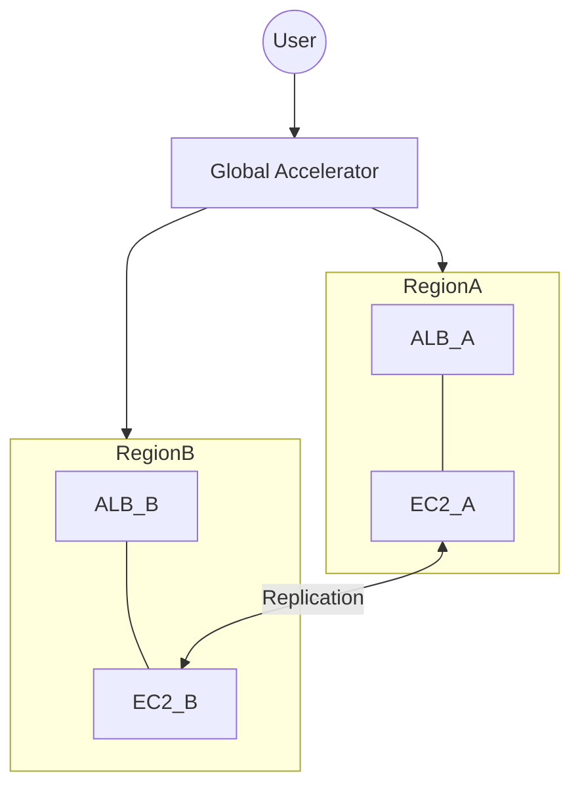

# 08. High Availability and Multi-Region Strategies

Build resilient, fault-tolerant, and global architectures using AWS's multi-layered infrastructure. This module covers everything from Availability Zone isolation to real-time Multi-Region failover with Global Accelerator.

## 📌 Key Concepts Covered
- **High Availability (HA)**: AZ isolation, redundancy, and health-managed traffic steering.
- **Disaster Recovery (DR)**: RTO/RPO metrics and patterns (Backup, Pilot Light, Warm Standby, Active-Active).
- **Global Traffic**: Route 53 policies vs Network-level Global Accelerator.
- **Global Networking**: Inter-Region Peering and Transit Gateway Peering backbones.

---

## 📂 Sub-Modules
1.  **[HA Fundamentals (Multi-AZ)](./01-HA-Fundamentals-Multi-AZ/README.md)**
    - Redundancy, isolation, inter-AZ data costs, and the "Single-AZ Trap."
2.  **[Disaster Recovery Strategies](./02-Disaster-Recovery-Strategies/README.md)**
    - Navigating the cost-recovery spectrum: Pilot Light, Warm Standby, and Active-Active.
3.  **[Global Accelerator and Route 53](./03-Global-Accelerator-and-Route53/README.md)**
    - Anycast IPs, bypassing DNS TTL issues, and the speed of the AWS private backbone.
4.  **[Multi-Region Networking](./04-Multi-Region-Networking/README.md)**
    - Building a global backbone with Inter-Region Peering and TGW Peering.

---

## ⚖️ DR Strategy Comparison

| Metric | Pilot Light | Warm Standby | Multi-Site |
| :--- | :--- | :--- | :--- |
| **Cost** | Low | Medium | High |
| **RTO** | Hours | Minutes | Real-time |
| **RPO** | Minutes | Seconds | Zero |

---

## 🛠️ Architecture Visualization

---
[← Previous: Load Balancing](../07-Load-Balancing-ALB-NLB/README.md) | [Next: Hybrid Connectivity →](../09-Hybrid-Connectivity/README.md)
