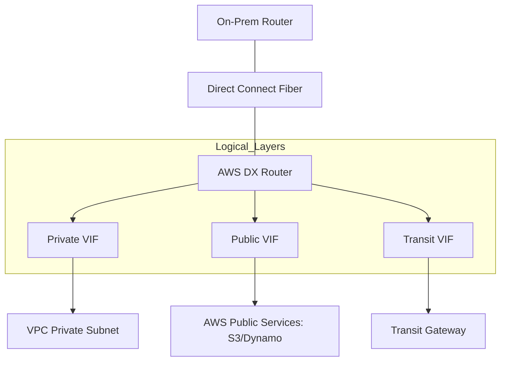

# 02. Direct Connect Deep Dive

**AWS Direct Connect (DX)** provides a dedicated, private physical fiber connection from your data center to AWS. It bypasses the public internet entirely, offering predictable performance and high security.

## The Physical Layer

1.  **Direct Connect Location**: You must have equipment in an AWS Direct Connect partner facility (Colocation center like Equinix or Digital Realty).
2.  **Cross-Connect**: A physical fiber cable is run from your rack to the AWS router rack in that facility.
3.  **802.1q VLANs**: You partition the physical connection into multiple virtual links using VLAN tags.

## Virtual Interfaces (VIFs)

To actually send traffic, you must create a **VIF**:

*   **Private VIF**: Used to access private resources (EC2, RDS) inside your VPC using their private IP addresses.
*   **Public VIF**: Used to access public AWS services (S3, DynamoDB, Glacier) without going over the internet.
*   **Transit VIF**: Used specifically to connect to a **Transit Gateway**.

## Dedicated vs. Hosted Connections

*   **Dedicated Connection**: You own the physical 1/10/100 Gbps port. You can create up to 50 VIFs.
*   **Hosted Connection**: An AWS Partner shares their bandwidth with you. You get 1 VIF (unless specified) and smaller speeds (50Mbps to 10Gbps).

---

## Real-Life Scenarios

### Scenario 1: "The S3 Speed Limit"
**Problem**: An analytics company was trying to upload 500TB of data to S3. Even with a 1Gbps VPN, it was taking weeks, and the internet jitter caused many failures.
**Solution**: Provisioned a **Direct Connect** with a **Public VIF**.
**Outcome**: The traffic stayed on a private, dedicated link. Upload speeds became consistent, and they finished the migration in days instead of weeks.

### Scenario 2: "The Colocation Confusion"
**Problem**: A client wanted DX but didn't have a rack in an AWS partner facility. 
**Solution**: They used an **AWS Partner (APN)** to provide a "Hosted Connection" from the partner's router to the client's office via a leased line.
**Outcome**: The client got the benefits of DX without the complexity of managing physical equipment in a remote data center.

### Scenario 3: "The VLAN ID Conflict"
**Problem**: A network engineer tried to set up a new Private VIF but couldn't get a BGP session established.
**Discovery**: The VLAN ID assigned by AWS was already in use on the client's local trunk port.
**Solution**: Changed the local trunk configuration to match the AWS-assigned VLAN ID (or vice versa during VIF creation).
**Outcome**: BGP session came "UP" immediately.

---

## ❓ Interview Questions

1. **What is the difference between a Private VIF and a Public VIF?**
    - Private VIF connects to a VPC (Private IPs). Public VIF connects to Public services like S3 or DynamoDB (Public IPs).
2. **Does Direct Connect provide encryption by default?**
    - No. It is a private line, but traffic is not encrypted at Layer 3 unless you add MACsec (Layer 2) or a VPN (Layer 3).
3. **What is a 'Transit VIF'?**
    - A specific VIF type used to connect Direct Connect to a Transit Gateway.
4. **How long does it typically take to provision a Dedicated Direct Connect?**
    - Weeks to months (physical cabling is involved).
5. **What is a 'Dedicated Connection'?**
    - A physical 1, 10, or 100 Gbps Ethernet port provided by AWS.
6. **What is a 'Hosted Connection'?**
    - A logical connection provided by an AWS Partner that shares their dedicated link with you.
7. **Which protocol is used for routing over Direct Connect?**
    - BGP (Border Gateway Protocol).
8. **What is a 'Cross-Connect'?**
    - The physical fiber cable connecting your router to the AWS router in a colocation facility.
9. **Can you access multiple VPCs with one Private VIF?**
    - No. One Private VIF connects to one VPC (via a VGW). For multiple VPCs, you need multiple VIFs or a **Direct Connect Gateway**.
10. **What is MACsec?**
    - An IEEE standard for Layer 2 security that provides encryption for Direct Connect at 10Gbps/100Gbps speeds.

---

## 🧠 Quiz

1. **DX bypasses the:**
    - [x] Public Internet
    - [ ] VPC
2. **VIF for S3 is:**
    - [x] Public VIF
    - [ ] Private VIF
3. **VIF for Transit Gateway is:**
    - [x] Transit VIF
    - [ ] Management VIF
4. **Physical requirement for DX:**
    - [x] Cross-Connect in Partner Facility
    - [ ] IGW
5. **Connection type where you own the port:**
    - [x] Dedicated
    - [ ] Hosted
6. **BGP is required for:**
    - [x] Dynamic routing over DX
    - [ ] Monitoring
7. **Physical speed options for dedicated DX:**
    - [x] 1, 10, or 100 Gbps
    - [ ] 100 Mbps only
8. **Layer 2 security for DX:**
    - [x] MACsec
    - [ ] IPsec
9. **Component that aggregates multiple DX VIFs:**
    - [x] Direct Connect Gateway (DXGW)
    - [ ] VGW
10. **Can you use 802.1q VLANs with DX?**
    - [x] Yes
    - [ ] No
11. **Hosted connections are provided by:**
    - [x] AWS Partners
    - [ ] AWS Support
12. **Direct Connect is ________ by default:**
    - [x] Unencrypted
    - [ ] Encrypted
13. **VLAN tag is used to:**
    - [x] Separate logical VIFs on a physical link
    - [ ] Increase speed
14. **Direct Connect SLA is usually:**
    - [x] Higher than VPN
    - [ ] Lower than VPN
15. **LOA-CFA stands for:**
    - [x] Letter of Authorization and Connecting Facility Assignment
    - [ ] Logic of Access
16. **Can you access S3 over a Private VIF?**
    - [x] No (Not without a VPC Endpoint)
    - [ ] Yes
17. **Is BGP ASN required?**
    - [x] Yes (Private or Public ASN)
    - [ ] No
18. **Number of VIFs on a Dedicated port:**
    - [x] Up to 50
    - [ ] Exactly 1
19. **Transit VIF connects to:**
    - [x] Transit Gateway
    - [ ] Internet Gateway
20. **Can you use Jumbo Frames (9001 MTU) on DX?**
    - [x] Yes
    - [ ] No