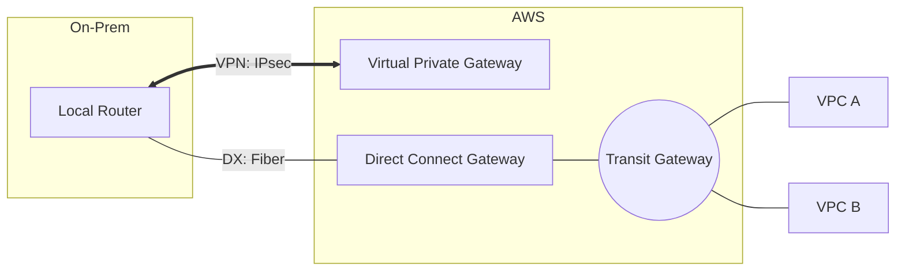

# 09. Hybrid Connectivity (VPN and Direct Connect)

Bring the power of the AWS cloud to your on-premises infrastructure. This module explores the technical details of establishing secure, private, and high-speed bridges between your data center and the VPC.

## 📌 Key Concepts Covered
- **Site-to-Site VPN**: IPsec tunnels, IKE phases, and BGP dynamic routing over the internet.
- **Direct Connect (DX)**: Dedicated fiber links, VIF types (Private/Public/Transit), and Macsec.
- **Direct Connect Gateway**: Global connectivity and scaling hybrid links to multiple VPCs.
- **Resiliency**: High availability models and BGP AS-Path prepending for failover.

---

## 📂 Sub-Modules
1.  **[VPN Site-to-Site Fundamentals](./01-VPN-Site-to-Site-Fundamentals/README.md)**
    - VGW, CGW, and the dual-tunnel architecture for HA.
2.  **[Direct Connect Deep Dive](./02-Direct-Connect-Deep-Dive/README.md)**
    - Physical cross-connects, VLAN tagging, and Public vs Private VIF logic.
3.  **[TGW and Hybrid Architectures](./03-TGW-and-Hybrid-Architectures/README.md)**
    - Leveraging Direct Connect Gateway and Transit Gateway for enterprise scale.
4.  **[Resiliency and Security in Hybrid](./04-Resiliency-and-Security-Hybrid/README.md)**
    - Multi-location models, MACsec encryption, and VPN-over-DX patterns.

---

## ⚖️ Comparison: VPN vs. Direct Connect

| Feature | Site-to-Site VPN | Direct Connect |
| :--- | :--- | :--- |
| **Path** | Public Internet | Dedicated Fiber |
| **Setup Time** | Minutes | Weeks/Months |
| **Security** | Encrypted (IPsec) | Private (Enc optional) |
| **Performance** | Variable | Consistent |
| **Throughput** | 1.25 Gbps | Up to 100 Gbps |

---

## 🛠️ Architecture Visualization

---
[← Previous: HA and Multi-Region](../08-High-Availability-and-Multi-Region/README.md) | [Next: Monitoring and Troubleshooting →](../10-Monitoring-and-Troubleshooting/README.md)
