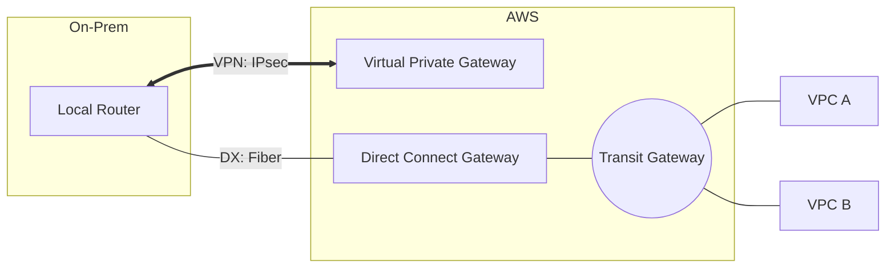

# Hybrid Connectivity (VPN and Direct Connect)

Bring the power of the AWS cloud to your on-premises infrastructure. This module explores the technical details of establishing secure, private, and high-speed bridges between your data center and the VPC.

## 📚 Learning Path

| # | Topic | Description | Key Concepts |
| :--- | :--- | :--- | :--- |
| **01** | [**VPN Fundamentals**](./01-VPN-Site-to-Site-Fundamentals/README.md) | The Internet Bridge | IPsec Tunnels, IKE, BGP Routing |
| **02** | [**Direct Connect (DX)**](./02-Direct-Connect-Deep-Dive/README.md) | Dedicated Fiber | Cross-Connects, VLANs, VIFs |
| **03** | [**Hybrid Hubs**](./03-TGW-and-Hybrid-Architectures/README.md) | Centralized Links | DX Gateway, Transit Gateway |
| **04** | [**Resiliency**](./04-Resiliency-and-Security-Hybrid/README.md) | Professional HA | Active-Passive, MACsec, VPN-over-DX |

---

## ⚖️ Comparison: VPN vs. Direct Connect

| Feature | Site-to-Site VPN | Direct Connect |
| :--- | :--- | :--- |
| **Path** | Public Internet | Dedicated Fiber |
| **Setup Time** | Minutes | Weeks/Months |
| **Security** | Encrypted (IPsec) | Private (Enc optional) |
| **Performance** | Variable | Consistent |
| **Throughput** | 1.25 Gbps | Up to 100 Gbps |

---

## 🛠️ Architecture Visualization

---

## 🏗️ Real-Life Scenarios

### Scenario 1: The "Jittery Video" Problem
**Problem**: A media company moved their video editing workstations to the cloud, but the editors in the physical office complained of "lag" and "stuttering" during 4K playback.
**Crisis**: Their existing Site-to-Site VPN was traversing the public internet, which had high data jitter and variable latency.
**Outcome**: Project deadlines were missed because the "Lag" made professional editing impossible.
**Solution**: Deployed an **AWS Direct Connect** link. By bypassing the public internet and using a dedicated fiber line, latency was reduced from 80ms (variable) to a constant 12ms.
**Result**: Editors reported that the cloud workstations felt "Local," and the project was completed on time.

### Scenario 2: The "Total Blackout" Resiliency Failure
**Problem**: An enterprise used a single Direct Connect link for all their banking transactions.
**Crisis**: A construction crew 5 miles from the data center accidentally cut the fiber optic cable belonging to the provider.
**Outcome**: The enterprise lost connectivity to the cloud for 18 hours. ATM transactions across the country failed, and the company's reputation was severely damaged.
**Solution**: Implement the **"High Resiliency" Model**. They added a second Direct Connect link at a different provider location and set up a **Site-to-Site VPN** as a "Last Resort" backup that automatically kicks in via BGP.
**Result**: When the next fiber cut occurred, the system automatically shifted 100% of the load to the redundant links with zero manual intervention.

### Scenario 3: The "Encryption at Rest vs. Transit" Audit
**Problem**: A government agency had a strict requirement that ALL data in transit MUST be encrypted using FIPS-validated algorithms.
**Crisis**: Direct Connect is a private line, but it is NOT encrypted by default. An auditor flagged this as a critical security risk.
**Outcome**: All cloud migration projects were halted until the encryption requirement was met.
**Solution**: Deployed **VPN-over-Direct Connect**. They established a private Site-to-Site VPN tunnel that runs *inside* the Direct Connect physical line.
**Result**: They achieved the performance of a dedicated line with the encryption of a VPN, satisfying the auditors and resuming the migration.

---

## ❓ Interview Questions

1.  **What is the difference between a 'Virtual Private Gateway' (VGW) and a 'Customer Gateway' (CGW)?**
    - *Answer*: A **VGW** is the AWS-side VPN endpoint attached to your VPC. A **CGW** is the logical representation of your physical on-premises router (e.g., a Cisco or Juniper device) that stays at your data center.
2.  **Explain the role of BGP (Border Gateway Protocol) in hybrid connectivity.**
    - *Answer*: BGP is used to exchange routing information between your on-premises network and AWS. It allows for "Dynamic Routing," meaning that if a link goes down, BGP will automatically update the route tables to point to an alternative path without manual intervention.
3.  **What is a 'Direct Connect Gateway' and why is it used?**
    - *Answer*: It is a global resource that allows you to connect a single Direct Connect link to multiple VPCs across different AWS Regions and Accounts. It acts as a bridge, simplifying large-scale multi-vpc networking.
4.  **How high is the bandwidth for a single Site-to-Site VPN tunnel?**
    - *Answer*: Each AWS VPN tunnel supports up to **1.25 Gbps**. For higher bandwidth, you can use ECMP (Equal-Cost Multi-Path) to bundle multiple tunnels together.
5.  **What is the 'Link Aggregation Group' (LAG) in Direct Connect?**
    - *Answer*: A LAG is a logical interface that uses the LACP protocol to aggregate multiple 1Gbps, 10Gbps, or 100Gbps physical Direct Connect connections into a single logical link, increasing total bandwidth and providing link-level redundancy.
6.  **Explain 'MACsec' encryption in Direct Connect.**
    - *Answer*: MACsec is a Layer 2 security standard that provides hardware-level encryption directly on the fiber optic cable between your router and the AWS device. It allows for line-rate encryption (up to 100Gbps) without the CPU overhead of a traditional IPsec VPN.

---

## 🧠 Comprehensive Quiz (25 Questions)

**1. Site-to-Site VPN traffic travels over:**
- A) Dedicated Fiber
- B) The Public Internet
- C) A satellite link
- D) nothing

Show Answer

**Answer: B**

**2. True/False: Direct Connect (DX) is encrypted by default.**
- A) True
- B) False (It is a private link, but not encrypted unless you use MACsec or VPN-over-DX)

Show Answer

**Answer: B**

**3. Which component represents YOUR physical router in the AWS Console?**
- A) VGW
- B) Customer Gateway (CGW)
- C) NAT Gateway
- D) IGW

Show Answer

**Answer: B**

**4. How many tunnels are created for a single AWS Site-to-Site VPN connection?**
- A) 1
- B) 2 (For High Availability)
- C) 5
- D) 10

Show Answer

**Answer: B**

**5. Which protocol is used for dynamic routing between AWS and On-Prem?**
- A) HTTP
- B) BGP
- C) FTP
- D) DHCP

Show Answer

**Answer: B**

**6. Maximum throughput for a single VPN tunnel?**
- A) 100 Mbps
- B) 1.25 Gbps
- C) 10 Gbps
- D) nothing

Show Answer

**Answer: B**

**7. True/False: Direct Connect can take weeks or months to set up.**
- A) True (Requires physical fiber installation)
- B) False

Show Answer

**Answer: A**

**8. 'Public VIF' is used to connect to:**
- A) Your private EC2 instances
- B) Public AWS services (S3, DynamoDB) without the Internet
- C) Google.com
- D) nothing

Show Answer

**Answer: B**

**9. Direct Connect bandwidth options include:**
- A) 1 Gbps
- B) 10 Gbps
- C) 100 Gbps
- D) All of the above

Show Answer

**Answer: D**

**10. Which service allows connecting one DX to multiple regions and accounts?**
- A) NAT Gateway
- B) Direct Connect Gateway
- C) CloudFront
- D) nothing

Show Answer

**Answer: B**

**11. 'MACsec' operates at which OSI layer?**
- A) Layer 7
- B) Layer 2 (Data Link)
- C) Layer 3
- D) nothing

Show Answer

**Answer: B**

**12. 'IPsec' is used by which connectivity type?**
- A) Direct Connect
- B) Site-to-Site VPN
- C) Peering
- D) nothing

Show Answer

**Answer: B**

**13. True/False: You can use a VPN as a backup for a Direct Connect link.**
- A) True
- B) False

Show Answer

**Answer: A**

**14. A 'Cross-Connect' is:**
- A) A physical cable connecting two routers in a DX location
- B) A software bug
- C) A type of VPN
- D) nothing

Show Answer

**Answer: A**

**15. 'LAG' (Link Aggregation Group) is used to:**
- A) Slow down the network
- B) Bundle multiple DX connections for more bandwidth/redundancy
- C) Connect to Azure
- D) nothing

Show Answer

**Answer: B**

**16. True/False: Direct Connect Gateway supports transitive routing between two VPCs.**
- A) False (Use Transit Gateway for that)
- B) True

Show Answer

**Answer: A**

**17. Which is the most cost-effective for a temporary connection?**
- A) Direct Connect
- B) Site-to-Site VPN
- C) Dedicated Fiber
- D) nothing

Show Answer

**Answer: B**

**18. BGP 'AS Number' is used for:**
- A) Authentication
- B) Path identification and loop prevention
- C) Naming the router
- D) nothing

Show Answer

**Answer: B**

**19. What is the 'VIF' in Direct Connect?**
- A) Very Important File
- B) Virtual Interface
- C) Vantage IP Filter
- D) nothing

Show Answer

**Answer: B**

**20. True/False: You can connect to AWS from your office using 'WIFI'.**
- A) True (If using Client VPN)
- B) False

Show Answer

**Answer: A**

**21. 'Transit VIF' is required to connect to:**
- A) An EC2
- B) A Transit Gateway
- C) S3
- D) nothing

Show Answer

**Answer: B**

**22. How many 'Transit Virtual Interfaces' can you have per Direct Connect connection?**
- A) 1
- B) 50
- C) 100
- D) 0

Show Answer

**Answer: A (Usually only one Transit VIF is allowed per DX connection)**

**23. Direct Connect 'Locations' are usually:**
- A) In your backyard
- B) Major third-party carrier hotels (like Equinix or Coresite)
- C) Inside the AWS Console
- D) nothing

Show Answer

**Answer: B**

**24. A Hybrid Network is a _____ between On-Prem and Cloud.**
- A) Fence
- B) Bridge
- C) Wall
- D) nothing

Show Answer

**Answer: B**

**25. Redundant paths are the _____ of a mission-critical hybrid link.**
- A) Secret
- B) Lifeline
- C) Decoration
- D) nothing

Show Answer

**Answer: B**

