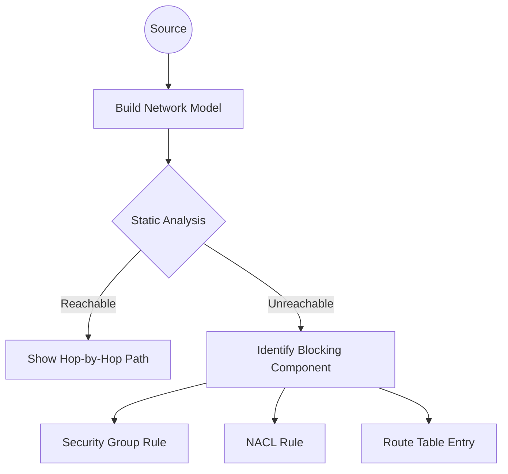

# Reachability Analyzer: Network Insights

VPC Reachability Analyzer is a configuration analysis tool that enables you to perform connectivity testing between a source resource and a destination resource in your virtual private clouds (VPCs).

## 🧠 How it Works: Static Analysis

Unlike traditional ping tools, Reachability Analyzer **does not send any packets**.

-   **Model-based**: It builds a mathematical model of your network configuration.
-   **Static Inspection**: It examines Route Tables, Security Groups, Network ACLs, Gateways (IGW, VGW, TGW), and Peering connections.
-   **Reachability Path**: If reachable, it produces the hop-by-hop path. If not, it identifies the specific component (e.g., a missing route or a blocking SG rule) that is causing the issue.

## 🎯 Key Benefits

1.  **Speed**: Debug complex multi-account or multi-VPC networking issues in seconds.
2.  **Accuracy**: No "false negatives" from OS firewalls or application crashes—it focuses strictly on the AWS infrastructure.
3.  **Proactive Testing**: Verify connectivity before deploying applications.

## ⚖️ Comparison: Reachability Analyzer vs. Network Access Analyzer

| Feature | Reachability Analyzer | Network Access Analyzer |
| :--- | :--- | :--- |
| **Primary Goal** | Debug point-to-point connectivity. | Audit broad network accessibility. |
| **Logic** | "Can A talk to B?" | "Can anything from the internet reach A?" |
| **Output** | Hop-by-hop path analysis. | Compliance/Security report. |
| **Cost** | Per analysis. | Per analyzed resource. |

---

## 📖 Stories from the Field: The Transit Gateway Mystery

**Scenario**: A company migrated from VPC Peering to Transit Gateway (TGW). Suddenly, instances in VPC-A could no longer reach the Database in VPC-B.
**Manual Debug**: Engineers checked VPC-A's route table (Correct) and VPC-B's SG (Correct).
**Discovery**: Running Reachability Analyzer showed the traffic was being dropped. The tool highlighted the **Transit Gateway Route Table** specifically, which was missing a return route back to VPC-A.
**Resolution**: Added the missing route to the TGW route table.
**Prevention**: Use Reachability Analyzer first for any multi-VPC connectivity issues—it sees the "invisible" middle-box configurations like TGW route tables that are easily overlooked.

---

## ❓ Interview Questions

1.  **Does Reachability Analyzer account for OS-level firewalls (like iptables)?**
    *   *Answer*: No. It only analyzes AWS resource configurations. If Reachability Analyzer says "Reachable" but you still can't connect, the issue is likely at the OS or Application level.
2.  **Can Reachability Analyzer test connectivity to resources outside of AWS (e.g., on-premises)?**
    *   *Answer*: It can analyze up to the AWS edge (VPN/Direct Connect Gateway), but it cannot analyze configurations inside your on-premises network.
3.  **What happens if there are multiple paths between source and destination?**
    *   *Answer*: It will typically show one valid path.
4.  **Is Reachability Analyzer a free tool?**
    *   *Answer*: No, there is a small cost per analysis perform (check current AWS pricing).
5.  **Which components can be a 'terminal' in Reachability Analyzer?**
    *   *Answer*: Instances, ENIs, VPN Gateways, Internet Gateways, Transit Gateways, Transit Gateway Attachments, and VPC Peering connections.

---

## 🧠 Quiz

1.  **True/False: Reachability Analyzer sends a test ping to the destination.** `(False)`
2.  **If a security group is blocking traffic, what will the tool show?** `(The specific SG ID and the reason for the block)`
3.  **To analyze compliance across your entire network, which tool is better?** `(Network Access Analyzer)`
4.  **Can you analyze connectivity between two VPCs connected via Peering?** `(Yes)`
5.  **Does the tool require an agent to be installed on EC2 instances?** `(No)`
