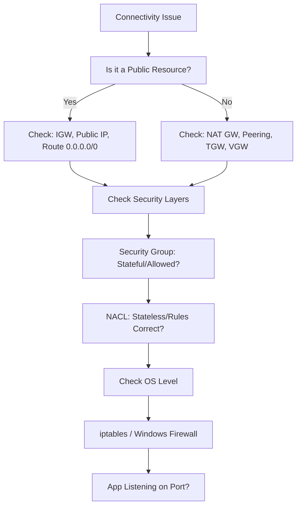

# Common Troubleshooting Scenarios

Networking in AWS can be complex. When things go wrong, following a logical troubleshooting flow is essential.

## 🗺️ The Troubleshooting Flowchart

Before diving into logs, follow this top-down checklist:

## 🛠️ Typical "Gotchas"

### 1. SG vs. NACL Misalignment
- **Symptoms**: Traffic is allowed in the SG but rejected.
- **Root Cause**: NACLs are stateless. If you allow inbound traffic on port 80, you MUST allow outbound traffic on ephemeral ports (1024-65535) in the NACL.
- **Diagnostic**: Check VPC Flow Logs for `REJECT` on outbound ephemeral ports.

### 2. DNS Resolution Failures
- **Symptoms**: `ping 8.8.8.8` works, but `ping google.com` fails.
- **Root Cause**: `enableDnsSupport` or `enableDnsHostnames` is disabled in the VPC settings, or the instance isn't using the AWS VPC DNS server (169.254.169.253).
- **Resolution**: Enable DNS settings in VPC console.

### 3. Route Table "Black Holes"
- **Symptoms**: Traceroute stops at the first hop.
- **Root Cause**: A route exists (e.g., to a Peering connection) but the target (the Peering connection itself) was deleted or is in another region without proper configuration.
- **Diagnostic**: Check Route Table for status `Blackhole`.

### 4. Asymmetric Routing
- **Symptoms**: Connection times out after initial handshake.
- **Root Cause**: Traffic enters through one path (e.g., Direct Connect) but tries to exit through another (e.g., Internet Gateway) because of conflicting route table priorities.

---

## 📖 Stories from the Field: The "Transparent" Firewall

**Scenario**: A Linux server was migrated to AWS. Connectivity to port 80 was allowed in SG/NACL and Flow Logs showed `ACCEPT`. However, `curl localhost:80` worked, but `curl <public-ip>:80` timed out.
**Discovery**: The server had `ufw` (Uncomplicated Firewall) enabled from its previous on-premises environment, which only allowed traffic from the local subnet.
**Cause**: OS-level firewall was blocking external traffic even though AWS networking was wide open.
**Resolution**: Updated `ufw` rules to allow traffic or disabled it.
**Prevention**: Always remember that AWS security is "layered". Passing the AWS perimeter (SG/NACL) doesn't mean you've reached the application.

---

## ❓ Interview Questions

1.  **If an instance can't reach the internet, what are the first 3 things you check?**
    *   *Answer*: 1. Does it have a Public IP? 2. Is there an IGW attached? 3. Is there a 0.0.0.0/0 route pointing to the IGW?
2.  **How do you troubleshoot a "Connection Refused" error vs. a "Connection Timeout"?**
    *   *Answer*: "Refused" usually means you reached the server but nothing is listening on that port (App issue). "Timeout" usually means the packets were dropped (SG/NACL/Route issue).
3.  **Why is `traceroute` often misleading in AWS?**
    *   *Answer*: AWS network infrastructure often hides internal hops for security, and many AWS components (like SGs) don't send ICMP Type 11 (Time Exceeded) packets back, making hops appear as `* * *`.
4.  **What is the "First IP + 2" rule in a subnet?**
    *   *Answer*: It is the IP address of the Amazon DNS server (e.g., in `10.0.0.0/24`, it's `10.0.0.2`).
5.  **A Flow Log shows `ACCEPT` but the user can't connect. Where do you look next?**
    *   *Answer*: OS-level firewall, Application status, or heavy packet loss/latency.

---

## 🧠 Quiz

1.  **Which command tests if a specific port is open on a remote server?** `(telnet or nc -zv)`
2.  **What status in a Route Table indicates the target is no longer available?** `(Blackhole)`
3.  **True/False: NACLs are stateful.** `(False)`
4.  **If you can ping an IP but not a domain name, what is the likely issue?** `(DNS resolution)`
5.  **Traffic Mirroring shows the packet reaching the instance, but the app doesn't respond. Is this an AWS networking issue?** `(No, likely OS or App issue)`