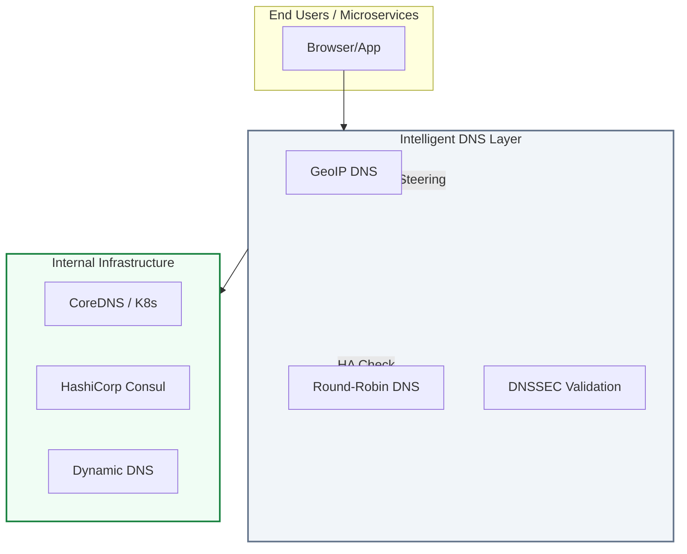
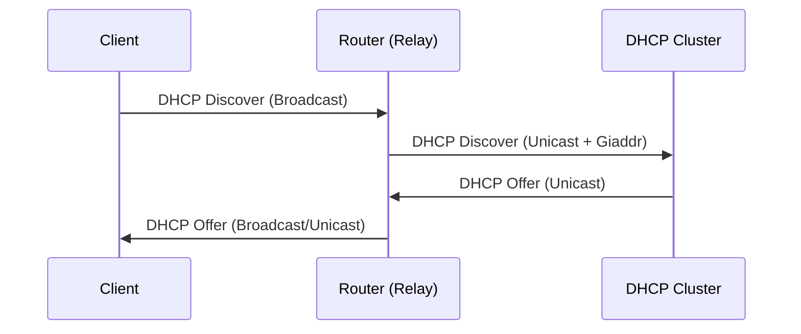

# 🌐 Advanced DNS & DHCP Management

> **"If DNS is broken, the Internet is broken. In a DevOps world, DNS isn't just a phonebook; it's the heartbeat of service discovery and global traffic steering."**

## 📚 Overview

Modern infrastructure relies on more than just static IP mappings. This module dives into the enterprise-grade management of **DNS (Domain Name System)** and **DHCP (Dynamic Host Configuration Protocol)**—the foundational pillars of network connectivity. We move beyond simple "A records" to explore high availability, global traffic management, security extensions (DNSSEC), and automated service discovery in Kubernetes and HashiCorp environments.

## 🎓 Learning Objectives

By the end of this module, you will:

- ✅ Deploy **Redundant DNS Clustering** (Master/Slave & Anycast).
- ✅ Implement **Intelligent Traffic Steering** using GeoDNS and Round-Robin.
- ✅ Secure the namespace with **DNSSEC** and encrypted protocols (**DoH/DoT**).
- ✅ Architect **DHCP Failover** and Relay strategies for multi-VLAN environments.
- ✅ Automate network service lifecycle with **Terraform**, **Ansible**, and **API-driven** workflows.
- ✅ Integrate with modern **Service Discovery** (Consul & CoreDNS).

---

## 🏗️ Technical Deep Dive: DNS High Availability

In production, a single DNS server is a single point of failure (SPOF). We solve this using **Master-Slave Synchronization** and **Anycast**.

### 🔄 Master-Slave Replication (BIND9)

| Role | Responsibility | Key Feature |
| :--- | :--- | :--- |
| **Master (ns1)** | Holds the "Zone of Authority" | Only server where edits are made. |
| **Slave (ns2)** | Fetches copies via AXFR/IXFR | Provides redundancy and load capacity. |

### 🛠️ Pro Pattern: The Notify Flow

1. Admin updates `db.example.com` and increments the **Serial Number**.
2. Master sends a **NOTIFY** packet to Slaves.
3. Slaves initiate a **Zone Transfer (AXFR)** to stay in sync.

---

## 🚀 Professional Pattern: Anycast DNS

Instead of having two different IPs for `ns1` and `ns2`, Anycast allows multiple servers to share the **exactly same IP address**. BGP routing then sends the user to the "closest" server.

**The Benefit**:

- **Automatic Failover**: If the US server dies, the US user's traffic is automatically routed to the EU server by the network providers.
- **Latency Reduction**: Users always talk to the geographically nearest instance.

---

## 🏆 Real-World DevOps Story: The "Unstoppable" TTL

**The Scenario**: A major e-commerce site was migrating their database to a new cloud provider. They updated their DNS records to point to the new IP.
**The Crisis**: They set the **TTL (Time To Live)** to 48 hours. After the migration, they realized the new database had a configuration error. They tried to switch back to the old IP, but millions of users were "stuck" on the broken server because their local ISPs had cached the record for 48 hours.
**The Fix**: There was no technical fix; they had to wait out the 48-hour cache window, losing millions in revenue.
**The Lesson**: **Lower your TTL to 60 seconds *before* a migration.** Only increase it back to normal (e.g., 3600s) once you are sure the new infrastructure is stable.

---

## 🛡️ DNS Security (DNSSEC & DoT)

DNS was designed in an era when everyone trusted each other. **DNSSEC** adds digital signatures to records to prevent "Cache Poisoning" and "Man-in-the-Middle" attacks.

### DNS over TLS (DoT) vs. DNS over HTTPS (DoH)

- **DoT (Port 853)**: Optimized for network-level encryption. Used by OS-level resolvers.
- **DoH (Port 443)**: Bypasses firewalls by hiding DNS traffic inside standard web traffic. Used heavily by browsers.

---

## 🏠 Advanced DHCP Architecture

### Failover & Load Balancing

Traditional DHCP is "broadcast-heavy." In large enterprises, we use **DHCP Relays (IP Helpers)** to allow a central pair of servers to manage hundreds of remote branch offices.

---

## ❓ Interview Preparation (Advanced Networking)

1. **Q: How does iterative DNS resolution differ from recursive resolution?**
    *A: In recursive resolution, the client asks a resolver (like Google 8.8.8.8) to find the answer entirely. In iterative resolution, the resolver asks the Root, then the TLD (.com), then the Authoritative server, receiving "referrals" at each step.*

2. **Q: What is the purpose of the 'Serial Number' in a DNS SOA record?**
    *A: It serves as a versioning system. Slave servers compare their local serial number with the Master's. If the Master's is higher, the Slave knows it must perform a Zone Transfer to get the latest updates.*

3. **Q: Explain 'DHCP Snooping' and why it is critical for security.**
    *A: It is a Layer 2 security feature on switches that blocks unauthorized (rogue) DHCP servers. It ensures that 'DHCP Offer' packets only come from 'Trusted' ports connected to the real server.*

4. **Q: What is a 'Split-Scope' DHCP configuration?**
    *A: It is a high-availability strategy where two servers share a subnet's IP range (e.g., 80/20 split). If one server fails, the other can still provide leases from its portion of the range.*

5. **Q: Why would you use 'View-based' DNS in BIND?**
    *A: To provide different answers to different users. For example, an 'Internal' view might map `wiki.company.com` to a private IP (10.0.0.5), while an 'External' view might deny access or map it to a public firewall IP.*

---

## 📝 Knowledge Check

1. **Which record type is used to delegate authority to another name server?**
    - [ ] a) A Record
    - [x] b) NS Record
    - [ ] c) CNAME Record
    - [ ] d) PTR Record

2. **What does a 'DHCP Relay' (IP Helper) add to the packet before sending it to the server?**
    - [ ] a) A digital signature
    - [x] b) The 'Giaddr' (Gateway IP Address) of the source subnet
    - [ ] c) The client's MAC address only

3. **In DNSSEC, which key is used to sign the actual resource records (A, MX, etc.)?**
    - [x] b) ZSK (Zone Signing Key)
    - [ ] a) KSK (Key Signing Key)
    - [ ] c) Master Key

4. **Which protocol is best for bypassing network-level DNS blocks in restricted environments?**
    - [ ] a) DNS over TLS (DoT)
    - [x] b) DNS over HTTPS (DoH)
    - [ ] c) Standard UDP/53

5. **True or False: DNS Round-Robin provides true health-checking and automatic failover.**
    - [ ] True
    - [x] False (It only cycles the list; client apps may still try a dead IP)

---

## 🔗 Next Steps

Network identity is secure and assigned. Now, let's explore how to protect these packets in transit.

Proceed to: **[Network Security & Firewalls](../../../../README.md)** →