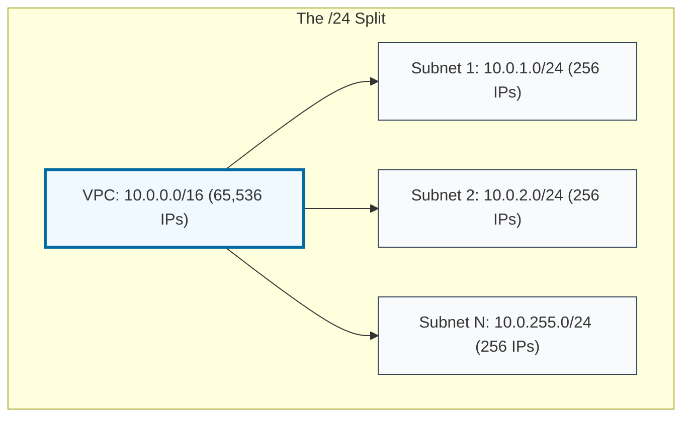

# 🔢 Module 02.02: CIDR Math and Calculation

> **"A prefix length is more than a number; it is a boundary. A single bit change can double your host capacity or halve your network's broadcast noise."**

## 📚 Overview

Calculating the size of a network and the range of its IP addresses is a fundamental skill for cloud architects. **CIDR (Classless Inter-Domain Routing)** provides the mathematical framework for this. In this module, we transition from simple binary to fast, mental math that allows you to calculate host counts and network boundaries in seconds.

## 🎓 Learning Objectives

By the end of this module, you will:

- ✅ Master the **Host Count Formula** (`2^n`).
- ✅ Calculate **Network Boundaries** using binary bits.
- ✅ Understand the difference between **Prefix Length** and **Subnet Mask**.
- ✅ Identify **Contiguous Subnets** for logical organization.
- ✅ Memorize the **Powers of 2** most common in cloud networking.

---

## 🏗️ The Golden Formula: Host Count

To find the number of IP addresses in a CIDR block, simply subtract the prefix length from 32, then raise 2 to that power.

**Formula: `2 ^ (32 - Prefix) = Total IP Addresses`**

| Prefix | Calculation | Total IPs | Usual Use |
| :--- | :--- | :--- | :--- |
| **/32** | 2^(32-32) = 2⁰ | **1** | Single Instance / Route |
| **/28** | 2^(32-28) = 2⁴ | **16** | NAT Gateways / Smallest Subnet |
| **/24** | 2^(32-24) = 2⁸ | **256** | Standard Tier Subnet |
| **/20** | 2^(32-20) = 2¹² | **4,096** | Large K8s / Database Cluster |
| **/16** | 2^(32-16) = 2¹⁶ | **65,536** | Standard VPC Size |

---

## 🚀 Professional Pattern: The Mental Block Math

Senior DevOps engineers don't reach for a calculator when choosing a CIDR. They use the **"Four Bit Rule."**

**The Pro Standard**:
- Adding **1 bit** to a prefix (e.g., /24 to /25) **HALVES** the number of IPs.
- Subtracting **1 bit** from a prefix (e.g., /24 to /23) **DOUBLES** the number of IPs.
- Adding **4 bits** effectively "moves a decimal" in hex/binary logic (e.g., /24 to /20 is 16x larger).

---

## 🏆 Real-World DevOps Story: The Overlapping Peering Request

**The Scenario**: Department A used `10.0.0.0/16` for their main production VPC. Department B requested to peer their VPC, which they had configured with `10.0.128.0/17`.
**The Crisis**: The peering request was rejected by AWS with a "CIDR Overlap" error. Department B was confused because their start IP was different from Department A's.
**The Discovery**: Because `10.0.128.0/17` is a subset of the larger `10.0.0.0/16` range, they occupied the same physical path in the routing table. You cannot peer networks where one is a "child" of the other.
**The Fix**: Department B had to migrate to `10.1.0.0/16`, costing two weeks of downtime and reconfiguration.
**The Lesson**: **Check your neighbors.** Always look at the corporate IP registry before picking a CIDR to ensure you aren't squatting on someone else's future subnet.

---

## ❓ Interview Preparation (CIDR Math)

1. **Q: How many total IP addresses are in a /20 subnet?**
    *A: 4,096. (2 ^ (32 - 20) = 2^12 = 4,096).*

2. **Q: If a subnet is 10.0.1.0/24, what is the very next available subnet of the same size?**
    *A: 10.0.2.0/24. A /24 takes up exactly 256 addresses, filling the entire 4th octet.*

3. **Q: How many /24 subnets can you fit into a /16 VPC?**
    *A: 256. (Total IPs in /16 is 65,536. Total in /24 is 256. 65,536 / 256 = 256).*

4. **Q: What is the subnet mask for a /24 in dotted decimal?**
    *A: 255.255.255.0. This represents 24 "ON" bits followed by 8 "OFF" bits.*

5. **Q: If I have a /25, how many addresses are in it?**
    *A: 128. It is exactly half of a /24 (256/2 = 128).*

---

## 📝 Knowledge Check

1. **Which CIDR prefix provides exactly 16 total IP addresses?**
    - [ ] a) /24
    - [ ] b) /26
    - [x] c) /28
    - [ ] d) /30

2. **Going from a /24 to a /23 does what to the total number of IPs?**
    - [ ] a) Reduces them by half
    - [x] b) Doubles them
    - [ ] c) Keeps them the same
    - [ ] d) Increases them by 24

3. **What is the maximum number of IPs in an AWS VPC (using a /16 prefix)?**
    - [ ] a) 1,024
    - [ ] b) 16,384
    - [x] c) 65,536
    - [ ] d) 16 million

4. **In the IP range 192.168.1.0/24, which octet is considered the 'Host' portion?**
    - [ ] a) First octet
    - [ ] b) Second octet
    - [ ] c) Third octet
    - [x] d) Fourth octet

5. **A /32 CIDR represents:**
    - [x] a) A single IP address
    - [ ] b) A network of 32 IPs
    - [ ] c) A broadcast address
    - [ ] d) All IP addresses in the world

---

## 🔗 Next Steps

You've done the math. Now let's use it to build walls. Let's explore the architectural zones of a production network.

Proceed to: **[03. Public and Private Zoning](./03-Public-and-Private-Zoning/README.md)** →