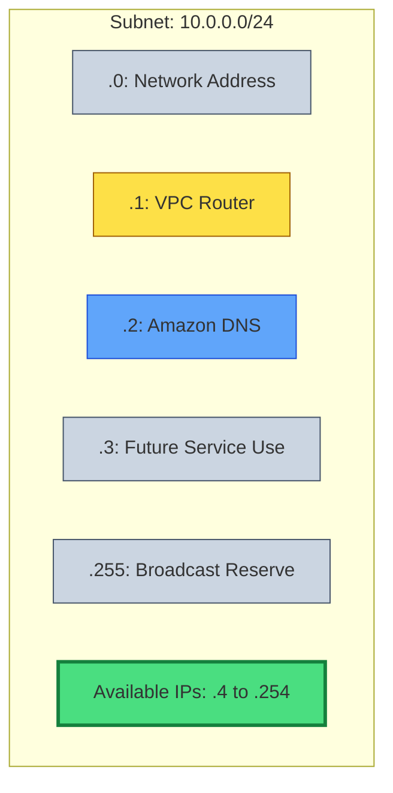

# ⚠️ Module 02.04: AWS Reserved IPs & Limits

> **"In every cloud subnet, there are missing pieces. AWS taxes your network with 5 reserved addresses—forgetting them in your math is the fastest way to a production scaling failure."**

## 📚 Overview

When you create a subnet in AWS, you do not get 100% of the IP addresses in that CIDR block. AWS reserves **5 IP addresses** in every subnet for its own internal management and infrastructure services. This module is a "Warning Label" for network architects—ensuring you always account for the cloud overhead before deploying your applications.

## 🎓 Learning Objectives

By the end of this module, you will:

- ✅ Identify the **Specific Roles** of the 5 AWS reserved IPs.
- ✅ Calculate **Usable IP Capacity** with 100% accuracy.
- ✅ Understand **VPC Scaling Limits** (Min/Max CIDR).
- ✅ Learn how **Secondary CIDR Blocks** can save a full VPC.
- ✅ Internalize the **"Cannot Resize"** constraint of cloud subnets.

---

## 🏗️ The Reserved Five

If you have a subnet `10.0.0.0/24`, the following addresses are "Off Limits" to your instances:

1.  **10.0.0.0**: **Network Address**. The identifier for the network itself.
2.  **10.0.0.1**: **VPC Router**. The default gateway that moves traffic between subnets.
3.  **10.0.0.2**: **DNS Server**. The IP for `AmazonProvidedDNS`, used for service discovery.
4.  **10.0.0.3**: **Future Use**. Explicitly reserved by AWS for upcoming internal features.
5.  **10.0.0.255**: **Broadcast Address**. While AWS doesn't technically use broadcast, they reserve this to remain compliant with standard IP protocols.

**The Math**: `(2 ^ (32 - Prefix)) - 5 = Usable IPs`

---

## 🚀 Professional Pattern: The Secondary CIDR Expansion

Senior DevOps engineers know that eventually, even a `/16` VPC might run out of space due to massive Kubernetes growth or microservice explosion.

**The Pro Standard**:
1. **Don't Migrate, Expand**: If a VPC is full, don't build a new one and migrate. Instead, add a **Secondary CIDR block** (e.g., `100.64.0.0/16`) to the existing VPC.
2. **Dedicated Tiers**: Use the secondary CIDR specifically for "Large Scale" components like Kubernetes Pods (using VPC CNI), leaving the primary CIDR for stable infrastructure.
3. **Avoid the Minimum**: Never use `/28` subnets for application workloads. Use them only for small utility components like NAT Gateways.

---

## 🏆 Real-World DevOps Story: The Smallest Subnet Trap

**The Scenario**: A cloud architect decided to be "efficient" and sized their microservice subnets at `/28` (16 total IPs). They calculated that the service would only ever have 10 instances.
**The Crisis**: When they tried to launch the 12th instance during a patch update (using a rolling update strategy that needs 2 extra nodes), the launch failed.
**The Discovery**: They forgot the "AWS Tax." `16 - 5 = 11`. They had exactly 11 usable slots. The moment they needed a 12th, the infrastructure broke.
**The Impact**: The rolling update stalled, leaving the site partially updated and unstable for two hours.
**The Lesson**: **Always round up.** IPs are cheap; architecture changes are expensive. Standardize on `/24` or larger for anything that needs to scale.

---

## ❓ Interview Preparation (Limits & Reservations)

1. **Q: How do you calculate usable IPs in an AWS Subnet?**
    *A: Use the formula `(2^(32-prefix)) - 5`. For a /24, that is 256 - 5 = 251 usable addresses.*

2. **Q: Can you use the .1 address for a specific instance if you disable the VPC router?**
    *A: No. You cannot disable the VPC router or reclaim any of the 5 reserved addresses. They are hard-coded into the AWS networking fabric.*

3. **Q: What is the smallest CIDR block allowed for an AWS VPC?**
    *A: A `/28` (16 IP addresses).*

4. **Q: What is the largest CIDR block allowed for an AWS VPC?**
    *A: A `/16` (65,536 IP addresses). While you can add up to 5 secondary CIDRs, no individual block can be larger than /16.*

5. **Q: If a subnet is running out of IPs, can you change its CIDR from /24 to /20?**
    *A: No. Subnets are immutable. You must create a new subnet with the larger CIDR and migrate your resources to it.*

---

## 📝 Knowledge Check

1. **How many IP addresses are available for your use in a /28 subnet?**
    - [ ] a) 16
    - [ ] b) 14
    - [x] c) 11
    - [ ] d) 8

2. **The address `base_ip + 2` in an AWS subnet is reserved for what?**
    - [ ] a) VPC Router
    - [x] b) DNS Server
    - [ ] c) Broadcast Address
    - [ ] d) Future Use

3. **What is the maximum allowed prefix for an AWS VPC primary CIDR?**
    - [ ] a) /8
    - [x] b) /16
    - [ ] c) /24
    - [ ] d) /32

4. **True or False: AWS supports network-wide broadcast packets in a VPC.**
    - [ ] True
    - [x] False (But the address is still reserved)

5. **Which command would you use to add more IP space to a full VPC?**
    - [ ] a) `modify-vpc-cidr`
    - [x] b) `associate-vpc-cidr-block`
    - [ ] c) `resize-vpc`
    - [ ] d) `add-subnet-mask`

---

## 🔗 Next Steps

You've mastered the building blocks of the network. Now let's explore how to connect these isolated subnets to the rest of the world and back.

Proceed to: **[Module 03: Internet and NAT Gateways](../03-Internet-and-NAT-Gateways/README.md)** →