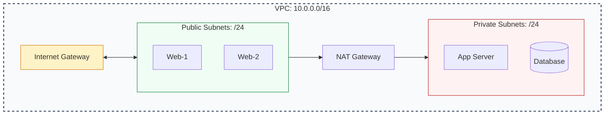

# 🔢 Module 02: Subnetting & CIDR

> **"Subnetting is the architecture of isolation. By dividing your network into private neighborhoods, you ensure that a flood in one street doesn't drown the entire city."**

## 📚 Overview

Subnetting is the practice of dividing a VPC's massive IP address range into smaller, manageable, and logically isolated segments. Understanding **CIDR (Classless Inter-Domain Routing)** is the "superpower" that allows DevOps engineers to design networks that are secure, scalable, and cost-effective. In this module, we master the math and the strategy behind modern IP allocation.

## 🎓 Learning Path

| # | Topic | Focus | Key Deliverable |
| :--- | :--- | :--- | :--- |
| **01** | [**Binary Fundamentals**](./01-Binary-and-IP-Fundamentals/README.md) | How Computers see IPs | Master Bits-to-Decimal conversion |
| **02** | [**CIDR Math**](./02-CIDR-Math-and-Calculation/README.md) | Network Sizes | Calculate host counts and boundaries |
| **03** | [**Zoning Patterns**](./03-Public-and-Private-Zoning/README.md) | Architectural Isolation | Design 3-Tier public/private zones |
| **04** | [**AWS Limits**](./04-AWS-Reserved-IPs-and-Limits/README.md) | Cloud Constraints | Account for the 5 Reserved IPs |

---

## 🚀 Professional Pattern: The /24 Standard

While you can technically create subnets as small as `/28`, senior engineers avoid "micro-subnets" for production applications.

**The Pro Standard**:
1. **Always Use /24**: Start with `/24` (251 usable IPs) for standard tiers. It is easy to calculate, fits 250+ resources, and fits perfectly into `/16` VPC boundaries.
2. **Leave Buffers**: Don't use contiguous numbers (e.g., 10.0.1.0, 10.0.2.0). Jump by 10s (e.g., 10.0.10.0 for Web, 10.0.20.0 for App) to leave room for future expansion in the same tier.
3. **Multi-AZ Logic**: Keep the same third octet for the same tier in different AZs where possible, or use a clear naming convention (e.g., `10.0.10.0` for App-AZ1, `10.0.11.0` for App-AZ2).

---

## 🏆 Real-World DevOps Stories

### 🌑 The "Small Subnet" Trap
**The Scenario**: A startup sized their EKS (Kubernetes) subnets at `/28` (11 usable IPs) to "save space."
**The Crisis**: During a successful marketing launch, Kubernetes attempts to scale. New pods stayed in "Pending" because the subnet was full. The site crashed while thousands of customers were trying to buy.
**The Fix**: A high-risk emergency migration to a new VPC with `/20` subnets.
**The Lesson**: **Cloud IP addresses are free; downtime is expensive.** Size your subnets for your 5-year growth, not your day-1 scale.

### 🛡️ The "Peering" Overlap
**The Scenario**: Two companies merged. Both used `10.0.0.0/16` for their main Production VPC.
**The Crisis**: They needed to peer the VPCs to sync databases. The connection failed because the routers couldn't distinguish between "VPC-A" and "VPC-B" for the same IP range.
**The Fix**: One company had to spend 3 months and $50k in man-hours to rebuild their entire network in the `10.1.0.0/16` range.
**The Lesson**: **Assume you will peer with everyone.** Start with a unique, corporate-allocated CIDR block to avoid future "Network Surgery."

---

## ❓ Interview Preparation (Subnetting & CIDR)

1. **Q: How many usable IP addresses are in a /24 subnet in AWS?**
    *A: 251. While the total count is 256 (2^8), AWS reserves 5 IPs: the network address (.0), the VPC router (.1), the DNS server (.2), a future-use IP (.3), and the broadcast address (.255).*

2. **Q: What happens if two VPCs have overlapping CIDR blocks?**
    *A: They function fine in isolation, but they **cannot** be connected via VPC Peering, Transit Gateway, or VPN. The routing tables would have identical destinations, causing a conflict.*

3. **Q: Why would you use a /28 subnet?**
    *A: It is rarely used for applications, but it is perfect for small components like **NAT Gateways** or **Network Load Balancers** that only need 1 or 2 IP addresses.*

4. **Q: Can you resize an existing AWS Subnet?**
    *A: No. To change the size, you must delete the resources inside, delete the subnet, and recreate it. This is why planning your CIDR schema correctly on Day 1 is critical.*

5. **Q: What is the purpose of the 169.254.169.254 address if it's not in my VPC CIDR?**
    *A: This is the **Instance Metadata Service (IMDS)** address. It is a "Link-Local" address provided by the cloud fabric to every instance so it can query its own properties (ID, Role, etc.).*

---

## 📝 Knowledge Check

1. **How many bits are in an IPv4 address?**
    - [ ] a) 16 bits
    - [x] b) 32 bits
    - [ ] c) 64 bits
    - [ ] d) 128 bits

2. **A /24 subnet contains how many TOTAL IP addresses?**
    - [ ] a) 128
    - [x] b) 256
    - [ ] c) 512
    - [ ] d) 1024

3. **How many IPs are reserved by AWS in every subnet?**
    - [ ] a) 2
    - [ ] b) 3
    - [x] c) 5
    - [ ] d) 10

4. **Which CIDR prefix allows for the LARGEST number of hosts?**
    - [x] a) /16
    - [ ] b) /20
    - [ ] c) /24
    - [ ] d) /28

5. **True or False: A private subnet should have an Internet Gateway in its route table.**
    - [ ] True
    - [x] False (It should use a NAT Gateway for internet access)

---

## 🔗 Next Steps

The strategy is set. Now let's dive into the math that makes it all work.

Proceed to: **[01. Binary and IP Fundamentals](./01-Binary-and-IP-Fundamentals/README.md)** →
