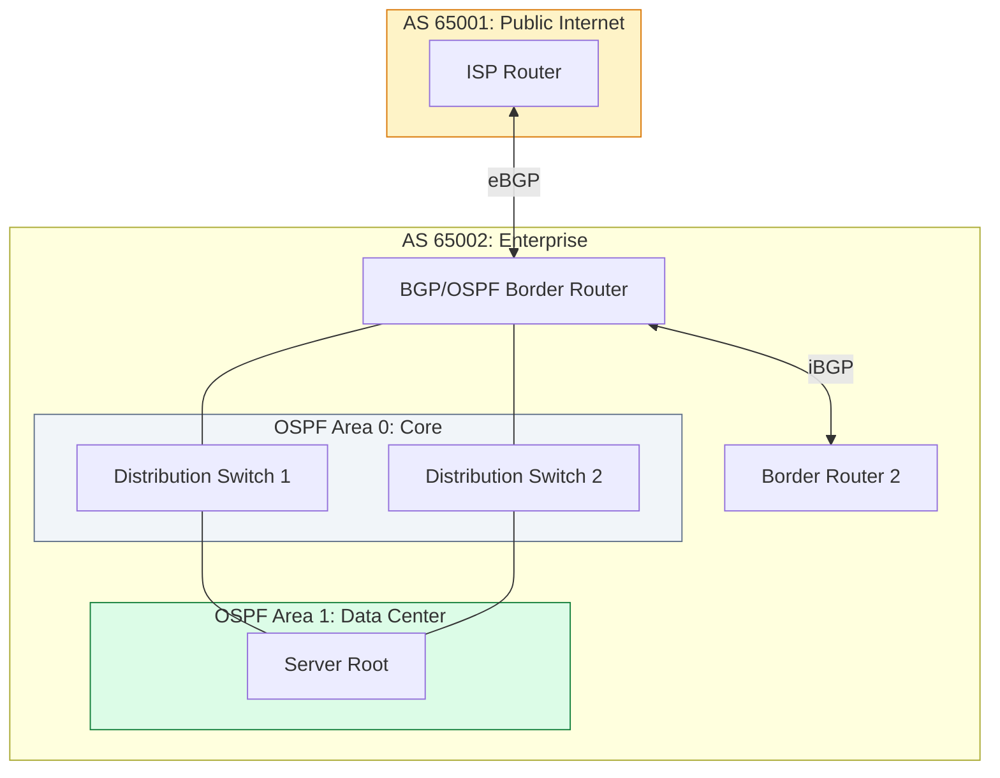

# 🌐 Module 03: Advanced Routing

> **"Routing is the art of making a thousand decisions a second, ensuring that every packet finds its home in a world that is constantly changing. A static network is a dead network."**

## 📚 Overview

While static routing works for small VPCs, enterprise-grade cloud environments and hybrid data centers require **Dynamic Routing Protocols**. This module moves beyond the "Default Gateway" to explore how **OSPF** manages internal complexity and how **BGP** powers the global internet. We will learn how to architect redundant, self-healing networks that can survive link failures without human intervention.

## 🎓 Learning Objectives

By the end of this module, you will:

- ✅ Orchestrate **Multi-Area OSPF** for internal scalability.
- ✅ Implement **BGP (Border Gateway Protocol)** for hybrid cloud and ISP connectivity.
- ✅ Master **Route Redistribution** between different protocols.
- ✅ Use **Prefix Lists** and **Route Maps** for granular traffic control.
- ✅ Design for **High Availability** using ECMP and BFD.

---

## 🏗️ Core Protocols

### 1. OSPF (Open Shortest Path First)
An Interior Gateway Protocol (IGP) used within a single organization.
- **Link-State**: Every router has a complete "map" of the network.
- **Areas**: Uses a hierarchical design (Area 0 is the backbone) to reduce CPU load on routers.
- **Dijkstra's Algorithm**: Calculates the fastest path based on link speed (cost).

### 2. BGP (Border Gateway Protocol)
The "Glue of the Internet." An Exterior Gateway Protocol (EGP) used between different organizations (Autonomous Systems).
- **Path Vector**: It doesn't use a map; it uses a list of "AS Numbers" to find the shortest path.
- **Policy-Based**: Unlike OSPF (which picks the fastest path), BGP picks the path that costs the least or follows company policy.

---

## 🚀 Professional Pattern: The "BGP Community" Tagging

In large networks, Managing thousands of routes with individual prefix lists is impossible. Senior engineers use **BGP Communities**.

**The Pro Standard**:
1. **Tagging**: When a route enters your network, "paint" it with a tag (e.g., `65001:100` for "Standard Internet").
2. **Policy**: Instead of filtering by IP, filter by tag. *"If the route has tag 100, set the local preference to 50."*
3. **Benefit**: You can change your global routing policy for thousands of subnets by updating a single community rule.

---

## 🏆 Real-World DevOps Story: The 5-Minute Internet Blackout

**The Scenario**: A major SaaS provider wanted to prefer their new, cheaper ISP for outgoing traffic. A network engineer decided to use **AS-Path Prepending** to make the old ISP look "further away."
**The Crisis**: The engineer made a typo and prepended their own AS number 50 times. Some older routers on the internet couldn't handle such a long path and crashed or dropped the routes entirely.
**The Impact**: 15% of the world's users lost access to the SaaS platform for 2 hours while the "bad" route propagated through global caches.
**The Fix**: Rolling back the change in BGP took only 1 minute, but the "convergence time" for the rest of the internet to see the fix took much longer.
**The Lesson**: **BGP is a global conversation.** A mistake on your router can have a butterfly effect across the entire planet. Always "soft-reconfig" and verify your advertisements carefully.

---

## ❓ Interview Preparation (Advanced Routing)

1. **Q: What is an Autonomous System (AS)?**
    *A: An Autonomous System is a collection of IP networks managed by one or more network operators on behalf of a single administrative entity (like an ISP or a large corporation) that has a clearly defined routing policy.*

2. **Q: Explain the difference between eBGP and iBGP.**
    *A: **eBGP (External)** is used to exchange routes between different AS numbers (e.g., your company and an ISP). **iBGP (Internal)** is used to distribute those external routes to other routers *within* your own AS.*

3. **Q: What is 'Route Redistribution' and why is it dangerous?**
    *A: It's the process of taking routes learned from one protocol (e.g., OSPF) and injecting them into another (e.g., BGP). It's dangerous because it can easily create **Routing Loops** if not managed with proper filtering and metrics.*

4. **Q: What is an OSPF Area 0?**
    *A: Area 0 is the mandatory **Backbone Area**. All other OSPF areas must connect to Area 0. Traffic moving between Area 1 and Area 2 must always pass through the backbone to prevent loops.*

5. **Q: What is the purpose of a 'Route Map'?**
    *A: A Route Map is a complex "if-then" statement for routing. It allows you to match specific traffic (by IP, tag, or metric) and then modify its attributes or block it entirely.*

---

## 📝 Knowledge Check

1. **Which protocol uses Dijkstra's algorithm to calculate the shortest path?**
    - [ ] a) BGP
    - [x] b) OSPF
    - [ ] c) RIP
    - [ ] d) STP

2. **A BGP router receives two paths to the same destination. Which attribute is checked FIRST by default?**
    - [ ] a) AS-Path length
    - [ ] b) Local Preference
    - [x] c) Weight (Cisco specific) or Local Preference (Standard)
    - [ ] d) Router ID

3. **What is the function of an OSPF 'ABR' (Area Border Router)?**
    - [ ] a) It connects the AS to the Internet
    - [x] b) It connects two or more OSPF areas together
    - [ ] c) It is the fastest router in the network
    - [ ] d) It assigns IP addresses to clients

4. **Which BGP message type is used to keep the connection alive between peers?**
    - [ ] a) Open
    - [ ] b) Update
    - [x] c) Keepalive
    - [ ] d) Notification

5. **True or False: In OSPF, all areas must physically touch the backbone Area 0.**
    - [x] True (Unless using a virtual link, which is a last resort)
    - [ ] False

---

## 🔗 Next Steps

You've mastered the logic of the network. Now let's explore the physical and virtual boundaries that keep us safe.

Proceed to: **[04. Network Security](../04-Network-Security/README.md)** →
Node: This link points to the next logical step in the curriculum.