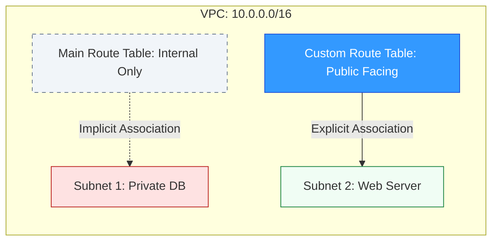

# 🚦 Module 04.01: Route Table Fundamentals

> **"A Route Table is the brain of your network. It doesn't just hold data; it holds the logic that defines what is public, what is private, and what is secure."**

## 📚 Overview

A **Route Table** is a collection of logic gates (routes) that controls exactly where network traffic is directed within your VPC. Every subnet in your cloud environment must be linked to a route table to function. This module explores the foundations of routing, distinguishing between the default **Main Table** and the architect-preferred **Custom Tables**, while mastering the immutable **Local Route** that powers all internal VPC communication.

## 🎓 Learning Objectives

By the end of this module, you will:

- ✅ Distinguish between **Implicit** and **Explicit** associations.
- ✅ Understand the security risks of the **Main Route Table**.
- ✅ Define the **Local Route** and its role in VPC "gravity."
- ✅ Explain why one subnet cannot have two route tables.
- ✅ Implement **Custom Route Tables** for tiered architectures.

---

## 🏗️ The Three Pillars of Routine

### 1. The Local Route (VPC Gravity)
Every route table, regardless of type, contains a default `local` route. 
- **Destination**: The VPC CIDR (e.g., `10.0.0.0/16`).
- **Target**: `local`.
- **Status**: Permanent. You cannot delete it, and you cannot move it. It ensures that any server in `Subnet A` can talk to any server in `Subnet B` by default.

### 2. The Main Route Table (The Safety Net)
This is created automatically when you build your VPC. It is the "Default" table. If you create a new subnet and don't tell it which table to use, it automatically (implicitly) uses this one.

### 3. Custom Route Tables (The Pro's Choice)
Senior engineers create these manually for specific needs (e.g., one for Web, one for App, one for DB). By **Explicitly Associate**-ing a subnet with a custom table, you ensure that its behavior is intentional and documented.

---

## 🚀 Professional Pattern: The "Lockdown Main" Strategy

The biggest security hole in AWS is a Main Route Table that has a route to the internet.

**The Pro Standard**:
- **Never put an IGW in the Main Table**: Keep the Main table strictly for internal traffic only.
- **Fail-Secure**: If a developer forgets to associate a new subnet, it will fallback to the "Locked" Main table and have no internet access. This forces the developer to purposefully decide if they want the subnet to be public, rather than accidentally exposing it.

---

## 🏆 Real-World DevOps Story: The Accidental Exposure

**The Scenario**: A startup was using the Main Route Table for their public web servers. To get them working, they added a route: `0.0.0.0/0 -> igw-xxxx`.
**The Crisis**: Six months later, a developer created a new "Secure Database Subnet" for a PCI-compliant project. They didn't bother creating a custom route table.
**The Discovery**: Because the database subnet was implicitly associated with the Main table, it "inherited" the route to the Internet Gateway. The database server was instantly reachable from the global internet. Within weeks, it was compromised.
**The Fix**: The team implemented the **Lockdown Main** strategy, ensuring that all internet routes only existed in custom tables.
**The Lesson**: **Defaults are dangerous.** Any subnet not explicitly managed is a liability. Use Custom tables to declare your security intent.

---

## ❓ Interview Preparation (Fundamentals)

1. **Q: Can a single subnet be associated with multiple route tables?**
    *A: **No.** Each subnet can only have one active route table at a time. This prevents conflicting logic from "confusing" the network fabric.*

2. **Q: What is the difference between an implicit and explicit association?**
    *A: An **implicit** association happens automatically when a subnet uses the Main Route Table by default. An **explicit** association is when you manually link a subnet to a specific custom route table.*

3. **Q: Is a route table a regional or availability zone resource?**
    *A: It is a **Regional** resource. You can create one route table and associate it with subnets in multiple Availability Zones.*

4. **Q: Can you modify the destination of the 'local' route?**
    *A: **No.** The local route is fixed to the VPC CIDR block. If you add additional CIDR blocks to your VPC, AWS automatically adds matching local routes to all your tables.*

5. **Q: Does a route table control traffic within a single subnet?**
    *A: **No.** Traffic between two instances in the *same* subnet is handled by the VPC's underlying Layer 2 fabric (switching logic) and never hits the route table layer.*

---

## 📝 Knowledge Check

1. **Which route table is created automatically with every VPC?**
    - [ ] a) Custom Route Table
    - [x] b) Main Route Table
    - [ ] c) Global Route Table
    - [ ] d) Transit Route Table

2. **What happens to the 'Local' route if you try to delete it?**
    - [ ] a) It is deleted permanently
    - [ ] b) It is moved to the bottom of the table
    - [x] c) You cannot delete it (the option is disabled)
    - [ ] d) It creates a 'Blackhole' status

3. **A subnet with no explicit association uses which table?**
    - [x] a) The Main Route Table
    - [ ] b) The Internet Gateway
    - [ ] c) No routing at all
    - [ ] d) The last custom table created

4. **If you have 10 subnets that all need identical internet access, how many route tables should you ideally create?**
    - [x] a) 1 (and associate all 10 subnets with it)
    - [ ] b) 10 (one for each subnet)
    - [ ] c) 0 (use the Main Table)
    - [ ] d) 20 (for redundancy)

5. **Where do you configure the link between a Subnet and a Route Table?**
    - [ ] a) In the EC2 console
    - [ ] b) In the IAM policy
    - [x] c) In the 'Subnet Associations' tab of the Route Table
    - [ ] d) In the VPC CIDR settings

---

## 🔗 Next Steps

You've learned the structure. Now let's learn the "Logic of the Winner"—how the router decides which path to take when multiple routes match.

Proceed to: **[02. Priority Logic (LPM)](./02-Priority-Logic-LPM/README.md)** →