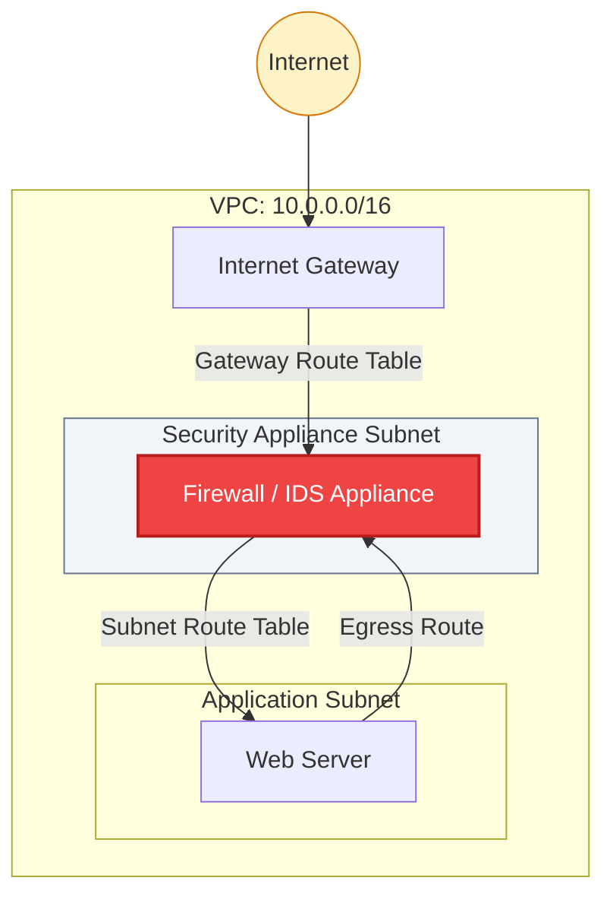

# 🛡️ Module 04.03: Gateway Routing & Middleboxes

> **"In a high-security environment, the straightest path is rarely the safest. Ingress routing allows you to 'bend' the network, forcing every packet to pass through your digital checkpoint before it reaches the target."**

## 📚 Overview

Advanced VPC architectures often require traffic to pass through a "Middlebox" (like a firewall, IDS/IPS, or proxy) before it reaches its final destination. This is achieved using **Gateway Route Tables** and ingress routing patterns. This module explores how to "intercept" traffic at the edge of the VPC and how to use **Traffic Mirroring** for invisible security monitoring.

## 🎓 Learning Objectives

By the end of this module, you will:

- ✅ Define and configure **Gateway Route Tables**.
- ✅ Implement the **"Bump-in-the-wire"** pattern for security.
- ✅ Distinguish between **North-South** and **East-West** traffic.
- ✅ Master **VPC Traffic Mirroring** for out-of-band inspection.
- ✅ Understand the role of the **Appliance Subnet**.

---

## 🏗️ The "Middlebox" Pattern

A "Middlebox" is any network appliance (usually an EC2 instance running specialized software) that sits between the source and destination.

### 1. Inbound Interception (North-South)
By associating a **Gateway Route Table** with your Internet Gateway (IGW), you can override the default routing. Instead of the IGW sending a packet straight to the Web Server, the Gateway RT tells the IGW: *"Everything for 10.0.1.0/24 must go to the Firewall's ENI first."*

### 2. Internal Interception (East-West)
If you want to inspect traffic between two internal subnets (e.g., between App and DB), you update the **Subnet Route Tables**.
- **Route in Subnet A**: `Destination: Subnet B CIDR, Target: Firewall ENI`.

---

## 🚀 Professional Pattern: The "Glass" Monitoring

For high-performance environments where any delay (latency) is unacceptable, "In-band" inspection (passing through a firewall) is too slow.

**The Pro Standard**:
1. **Out-of-band Inspection**: Use **VPC Traffic Mirroring**.
2. **The Mirror**: AWS copies every packet from the source Network Interface (ENI) and sends it to a monitoring appliance in the background.
3. **Zero Latency**: If the monitoring appliance crashes, the production traffic is **unaffected** because it's only receiving a copy. 
4. **Use Case**: Perfect for Intrusion Detection Systems (IDS) or troubleshooting encrypted traffic with Wireshark.

---

## 🏆 Real-World DevOps Story: The IDS Gatekeeper

**The Scenario**: A financial technology firm reached a scale where they were being targeted by sophisticated DDoS and malware injection attempts daily. Their web servers' local firewalls were overwhelmed.
**The Crisis**: The security team wanted to place a dedicated Intrusion Prevention System (IPS) in front of the entire VPC, but they didn't want to assign public IPs to the IPS instances to avoid making the security layer itself a target.
**The Fix**: They implemented a **Gateway Route Table** on the IGW. Traffic destined for the web subnets was redirected to the IPS appliance's internal interface.
**The Impact**: 98% of malicious traffic was dropped at the VPC boundary before it ever touched a web server.
**The Lesson**: **Control the edge.** By using Gateway Routing, you can make your security appliances the "Guardians of the Gate" without changing the network configuration of your application servers.

---

## ❓ Interview Preparation (Middleboxes)

1. **Q: What is a Gateway Route Table and where is it attached?**
    *A: It is a special route table used for ingress routing. It is attached directly to the **Internet Gateway (IGW)** or a **Virtual Private Gateway (VGW)**, allowing you to redirect incoming traffic before it reaches a subnet.*

2. **Q: What is the difference between 'In-band' and 'Out-of-band' inspection?**
    *A: **In-band** means traffic physically passes through the appliance (like a firewall). If the appliance fails, traffic stops. **Out-of-band** (Traffic Mirroring) means the appliance receives a copy of the traffic. If the appliance fails, production traffic continues normally.*

3. **Q: How do you identify the target for a middlebox route?**
    *A: You use the **Elastic Network Interface (ENI)** ID of the appliance. In the route table, the target will look like `eni-xxxxxxxx`.*

4. **Q: What is 'North-South' traffic vs 'East-West' traffic?**
    *A: **North-South** is traffic moving between the VPC and the internet. **East-West** is traffic moving between different subnets or regions within your internal cloud infrastructure.*

5. **Q: Why should you disable 'Source/Destination Check' on a firewall instance?**
    *A: By default, an EC2 instance only accepts packets meant for its own IP. A firewall appliance needs to process packets meant for *other* destinations. Disabling this check allows the instance to "see" and route traffic passing through it.*

---

## 📝 Knowledge Check

1. **Which component can you associate a Gateway Route Table with?**
    - [ ] a) EC2 Instance
    - [x] b) Internet Gateway (IGW)
    - [ ] c) Subnet
    - [ ] d) NAT Gateway

2. **Which technology provides 'latency-free' traffic monitoring by sending a copy of packets?**
    - [ ] a) Flow Logs
    - [x] b) Traffic Mirroring
    - [ ] c) Ingress Routing
    - [ ] d) Direct Connect

3. **In an East-West security pattern, where is the traffic intercepted?**
    - [ ] a) At the Internet Gateway
    - [x] b) At the Subnet Route Table
    - [ ] c) At the NAT Gateway
    - [ ] d) On the user's laptop

4. **What must be disabled on a Firewall EC2 instance for it to route traffic?**
    - [ ] a) Termination Protection
    - [ ] b) Detailed Monitoring
    - [x] c) Source/Destination Check
    - [ ] d) IPv6 Support

5. **True or False: Every packet in VPC Ingress Routing must have a destination inside the VPC.**
    - [x] True
    - [ ] False

---

## 🔗 Next Steps

You've built advanced paths. Now let's learn what happens when they break and how to find the "Blackholes" in your network.

Proceed to: **[04. Troubleshooting and Blackholes](./04-Troubleshooting-and-Blackholes/README.md)** →