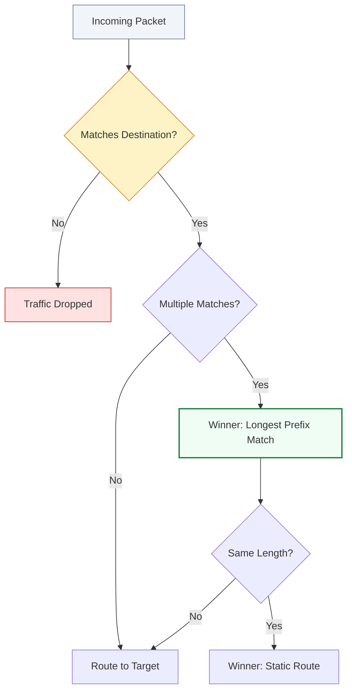

# 🚦 Module 04: Routing & Route Tables

> **"Route tables are the GPS of your VPC. They determine where network traffic from your subnet or gateway is directed, ensuring packets reach their intended destination securely and efficiently."**

## 📚 Overview

Routing is the "traffic control" system of the cloud. Without correct route tables, your instances are isolated islands, unable to talk to each other or the internet. This module explores how to manage **Route Tables**, how the router makes decisions using **Longest Prefix Match (LPM)**, and how to troubleshoot the dreaded "Blackhole" status that brings down production environments.

## 🎓 Learning Path

| # | Topic | Focus | Key Deliverable |
| :--- | :--- | :--- | :--- |
| **01** | [**Fundamentals**](./01-Route-Table-Fundamentals/README.md) | Basics of VPC Routing | Master Main vs. Custom tables |
| **02** | [**Priority Logic (LPM)**](./02-Priority-Logic-LPM/README.md) | How the Router Decides | Calculate the winning route |
| **03** | [**Gateway & Middleboxes**](./03-Gateway-Routing-and-Middleboxes/README.md) | Advanced Ingress | Design security appliance loops |
| **04** | [**Troubleshooting**](./04-Troubleshooting-and-Blackholes/README.md) | Fixing Broken Paths | Resolve 'Blackhole' and circular routes |

---

## 🚀 Professional Pattern: The Main Table "Safety Lock"

In AWS, every new subnet is automatically associated with the **Main Route Table** of the VPC. This is a major security risk if you aren't careful.

**The Pro Standard**:
1. **The Lockdown**: Keep the Main Route Table "Clean." It should only contain the default `local` route and NO routes to the internet (IGW/NAT).
2. **Explicit Association**: Force yourself to create a **Custom Route Table** for every single subnet. If you forget to associate a subnet, it falls back to the "locked-down" Main table, preventing it from accidentally being exposed to the web.
3. **Naming Convention**: Name your tables by their tier (e.g., `rt-public-web`, `rt-private-app`, `rt-isolated-db`).

---

## 🏆 Real-World DevOps Stories

### 🌑 The "Blackhole" Dash
**The Scenario**: A network engineer deleted a VPC Peering connection that was no longer needed for a staging cleanup.
**The Crisis**: Suddenly, the production monitoring dashboard (hosted in a different VPC) stopped reporting data.
**The Discovery**: The route table still had an entry for the dashboard's IP range, but since the target (the peering connection) was gone, the status changed to **Blackhole**. Traffic was being sent into a void.
**The Lesson**: **Connectivity is a two-step process.** Deleting the wire (Peering/VPN) doesn't delete the signs (Routes). Always clean up your route tables after retiring a network link.

### 🛡️ The "LPM" Security Bypass
**The Scenario**: An admin added a specific route `10.0.1.50/32` (a single server) to point to a security appliance for inspection. Later, they changed the main VPC CIDR.
**The Crisis**: The security appliance stopped seeing traffic for that server.
**The Discovery**: They had added a new route `10.0.1.0/24` pointing directly to a Transit Gateway. Because `/32` is longer than `/24`, the server traffic was correctly going to the appliance. But when they "cleaned up" the `/32` thinking it was redundant, traffic immediately took the `/24` path, bypassing the security check.
**The Lesson**: **Specificity is power.** The Longest Prefix Match (LPM) is the ultimate law. If you want traffic to go to a middlebox, your route must be more specific (or equal) to any other matching route.

---

## ❓ Interview Preparation (Routing)

1. **Q: What is the 'Local Route' and can you delete it?**
    *A: The Local Route is the default entry that allows all subnets in a VPC to talk to each other. It matches the VPC CIDR (e.g., 10.0.0.0/16). You **cannot** delete or modify it; it is the fundamental "gravity" of the VPC.*

2. **Q: Explain 'Longest Prefix Match' (LPM).**
    *A: It is the algorithm used to decide between multiple matching routes. The router picks the route with the most specific bitmask. Example: `10.0.1.0/24` wins over `10.0.0.0/16` for traffic going to `10.0.1.5`.*

3. **Q: What does it mean when a route status is 'Blackhole'?**
    *A: It means the destination is valid, but the target (like a NAT Gateway or Peering ID) has been deleted or is unavailable. Packets hitting this route are silently dropped by the VPC fabric.*

4. **Q: Can a single Subnet be associated with multiple Route Tables?**
    *A: **No.** A subnet can only have one active route table. However, one Route Table can be shared by many subnets (e.g., all Web subnets usually share one table).*

5. **Q: What is a 'Gateway Route Table'?**
    *A: It is a special type of route table associated with an Internet Gateway or Virtual Private Gateway. It is used to "intercept" traffic *entering* the VPC and redirect it to a security appliance (middlebox) before it reaches the target subnet.*

---

## 📝 Knowledge Check

1. **Which route will be chosen for traffic to 10.0.1.50?**
    - [ ] a) 10.0.0.0/16
    - [x] b) 10.0.1.0/24
    - [ ] c) 0.0.0.0/0
    - [ ] d) All of the above

2. **True or False: If you don't associate a subnet with a route table, it has no routing.**
    - [ ] True
    - [x] False (It implicitly associates with the 'Main' route table)

3. **What is the destination CIDR for the default "Internet" route?**
    - [ ] a) 10.0.0.0/8
    - [ ] b) 172.31.0.0/16
    - [x] c) 0.0.0.0/0
    - [ ] d) 255.255.255.255

4. **What does the prefix 'pcx-' represent in a route table target?**
    - [ ] a) Public Cloud Extension
    - [x] b) VPC Peering Connection
    - [ ] c) Private Connector
    - [ ] d) Port Control X

5. **How many 'Main' route tables can you have per VPC?**
    - [x] a) 1
    - [ ] b) 2
    - [ ] c) 5
    - [ ] d) Unlimited

---

## 🔗 Next Steps

You've mastered the GPS of the VPC. Now let's dive into the core engine of routing—how the table is actually constructed.

Proceed to: **[01. Route Table Fundamentals](./01-Route-Table-Fundamentals/README.md)** →
