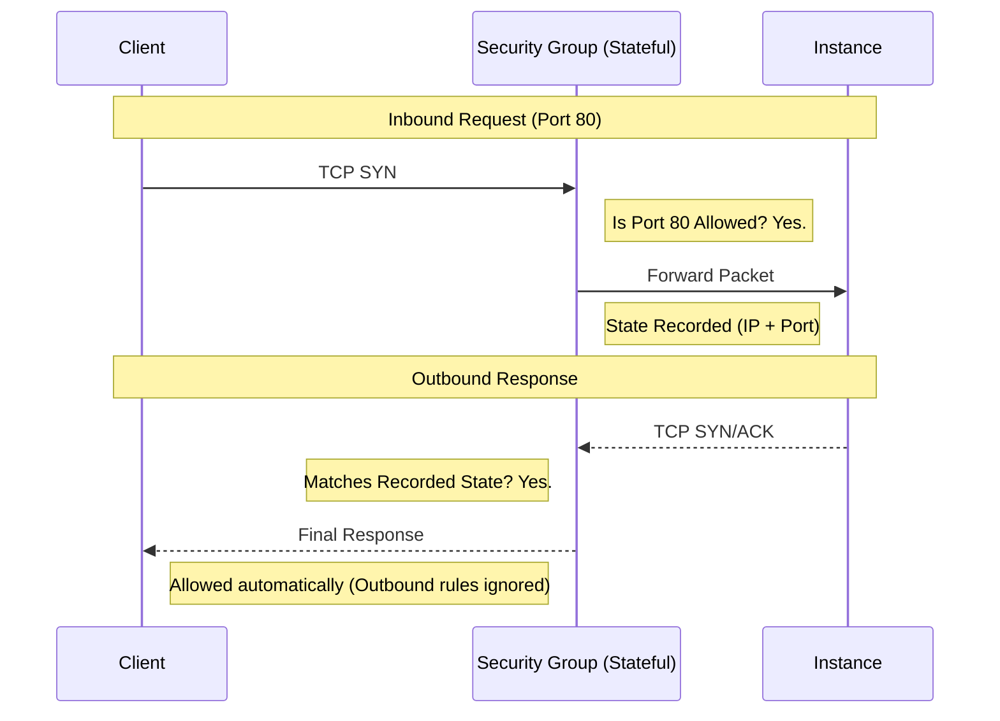

# 🛡️ Module 05.01: Security Groups (Stateful Defense)

> **"Security Groups are the invisible guardians of your instances. They don't just follow rules; they remember connections, ensuring that if you open the door to a friend, you never have to worry about them finding their way out."**

## 📚 Overview

A **Security Group (SG)** acts as a virtual firewall for your instances (EC2, RDS, Lambda, etc.) to control inbound and outbound traffic. It is the primary security mechanism in a VPC, operating at the **Instance (ENI) Level**. This module explores the power of **Stateful** tracking, allow-only logic, and the scalability of Security Group referencing.

## 🎓 Learning Objectives

By the end of this module, you will:

- ✅ Define and identify **Stateful Tracking**.
- ✅ Master the **Allow-Only** model (Whitelisting).
- ✅ Implement **SG-to-ID Referencing** for scalable security.
- ✅ Understand the **Additive Nature** of multiple Security Groups.
- ✅ Identify the **Defaults** for new custom Security Groups.

---

## 🏗️ The Pillars of Security Groups

### 1. Stateful Logic (Memory)
The defining feature of an SG is its memory. If you add an inbound rule to allow traffic on port 443, the Security Group "records" that connection. When the instance sends a response back to the client, the SG sees it matches an existing session and lets it through automatically, **ignoring any outbound rules**.

### 2. Whitelisting (The Exclusive Club)
Security Groups follow an "Implicit Deny" model. 
- You can **only** add "Allow" rules.
- You **cannot** add a "Deny" rule. 
- If no rule explicitly allows the traffic, the packet is dropped.

### 3. SG-to-ID Referencing (Scalability)
Instead of whitelisting IP addresses (which change constantly), you can reference the Security Group ID of the source. 
- **Rule**: *"Allow Port 3306 from `sg-app-tier`"*.
- **Result**: Any instance with the `sg-app-tier` group can talk to the database, regardless of its IP. This is the cornerstone of Infrastructure as Code security.

---

## 🚀 Professional Pattern: The Zero-Trust Reference

Senior DevOps engineers never hardcode IP addresses in Security Groups.

**The Pro Standard**:
- **Application Segmentation**: Create an SG for each tier (e.g., `web-sg`, `app-sg`, `db-sg`).
- **Chain of Trust**: 
    - `web-sg` allows 443 from `0.0.0.0/0`.
    - `app-sg` allows 8080 from `web-sg`.
    - `db-sg` allows 3306 from `app-sg`.
- **Benefit**: If an attacker compromises a server in the Web tier, they cannot talk to the Database because the Database only trusts the App tier.

---

## 🏆 Real-World DevOps Story: The Vanishing IPs

**The Scenario**: A startup was manually whitelisting the Private IPs of 50 web servers inside their Database Security Group.
**The Crisis**: Because they used Auto Scaling, AWS would periodically terminate "old" servers and launch "new" ones with different IPs. Every morning, the database connection would fail because the new server IPs weren't on the list.
**The Discovery**: A junior admin was spending 2 hours every day updating IP addresses in the console.
**The Fix**: A senior engineer changed the Database rule to: `Allow Port 5432 from sg-web-servers`.
**The Impact**: The manual work vanished instantly. Scaling from 50 to 500 servers required zero security configuration changes.
**The Lesson**: **Identity is better than address.** Trust the Group, not the IP.

---

## ❓ Interview Preparation (Security Groups)

1. **Q: What does 'Stateful' mean in a Security Group?**
    *A: It means the firewall tracks the state of connections. If an inbound request is allowed, the outbound response is automatically permitted by the state tracker, regardless of outbound rules. Conversely, if an outbound request is initiated, the inbound response is automatically allowed.*

2. **Q: Can you explicitly block (DENY) a specific IP address in a Security Group?**
    *A: **No.** Security Groups only support 'Allow' rules. To specifically block an IP, you must use a **Network ACL** at the subnet level.*

3. **Q: Where exactly are Security Groups applied?**
    *A: They are applied at the **Network Interface (ENI)** level of an instance, not at the subnet or VPC level. This means security moves with the instance.*

4. **Q: If an instance has 3 Security Groups attached, how are the rules evaluated?**
    *A: They are **Additive**. AWS evaluates all rules across all 3 groups. If *any* single rule across all groups allows the traffic, the traffic is permitted.*

5. **Q: What are the default rules for a newly created custom Security Group?**
    *A: By default, it has **No Inbound Rules** (Deny All) and **One Outbound Rule** (Allow All to 0.0.0.0/0).*

---

## 📝 Knowledge Check

1. **Which of the following is a characteristic of a Security Group?**
    - [ ] a) Stateless
    - [x] b) Stateful
    - [ ] c) Subnet-level
    - [ ] d) Supports Deny rules

2. **When referencing another Security Group as a source, what information is used?**
    - [ ] a) The instance tags
    - [ ] b) The instance IP address
    - [x] c) The Security Group ID (sg-xxxx)
    - [ ] d) The IAM Role

3. **What happens to outbound response traffic for an allowed inbound connection?**
    - [ ] a) It is dropped unless allowed by an outbound rule
    - [x] b) It is automatically allowed by state tracking
    - [ ] c) It must be allowed by a NACL first
    - [ ] d) It is redirected to a Load Balancer

4. **True or False: An EC2 instance can have multiple Security Groups attached at once.**
    - [x] True 
    - [ ] False

5. **In a 'Zero Trust' architecture, what should be the source of a Database SG rule?**
    - [ ] a) 0.0.0.0/0
    - [ ] b) The VPC CIDR (10.0.0.0/16)
    - [x] c) The App Tier's Security Group ID
    - [ ] d) The Admin's home IP

---

## 🔗 Next Steps

The SG protects the instance, but what protects the entire street (subnet)? Let's look at the stateless gatekeeper.

Proceed to: **[02. Network ACLs: Stateless](./02-Network-ACLs-Stateless/README.md)** →