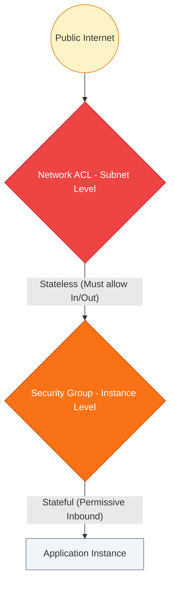

# 🛡️ Module 05: Network Security (NACLs & SGs)

> **"In the cloud, your network is your first and last line of defense. Security is not a single wall; it is a series of gates, each requiring a specific key to pass."**

## 📚 Overview

AWS provides two distinct layers of firewall protection for your Virtual Private Cloud: **Security Groups** (Instance level) and **Network ACLs** (Subnet level). Mastering the interaction between these two is the core requirement for architecting secure, enterprise-grade cloud environments. This module dives into stateful vs. stateless logic, layered defense strategies, and how to block malicious traffic at the edge.

## 🎓 Learning Path

| # | Topic | Focus | Key Deliverable |
| :--- | :--- | :--- | :--- |
| **01** | [**SGs: Stateful**](./01-Security-Groups-Stateful/README.md) | Instance-Level Firewall | Master State Tracking & SG-ID referencing |
| **02** | [**NACLs: Stateless**](./02-Network-ACLs-Stateless/README.md) | Subnet-Level Gatekeeper | Rule Numbering & Ephemeral Ports |
| **03** | [**Layered Defense**](./03-Layered-Defense-Strategies/README.md) | Professional Design | Implement 3-Tier Security Patterns |
| **04** | [**Troubleshooting**](./04-Advanced-Troubleshooting/README.md) | Finding the "Block" | Master Flow Logs and Reachability tests |

---

## 🚀 Professional Pattern: Micro-Segmentation

Senior security architects avoid using a single "Catch-All" Security Group. Instead, they use **Micro-segmentation**.

**The Pro Standard**:
1. **Never use IPs in SG Rules**: Don't whitelist `10.0.1.5`. Instead, allow traffic from **SG-ID** (e.g., "Allow Port 3306 from `sg-app-tier`"). This ensures that if you scale from 1 to 100 app servers, the database automatically trusts all of them without a single IP update.
2. **Deny at the Edge**: Use **Network ACLs** for high-level "Reject" rules (e.g., blocking botnet CIDRs). This drops the traffic at the subnet boundary, saving your instances from processing malicious packets.
3. **Least Privilege**: Only open exactly what is needed. If a server doesn't provide a web service, it should NOT have port 80/443 open.

---

## 🏆 Real-World DevOps Stories

### 🌑 The "Ephemeral Port" Mystery
**The Scenario**: An application server in a private subnet couldn't download software updates. The Security Group was set to "Allow All Outbound," and the route table was correct.
**The Crisis**: The deployment pipeline stayed red for 12 hours. The team was baffled because "the firewall says allow."
**The Discovery**: A custom **Network ACL** had been applied to the subnet. It allowed outbound traffic on port 443, but it **denied** inbound traffic on high ports (1024-65535). Because NACLs are **stateless**, they didn't "remember" the request started inside; they saw the response as new inbound traffic and blocked it.
**The Lesson**: **Stateless means no memory.** If you open a door in a NACL, you must open the return path for the **Ephemeral Port** range as well.

### 🛡️ The "Lateral Move" Breach
**The Scenario**: A junior admin used one single Security Group for "Dev-VPC." It allowed Port 22/80/443 between all instances in the group.
**The Crisis**: A single staging web server was compromised. The attacker used that server to SSH into the database server in the same VPC because theyshared the same permissive Security Group.
**The Impact**: The production-ready database was wiped. 
**The Lesson**: **Walls within walls.** Every tier (Web, App, DB) must have its own dedicated Security Group that only trusts the tier directly above it.

---

## ❓ Interview Preparation (Security)

1. **Q: What is the main difference between 'Stateful' and 'Stateless' firewalls?**
    *A: **Security Groups are Stateful**: If you allow traffic in, the response is automatically allowed out. **NACLs are Stateless**: You must explicitly allow both the request and the response in the rules.*

2. **Q: In what order are Network ACL rules evaluated?**
    *A: Rules are evaluated in numerical order, from **lowest to highest**. As soon as a packet matches a rule (Allow or Deny), evaluation stops. This is why 'Deny' rules should always have lower numbers (e.g., 10, 20) than your broad 'Allow' rules.*

3. **Q: Can you use a Security Group to block a specific IP address?**
    *A: **No.** Security Groups only support "Allow" rules. To specifically block or blackhole an IP address, you must use a **Network ACL**, which supports "Deny" rules.*

4. **Q: Why should you reference Security Group IDs instead of IP ranges in your rules?**
    *A: Referencing IDs is more dynamic and secure. If an instance scales out or changes its Private IP, the rule remains valid as long as the instance maintains that SG-ID. It also makes your security intent much clearer to other engineers.*

5. **Q: What is an 'Ephemeral Port'?**
    *A: These are short-lived transport protocol ports used by clients for communication. When an instance sends a request (Outbound), it expects the server to respond on a port in the range 1024-65535. NACLs must be configured to allow this inbound return traffic.*

---

## 📝 Knowledge Check

1. **Which firewall operates at the INSTANCE (ENI) level?**
    - [ ] a) Network ACL (NACL)
    - [x] b) Security Group (SG)
    - [ ] c) Internet Gateway
    - [ ] d) IAM Policy

2. **True or False: A Security Group 'remembers' a connection and allows the return traffic automatically.**
    - [x] True (It is stateful)
    - [ ] False

3. **Which component allows you to specify a 'Deny' rule?**
    - [ ] a) Security Group
    - [x] b) Network ACL
    - [ ] c) Route Table
    - [ ] d) Instance Metadata

4. **In a Network ACL, which rule number will be evaluated first?**
    - [x] a) 10
    - [ ] b) 100
    - [ ] c) 1000
    - [ ] d) 65535

5. **What is the default behavior of a Security Group's INBOUND rules?**
    - [ ] a) Allow All
    - [x] b) Deny All
    - [ ] c) Allow SSH Only
    - [ ] d) Allow HTTP Only

---

## 🔗 Next Steps

You've built the layered defense. Now let's explore the instance-level gatekeeper in detail.

Proceed to: **[01. Security Groups: Stateful](./01-Security-Groups-Stateful/README.md)** →
