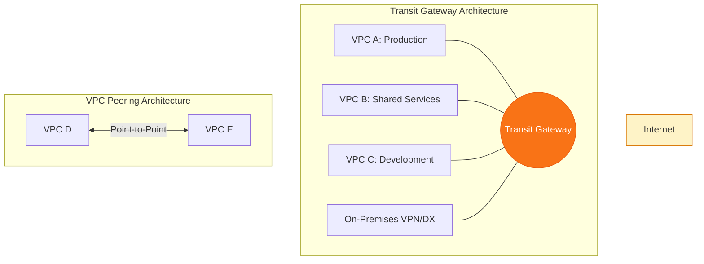

# 🏙️ Module 06: VPC Peering & Transit Gateway

> **"A single VPC is an island. Peering is a bridge, but Transit Gateway is the central hub that turns a scattered archipelago into a global empire. Connect wisely, for the network is the backplane of your business."**

## 📚 Overview

As your cloud footprint grows, a single VPC is no longer enough. You need separate environments for Production, Staging, and Shared Services. But how do they talk to each other securely? This module covers the two primary ways to interconnect VPCs: **VPC Peering** for simple, cost-effective point-to-point connections, and **Transit Gateway (TGW)** for complex, centralized hub-and-spoke architectures. We will explore the trade-offs between "Free but Complex" (Peering) and "Simple but Paid" (TGW).

## 🎓 Learning Objectives

By the end of this module, you will:

- ✅ Configure and troubleshoot **Point-to-Point VPC Peering**.
- ✅ Architect a centralized **Hub-and-Spoke** network using Transit Gateway.
- ✅ Resolve **CIDR Overlap** issues and understand routing limitations.
- ✅ Implement **DNS Resolution Support** across interconnected VPCs.
- ✅ Master **TGW Route Tables**, Associations, and Propagations.
- ✅ Optimize costs by choosing the right connectivity model for high-volume traffic.

---

## 🏗️ Core Connectivity Models

### 1. VPC Peering: The Virtual Cable
- **Nature**: A 1-to-1 connection between two VPCs.
- **Traffic**: Travels over the AWS backbone, never hitting the internet.
- **Cost**: $0.00 for the connection itself (only standard Data Transfer fees).
- **Limit**: **Non-Transitive**. You cannot hop through VPC B to reach VPC C.

### 2. Transit Gateway: The Cloud Router
- **Nature**: A regional hub that can connect thousands of VPCs and VPNs.
- **Traffic**: Supports **Transitive Routing** (VPC A can reach VPC C through the TGW).
- **Cost**: Monthly hourly charge per attachment + data processing fees ($0.02/GB).
- **Benefit**: Centralized monitoring, security, and simpler route table management.

---

## 🚀 Professional Pattern: The "Data Tier" Peering Exception

Even in a Transit Gateway architecture, senior engineers sometimes use Peering for specific workloads.

**The Pro Standard**:
1. **The Hub**: Use Transit Gateway for 99% of your general traffic (Management, Logging, API calls).
2. **The Exception**: If you have a Data Warehouse in VPC A that pulls 100TB of data daily from a Database in VPC B, **Peer them directly.**
3. **The Saving**: TGW would charge $2,000 for that 100TB processing. Peering charges $0 (if in the same AZ).
4. **Architectural Hybrid**: A "Hub-and-Spoke" model with "Direct Peer" shortcuts for high-bandwidth, cost-sensitive links.

---

## 🏆 Real-World DevOps Story: The 1,225 Connection Nightmare

**The Scenario**: A large insurance company used VPC Peering to connect all their departments. As they reached 50 VPCs, they realized that to make every VPC talk to every other VPC, they needed **1,225 Peering Connections**.
**The Crisis**: Every time a new subnet was added, 49 other VPCs had to have their route tables manually updated. The network team spent 80% of their month just clicking "Create Route."
**The Discovery**: They were hitting the AWS soft limit for peering connections and their route tables were becoming bloated and slow to load in the console.
**The Fix**: They migrated to a **Transit Gateway**. They deleted 1,225 peering connections and replaced them with **50 TGW Attachments**.
**The Result**: Route management became centralized. A new VPC only needed one route to the TGW hub to talk to everyone else. The "Archipelago" became a "Single Fabric."
**The Lesson**: **Peering is for pairs; Transit Gateway is for Platforms.**

---

## ❓ Interview Preparation (Interconnectivity)

1. **Q: What does it mean that VPC Peering is 'Non-Transitive'?**
    *A: It means that if VPC A is peered with VPC B, and VPC B is peered with VPC C, traffic from A cannot reach C via B. You must create a direct peering connection between A and C, or use a Transit Gateway which supports transitive routing.*

2. **Q: Can you peer two VPCs with overlapping CIDR blocks?**
    *A: **No.** VPC Peering requires unique CIDR blocks. If both VPCs use `10.0.0.0/16`, the routing logic will fail because the router won't know if the traffic is destined for the local network or the peered one.*

3. **Q: In a Transit Gateway, what is the difference between an 'Association' and a 'Propagation'?**
    *A: An **Association** determines which TGW Route Table an attachment uses for outgoing traffic. A **Propagation** is the process where an attachment dynamically "tells" a TGW Route Table which CIDR blocks it is responsible for.*

4. **Q: How do you enable DNS resolution between peered VPCs?**
    *A: You must enable the 'DNS Resolution Support' flag on the Peering Connection. This allows the instances in VPC A to resolve the private DNS names of instances in VPC B.*

5. **Q: When is VPC Peering CHEAPER than Transit Gateway?**
    *A: Always. Peering has no hourly cost and no data processing fees ($0.02/GB). TGW charges for both. Peering is the most cost-effective solution for high-volume data transfers.*

---

## 📝 Knowledge Check

1. **What is the maximum number of VPCs you can connect via a single Transit Gateway?**
    - [ ] a) 10
    - [ ] b) 100
    - [x] c) Up to 5,000 (Soft limit varies)
    - [ ] d) Unlimited

2. **Which connectivity option supports 'Security Group Referencing' across VPCs (in the same region)?**
    - [x] a) VPC Peering
    - [ ] b) Transit Gateway
    - [ ] c) Internet Gateway
    - [ ] d) NAT Gateway

3. **What is the primary cost driver for Transit Gateway?**
    - [ ] a) Number of subnets
    - [ ] b) Number of routes
    - [x] c) Hourly attachment fee + Data processing ($/GB)
    - [ ] d) Encryption overhead

4. **VPC A is peered to VPC B. How many route table entries are needed for A to talk to B?**
    - [ ] a) Zero (it's automatic)
    - [x] b) One (pointing the CIDR of VPC B to the Peering ID)
    - [ ] c) Two (one for each subnet)
    - [ ] d) Four (inbound and outbound)

5. **True or False: Transit Gateway traffic remains on the AWS global backbone and does not traverse the public internet.**
    - [x] True 
    - [ ] False

---

## 🔗 Next Steps

You've connected your VPCs. Now let's explore how to distribute traffic across your servers using Cloud Load Balancers.

Proceed to: **[07. Cloud Load Balancers (ALB/NLB)](../07-Load-Balancing-ALB-NLB/README.md)** →
Node: This link points to the next logical step in the curriculum.
