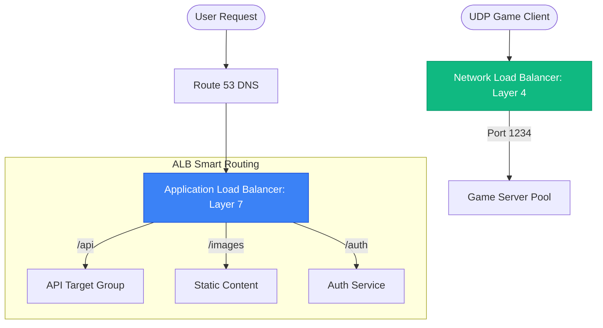

# ⚖️ Module 07: Cloud Load Balancers (ALB, NLB, GLB)

> **"A Load Balancer is the gateway to your application. It transforms a collection of individual servers into a single, cohesive, and resilient service. In the cloud, it's not just a tool; it's the anchor of your availability."**

## 📚 Overview

AWS Elastic Load Balancing (ELB) takes the complexity out of high availability. Whether you are routing millions of HTTP requests with **ALB**, handling ultra-low-latency UDP traffic with **NLB**, or inspecting packets with a **Gateway Load Balancer (GLB)**, these services provide the scale and reliability needed for enterprise production. This module covers how to choose the right load balancer for your workload, how to configure listeners and target groups, and how to use advanced health checks to automate server recovery.

## 🎓 Learning Objectives

By the end of this module, you will:

- ✅ Choose between **ALB**, **NLB**, and **GLB** based on technical requirements.
- ✅ Implement **Path-based** and **Host-based** routing for microservices.
- ✅ Secure applications with **SSL termination** via AWS Certificate Manager (ACM).
- ✅ Design **Deep Health Checks** that monitor application logic, not just ports.
- ✅ Optimize availability using **Cross-Zone Load Balancing**.
- ✅ Master **Connection Draining** for zero-downtime updates.

---

## 🏗️ The Cloud LB Family

### 1. Application Load Balancer (ALB)
- **Layer**: 7 (Application)
- **Logic**: Inspects HTTP headers, Cookies, and URLs.
- **Best For**: Web applications, microservices, and containerized apps.
- **Feature**: Integrated with **AWS WAF** for security.

### 2. Network Load Balancer (NLB)
- **Layer**: 4 (Transport)
- **Logic**: Inspects IP and Port numbers only.
- **Best For**: Ultra-performance, static IPs, and non-HTTP protocols (SMTP, Gaming).
- **Speed**: Scales to millions of requests per second instantly.

### 3. Gateway Load Balancer (GLB)
- **Layer**: 3 (Network)
- **Logic**: Transparently passes everything to third-party appliances.
- **Best For**: Firewall, IDS/IPS, and packet inspection virtual appliances.
- **Feature**: Uses the GENEVE protocol to preserve packet headers.

---

## 🚀 Professional Pattern: The "Two-Phase" Health Check

Junior admins often check if Port 80 is open. If the server is 100% CPU but Port 80 is open, the ELB keeps sending traffic to a "Zombie" server.

**The Pro Standard**:
1. **The Endpoint**: Create a `/health-check` route in your code.
2. **The Logic**: Within that route, perform a quick check: *Is the Database reachable? Is the Disk full?*
3. **The Result**: If the DB is down, the code returns `500 Server Error`. The ELB immediately stops sending users to that node, even though the OS and Port 80 are still "up."
4. **The Benefit**: True **Application-Aware Failover**.

---

## 🏆 Real-World DevOps Story: The Black Friday "Ghost" Session

**The Scenario**: An e-commerce site was gearing up for Black Friday. They used an ALB and stored user sessions (shopping carts) in the server's local RAM to save money.
**The Crisis**: During the peak sale, users reported that their carts were disappearing randomly. One user would add a TV, click "Checkout," and see an empty cart.
**The Discovery**: The ALB sent the "Add to Cart" request to Server 1. When the user clicked "Checkout," the ALB sent that request to Server 2. Since Server 2 didn't have Server 1's RAM, the cart was empty.
**The Fix**: They tried enabling **Sticky Sessions**, but it caused an uneven load (one server got 80% of users). The ultimate fix was moving sessions to **DynamoDB**.
**The Lesson**: **Stateless is the only way to scale.** A load balancer works best when your servers are identical and "disposable."

---

## ❓ Interview Preparation (Cloud ELB)

1. **Q: Why does the ALB use a DNS Name instead of a Static IP?**
    *A: Because the ALB is a managed, scaling service. AWS transparently adds and removes IP addresses (load balancer nodes) behind that DNS name as your traffic increases or decreases.*

2. **Q: How does 'Cross-Zone Load Balancing' help with an unbalanced Target Group?**
    *A: If you have 2 instances in AZ-A and 10 instances in AZ-B, without cross-zone, the 2 instances in AZ-A would each do 5x the work. With cross-zone enabled, every instance gets an equal share of the total traffic, regardless of its AZ.*

3. **Q: What is 'Server Name Indication' (SNI) on an ALB?**
    *A: SNI allows you to host multiple websites (each with its own SSL certificate) on a single ALB listener. The ALB checks the "Hostname" the user is requesting and presents the correct certificate for that specific site.*

4. **Q: What is the purpose of the 'X-Forwarded-For' header?**
    *A: Since the Load Balancer sits between the user and the server, the server sees the LB's private IP as the source. The ALB adds the `X-Forwarded-For` header so the server can see the user's TRUE public IP for logging and security.*

5. **Q: What happens during 'Deregistration Delay' (Connection Draining)?**
    *A: The ALB stops sending *new* requests to a target being removed but allows *existing* active connections to finish their work during a specified timeout (default 300s). This ensures a graceful user experience during updates.*

---

## 📝 Knowledge Check

1. **Which ELB type should you choose if your application requires a Static IP address for whitelisting?**
    - [ ] a) ALB
    - [x] b) NLB
    - [ ] c) GLB
    - [ ] d) CLB

2. **What is the primary protocol used by the Gateway Load Balancer to encapsulate traffic?**
    - [ ] a) HTTP/S
    - [ ] b) TCP/UDP
    - [x] c) GENEVE
    - [ ] d) ICMP

3. **A target group is marked 'Unhealthy'. What does the ALB do with incoming traffic?**
    - [ ] a) Sends it to the unhealthy instance anyway
    - [x] b) Routes it only to the remaining healthy instances in the group
    - [ ] c) Returns a 404 error
    - [ ] d) Retries the request until it passes

4. **Which ELB feature is required to host multiple domains on a single HTTPS listener?**
    - [ ] a) Sticky Sessions
    - [b] b) SNI (Server Name Indication)
    - [ ] c) Cross-Zone Balancing
    - [ ] d) Proxy Protocol

5. **True or False: Internal load balancers are accessible from the public internet.**
    - [ ] True
    - [x] False (They only have private IPs and are for internal traffic)

---

## 🔗 Next Steps

You've mastered traffic distribution. Now let's explore how to design for high availability across multiple regions and ensure your network is resilient to total disasters.

Proceed to: **[08. High Availability & Multi-Region](../08-High-Availability-and-Multi-Region/README.md)** →
Node: This link points to the next logical step in the curriculum.
