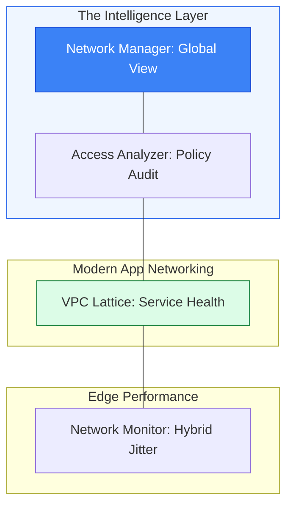

# 🚀 Module 10.05: Advanced Monitoring Tools

> **"As your network grows from one VPC to a global mesh of thousands, you can no longer rely on manual logs. You need Automated Reasoning to find security holes and Global Visibility to manage your empire."**

## 📚 Overview

Basic flow logs and reachability tests are essential for daily tasks, but they don't scale to an enterprise level. **Advanced Monitoring Tools** are designed to provide high-level "Command and Control" over your entire global infrastructure. In this module, we explore **AWS Network Manager** for global visualization, **Network Access Analyzer** for automated security auditing, and **VPC Lattice Monitoring** for modern service-to-service visibility. These tools don't just show you "Packets"; they show you the **Health and Policy Compliance** of your entire business.

## 🎓 Learning Objectives

By the end of this module, you will:

- ✅ Visualize a global hub-and-spoke network using **AWS Network Manager**.
- ✅ Perform automated security audits with **Network Access Analyzer**.
- ✅ Monitor service-to-service performance and HTTP status codes using **VPC Lattice**.
- ✅ Measure hybrid link latency and jitter with **CloudWatch Network Monitor**.
- ✅ Leverage **Automated Reasoning** to identify compliance violations at scale.

---

## 🏗️ The Advanced Toolkit

### 1. AWS Network Manager (Global Command)
- **Role**: Provides a single dashboard to visualize and monitor your entire global network (Transit Gateways, VPNs, and Direct Connects).
- **Key Feature**: **Global Topology Diagrams**. It automatically draws the map of your VPCs and how they connect across regions.

### 2. Network Access Analyzer (The Auditor)
- **Role**: Uses automated reasoning to identify network paths that lead to your resources.
- **Why it matters**: It answer questions like "Are any of my databases reachable from an Internet Gateway?" across 100+ accounts simultaneously.

### 3. VPC Lattice Monitoring (Service Visibility)
- **Role**: Instead of monitoring "IPs and ENIs," it monitors "Services."
- **Visibility**: It provides HTTP-level visibility (2xx/4xx/5xx errors) and throughput metrics for your microservices, even across different VPCs.

---

## 🚀 Professional Pattern: The "Compliance Guardrail"

In an enterprise, a developer might accidentally create a peering connection that "short-circuits" your security and exposes your database to the internet.

**The Pro Standard**:
1. **The Policy**: Define a **Network Access Scope** that says "No path from an Internet Gateway to a private subnet containing the tag `Data-Security: High`."
2. **The Automation**: Run **Network Access Analyzer** on a daily schedule via a Lambda function or AWS Backup.
3. **The Alert**: If the analyzer finds a path that violates the scope, it triggers a CloudWatch Alarm.
4. **The Benefit**: You find and fix accidental security holes before an attacker does.
5. **The Outcome**: Continuous compliance that scales with your infrastructure.

---

## 🏆 Real-World DevOps Story: The "Invisible" Peering Loophole

**The Scenario**: A large insurance company had a strict policy: "Production databases must never be reachable from the Dev/Test VPCs."
**The Crisis**: During a routine audit, they found that a junior admin had peered a "Shared Services" VPC to both Dev and Prod. This created a transitive path where a compromised Dev server could reach a Prod database through the middleman VPC.
**The Discovery**: Manual route table inspection missed this because the paths were split across three different accounts.
**The Fix**: They ran **Network Access Analyzer**. The tool used "Automated Reasoning" to trace every possible path. It instantly highlighted the transitive link through the Shared Services VPC.
**The Result**: The "Stealth" bridge was closed, and the company implemented a permanent Network Access Scope to prevent it from ever happening again.
**The Lesson**: **If a path exists, the computer will find it.** Use automated reasoning to audit what human eyes miss.

---

## ❓ Interview Preparation (Advanced Tools)

1. **Q: What is the main difference between Reachability Analyzer and Network Access Analyzer?**
    *A: **Reachability Analyzer** is for debugging a specific point-to-point path ("Can instance A reach instance B right now?"). **Network Access Analyzer** is for high-level security auditing ("Are there ANY paths from any Internet Gateway to my sensitive database subnets?").*

2. **Q: Which tool would you use to see a map of your global Transit Gateway architecture?**
    *A: **AWS Network Manager**. It provides a global dashboard and automatically generates topology diagrams for your entire AWS network across all regions.*

3. **Q: How does VPC Lattice monitoring differ from standard Flow Logs?**
    *A: Flow Logs work at the Network Layer (Layer 3/4) and show IPs and Ports. **VPC Lattice Monitoring** works at the Application Layer (Layer 7) and provides service-level metrics like HTTP success rates, error codes (4xx/5xx), and application-to-application latency.*

4. **Q: What is CloudWatch Network Monitor used for?**
    *A: It is used to monitor the performance (packet loss and latency) between your AWS resources and your on-premises network over the internet or a Direct Connect link. It uses 'probes' to measure the real-time quality of your hybrid connection.*

5. **Q: Can Network Access Analyzer detect paths that cross multiple AWS accounts?**
    *A: **Yes.** Since it analyzes the configuration of your Transit Gateways and VPC Peering, it can identify complex paths that jump across account boundaries.*

---

## 📝 Knowledge Check

1. **Which tool is best for visualizing 'Global Topology Diagrams' of your TGW network?**
    - [ ] a) Route 53
    - [ ] b) VPC Flow Logs
    - [x] c) AWS Network Manager
    - [ ] d) IAM

2. **To ensure your production subnets are never reachable from the public internet, which tool should you use?**
    - [ ] a) Reachability Analyzer
    - [x] b) Network Access Analyzer
    - [ ] c) CloudTrail
    - [ ] d) Inspector

3. **VPC Lattice Monitoring is unique because it focuses on:**
    - [ ] a) IP Addresses
    - [ ] b) Hardware CPU
    - [x] c) Logic Services and HTTP status codes
    - [ ] d) Disk I/O

4. **What does CloudWatch Network Monitor use to measure the health of a hybrid link?**
    - [ ] a) Log analysis
    - [x] b) Synthetic probes (active traffic testing)
    - [ ] c) Billing records
    - [ ] d) User feedback

5. **True or False: Network Access Analyzer actually sends malicious packets to your network to see if they get through.**
    - [ ] True 
    - [x] False (It uses automated reasoning and configuration analysis)

---

## 🔗 Next Steps

You have reached the end of the Networking Curriculum. You now possess the tools to build, secure, and monitor enterprise-grade global networks.

Return to: **[Networking Phase Overview](../README.md)** or Proceed to: **[Phase 2: Linux Mastery](../../../02-Linux/README.md)** →
Node: Final link of the module.