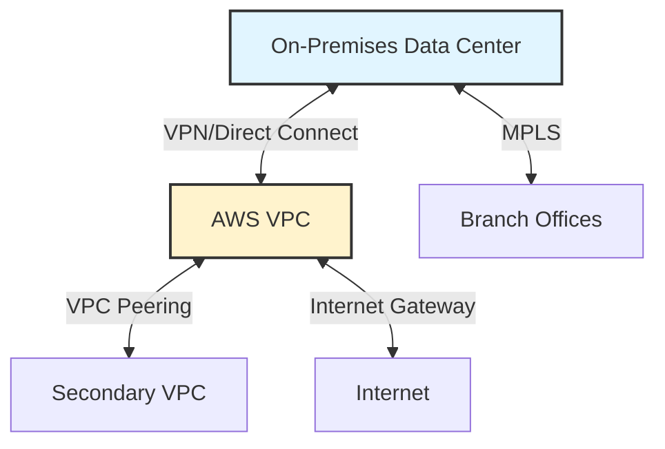

# VPC vs. Traditional Networks

Understanding the differences between VPCs and traditional data center networks helps you leverage cloud advantages effectively.

## Traditional Data Center Networks

### Physical Infrastructure
- **Routers**: Physical Cisco/Juniper devices
- **Switches**: Layer 2/3 switching hardware
- **Firewalls**: Dedicated security appliances
- **Load Balancers**: F5, Citrix NetScaler hardware
- **Cables**: Fiber optic, Cat6 Ethernet

### Characteristics
- **CapEx Heavy**: $100k+ for enterprise routers
- **Long Lead Times**: 4-8 weeks for hardware procurement
- **Physical Limitations**: Rack space, power, cooling
- **Manual Configuration**: CLI access to each device
- **Fixed Capacity**: Can't instantly scale

---

## Virtual Private Cloud (VPC)

### Software-Defined Infrastructure
- **Virtual Routers**: Software-based routing
- **Virtual Switches**: Distributed virtual switching
- **Security Groups**: Stateful virtual firewalls
- **Elastic Load Balancers**: Managed load balancing service
- **Virtual Cables**: Software-defined networking (SDN)

### Characteristics
- **OpEx Model**: Pay-as-you-go pricing
- **Instant Provisioning**: Minutes to deploy
- **Unlimited Scale**: Add resources on-demand
- **API-Driven**: Infrastructure as Code
- **Elastic Capacity**: Auto-scaling built-in

---

## Detailed Comparison

| Aspect | Traditional Network | VPC |
| :--- | :--- | :--- |
| **Deployment Time** | Weeks to months | Minutes |
| **Initial Cost** | $500k-$5M+ | $0 (pay for usage) |
| **Scalability** | Limited by hardware | Nearly unlimited |
| **Redundancy** | Manual setup, expensive | Built-in, multi-AZ |
| **Maintenance** | 24/7 NOC team | Cloud provider managed |
| **Upgrades** | Hardware refresh cycles | Transparent updates |
| **Disaster Recovery** | Separate DR site required | Multi-region replication |
| **Automation** | Limited, complex | Full API/IaC support |
| **Network Changes** | Change windows, downtime | Zero-downtime updates |
| **Monitoring** | SNMP, custom tools | CloudWatch, VPC Flow Logs |

---

## Migration Considerations

### Advantages of Moving to VPC
1. **Cost Reduction**: 40-60% savings on infrastructure
2. **Agility**: Deploy in minutes vs. weeks
3. **Global Reach**: Multi-region in hours
4. **Elasticity**: Scale up/down automatically
5. **Innovation**: Focus on apps, not infrastructure

### Challenges
1. **Learning Curve**: New paradigm for network engineers
2. **Shared Responsibility**: Security is shared with cloud provider
3. **Connectivity**: Hybrid cloud requires VPN/Direct Connect
4. **Compliance**: Data residency and regulatory concerns
5. **Vendor Lock-in**: Cloud-specific features

---

## Hybrid Cloud Architecture

Many organizations run both traditional and cloud networks:

---

## 🏗️ Real-Life Scenario: The Data Center Migration
**Company**: Mid-size e-commerce (500 servers)
**Traditional Setup**: 
- 2 data centers (primary + DR)
- $3M annual infrastructure cost
- 6-week lead time for new servers
- 4-person NOC team

**Migration to VPC**:
- Moved to AWS over 18 months
- Reduced to $1.2M annual cost (60% savings)
- New environments in minutes
- Reduced NOC to 1 person (others moved to DevOps)

**Unexpected Benefits**:
- Black Friday scaling: 10x capacity in 30 minutes
- DR testing: Weekly instead of annually
- Innovation: Launched 3 new products faster

---

## ❓ Interview Questions
1.  **What are the key differences between traditional networks and VPCs?**
    *   *Answer*: Traditional networks use physical hardware (routers, switches) with CapEx costs and long deployment times. VPCs use software-defined networking with OpEx pricing, instant provisioning, and elastic scaling. VPCs are API-driven and cloud-provider managed.
2.  **What is the shared responsibility model in cloud networking?**
    *   *Answer*: The cloud provider is responsible for the physical infrastructure, hypervisor, and network virtualization. The customer is responsible for VPC configuration, security groups, NACLs, routing tables, and application-level security.

---

## 🧠 Quiz Snippet (5/20+)
<b>1. What does SDN stand for?</b>

Show Answer

Answer: Software-Defined Networking

<b>2. True/False: VPCs require physical routers.</b>

Show Answer

Answer: False - virtual/software-based

<b>3. What is CapEx?</b>

Show Answer

Answer: Capital Expenditure - upfront hardware costs

<b>4. What is OpEx?</b>

Show Answer

Answer: Operational Expenditure - pay-as-you-go costs

<b>5. How long does it take to provision a VPC?</b>

Show Answer

Answer: Minutes

