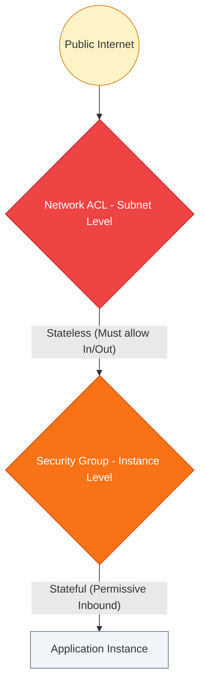
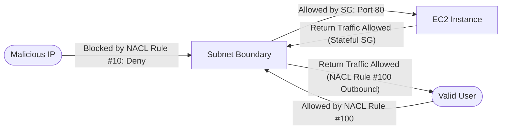

# 🛡️ Module 03: Network Security (NACLs & SGs)

> **"Junior, a firewall rule isn't just a line of config. It's a business decision. 'Allow All' is a decision to go out of business. We operate on the principle of Least Privilege."**

---

## 🏗️ Junior’s Mission

**Goal**: Build a fortress where only authorized traffic enters, and nothing unauthorized leaves.
**Why it matters**: A misconfigured Security Group is the #1 cause of cloud data breaches.

---

## 🌍 Operational Reality

**In Theory**: "Blocking IPs is how we secure things."
**In Production**:
*   **IPs Change**: Cloud IPs change every hour. Hardcoding IPs in rules is a nightmare. We use **Reference IDs** (e.g., `Allow traffic from sg-web-tier`, not `10.0.1.5`).
*   **The "Stateful" Miracle**: Security Groups track connections. If you allow a request *in* (Ingress), the response *out* (Egress) is automatically allowed. This simplifies life immensely.
*   **The "Stateless" Trap**: NACLs do *not* track connections. If you allow Inbound Port 80, you must explicitly allow Outbound Ports 1024-65535 (Ephemeral Ports) for the return traffic.

---

## 🛠️ The Toolbelt

You debug connectivity from the *Network Layer*.

| Tool | Command | Purpose |
| :--- | :--- | :--- |
| **netcat (nc)** | `nc -zv 10.0.1.5 80` | "Can I reach Port 80 on that IP?" (Success = Open). |
| **telnet** | `telnet google.com 443` | Old school, but widely available port test. |
| **nmap** | `nmap -Pn -p 80 10.0.1.0/24` | Scan an entire subnet for open web ports. |
| **iptables** | `sudo iptables -L` | Check local OS-level firewalls (often forgotten!). |

---

## 🔍 Deep Dive: The Defense Layers

### 1. Security Groups (The Bouncer)
*   **Location**: The Network Interface (ENI) of the Instance.
*   **Behavior**: **Stateful**.
*   **Default**: Deny All (Implicit). You only write "Allow" rules.
*   **Use Case**: "Allow the Web Tier to talk to the App Tier."
*   **Best Practice**: Reference **SG IDs**, not IPs.

### 2. Network ACLs (The Perimeter Fence)
*   **Location**: The Subnet Boundary.
*   **Behavior**: **Stateless**.
*   **Default**: Allow All (In Default VPC). Deny All (In Custom NACL).
*   **Rule Logic**: Processed in numeric order (Rule 100 before Rule 200).
*   **Use Case**: "Block this specific malicious Botnet IP range from entering our entire subnet."
*   **Danger**: 99% of connectivity issues are caused by a junior messing with NACLs and forgetting Ephemeral Ports.

### Visual: The Packet Flow & Ephemeral Ports

---

## 🚀 Professional Pattern: Micro-Segmentation

Senior security architects avoid using a single "Catch-All" Security Group. Instead, they use **Micro-segmentation**.

**The Pro Standard**:
1.  **DB Tier**: Only allows Inbound Port 3306 from `sg-app-tier`.
2.  **App Tier**: Only allows Inbound Port 8080 from `sg-web-tier`.
3.  **Web Tier**: Only allows Inbound Port 443 from `sg-load-balancer`.
4.  **Result**: If a hacker breaches the Web Tier, they cannot SSH into the Database, because the DB SG strictly denies Port 22 from the Web SG.

---

## > [!IMPORTANT] Senior SRE Pro-Tips

1.  **Never open Port 22 (SSH) to `0.0.0.0/0`**. I will personally revoke your commit access. Use a Bastion host or SSM Session Manager.
2.  **The "Outbound" Trap**: By default, SGs allow all outbound. If a hacker compromises your server, they can download malware. **Lock down egress.** Only allow servers to talk to needed APIs (S3/DynamoDB).
3.  **Order Matters in NACLs**: Rules are processed in order. Rule #10 `Deny 1.2.3.4` must come BEFORE Rule #100 `Allow All`. If you swap them, the Deny is ignored.

---

## 🎫 Junior's First Ticket: Incident #404

**Scenario**: "The App Server can't connect to the Database."

**Investigation Steps**:
1.  **Run the Test**: `nc -zv db-prod 3306`.
    *   *Result*: `Connection Timed Out`. (Timeout = Firewall drop. Refused = Service down).
2.  **Check DB Security Group**: "Does `sg-database` allow Inbound 3306 from `sg-app-server`?"
    *   *Result*: Yes.
3.  **Check App Security Group**: "Does `sg-app-server` allow Outbound 3306?"
    *   *Result*: Yes.
4.  **Check NACL**: "Did someone add a deny rule to the subnet?"
    *   *Result*: No.
5.  **The Twist**: Check the **OS Firewall** (`ufw` or `iptables`) on the DB server.
    *   *Result*: `iptables` was dropping Input.
    *   *Fix*: Update the OS firewall or disable it in favor of Security Groups.

---

## ❓ Interview Preparation (Security)

1. **Q: What is the main difference between 'Stateful' and 'Stateless' firewalls?**
    *A: **Security Groups are Stateful**: If you allow traffic in, the response is automatically allowed out. **NACLs are Stateless**: You must explicitly allow both the request and the response in the rules.*

2. **Q: In what order are Network ACL rules evaluated?**
    *A: Rules are evaluated in numerical order, from **lowest to highest**. As soon as a packet matches a rule (Allow or Deny), evaluation stops. This is why 'Deny' rules should always have lower numbers (e.g., 10, 20) than your broad 'Allow' rules.*

3. **Q: Can you use a Security Group to block a specific IP address?**
    *A: **No.** Security Groups only support "Allow" rules. To specifically block or blackhole an IP address, you must use a **Network ACL**, which supports "Deny" rules.*

4.  **Q: What is an 'Ephemeral Port'?**
    *A: These are short-lived transport protocol ports used by clients for communication. When an instance sends a request (Outbound), it expects the server to respond on a port in the range 1024-65535. NACLs must be configured to allow this inbound return traffic.*

---

## 📝 Knowledge Check

1.  **Which firewall operates at the INSTANCE (ENI) level?**
    - [ ] a) Network ACL (NACL)
    - [x] b) Security Group (SG)
    - [ ] c) Internet Gateway
    - [ ] d) IAM Policy

2.  **True or False: A Security Group 'remembers' a connection and allows the return traffic automatically.**
    - [x] True (It is stateful)
    - [ ] False

3.  **Which component allows you to specify a 'Deny' rule?**
    - [ ] a) Security Group
    - [x] b) Network ACL (Stateless)
    - [ ] c) Route Table

4.  **In a Network ACL, which rule number will be evaluated first?**
    - [x] a) 10 (Lowest number)
    - [ ] b) 100
    - [ ] c) 1000

5.  **What is the default behavior of a Security Group's INBOUND rules?**
    - [ ] a) Allow All
    - [x] b) Deny All (Implicit Deny)
    - [ ] c) Allow SSH Only

---

## 🔗 Next Steps

You have secured the gates. Now let's build the highway.

Proceed to: **[High Availability & VPNs](../06-High-Availability/README.md)** →
